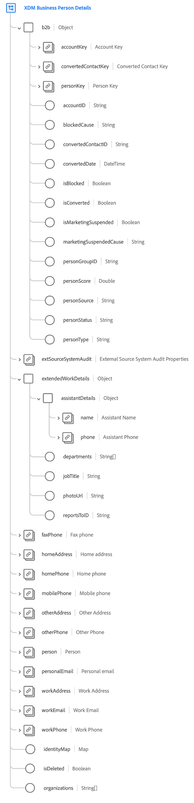

# [!UICONTROL XDM Business Person Details] schema field group

[!UICONTROL XDM Business Person Details] is a standard schema field group for the [[!DNL XDM Individual Profile] class](../../classes/individual-profile.md) that captures information about an individual person in the context of a business-to-business (B2B) enterprise.

| Property | Data type | Description |
| --- | --- | --- |
| `b2b` | Object | An object that captures the B2B-specific details about the person. |
| `b2b.accountKey` | [[!UICONTROL B2B Source]](../../data-types/b2b-source.md) | A composite identifier for the business account related to the person. |
| `b2b.convertedContactKey` | [[!UICONTROL B2B Source]](../../data-types/b2b-source.md) | A composite identifier for the associated contact if the lead was converted. |
| `b2b.personKey` | [[!UICONTROL B2B Source]](../../data-types/b2b-source.md) | A composite identifier for the person or profile fragment. |
| `b2b.accountID` | String | A unique ID for the business account this person is associated with. |
| `b2b.blockedCause` | String | If the person is blocked, this property provides the reason why. |
| `b2b.convertedContactID` | String | The contact ID if the lead was successfully converted. |
| `b2b.convertedDate` | DateTime | The date of conversion if the lead was successfully converted. |
| `b2b.isBlocked` | Boolean | Indicates whether the person is blocked. |
| `b2b.isConverted` | Boolean | Indicates whether the lead is converted. |
| `b2b.isMarketingSuspended` | Boolean | Indicates whether marketing is suspended for the person. |
| `b2b.marketingSuspendedCause` | String | If marketing is suspended for the person, this property provides the reason why. |
| `b2b.personGroupID` | String | A group identifier for the person. |
| `b2b.personScore` | Double | A score generated for the person by a CRM system. |
| `b2b.personSource` | String | The source that the person's information was received from. |
| `b2b.personStatus` | String | The current marketing or sales status of the person. |
| `b2b.personType` | String | The type of B2B person. |
| `extSourceSystemAudit` | [External Source System Audit Attributes](../../data-types/external-source-system-audit-attributes.md) | If the business person relation comes from an external source system, this object captures audit attributes for that system. |
| `extendedWorkDetails` | Object | Captures additional work-related details about the person. |
| `extendedWorkDetails.assistantDetails` | Object | Captures the following attributes related to the person's assistant: <ul><li>`name`: ([Person name](../../data-types/person-name.md)) The assistant's full name.</li><li>`phone`: ([Phone number](../../data-types/phone-number.md)) The assistant's phone number.</li></ul>|
| `extendedWorkDetails.departments` | Array of strings | A list of department names where the person works. |
| `extendedWorkDetails.jobTitle` | String | The person's job title. |
| `extendedWorkDetails.photoUrl` | String | A URL to a photo of the person. |
| `extendedWorkDetails.reportsToID` | String | An identifier for the person's reporting manager. |
| `faxPhone` | [Phone number](../../data-types/phone-number.md) | The person's fax phone number. |
| `homeAddress` | [Postal address](../../data-types/postal-address.md) | The person's home address. |
| `homePhone` | [Phone number](../../data-types/phone-number.md) | The person's home phone number. |
| `mobilePhone` | [Phone number](../../data-types/phone-number.md) | The person's mobile phone number. |
| `otherAddress` | [Postal address](../../data-types/postal-address.md) | An alternate address for the person. |
| `otherPhone` | [Phone number](../../data-types/phone-number.md) | An alternate phone number for the person. |
| `person` | [Person](../../data-types/person.md) | An individual actor, contact, or owner. |
| `personalEmail` | [Email address](../../data-types/email-address.md) | The person's personal email address. |
| `workAddress` | [Postal address](../../data-types/postal-address.md) | The person's work address. |
| `workEmail` | [Email address](../../data-types/email-address.md) | The person's work email address. |
| `workPhone` | [Phone number](../../data-types/phone-number.md) | The person's work phone number. |
| `identityMap` | Map | A map field that contains a set of namespaced identities for the person. This field is automatically updated by the system as identity data is ingested. In order to properly utilize this field for [Real-Time Customer Profile](../../../profile/home.md), do not attempt to manually update the field's contents in your data operations.  See the section on identity maps in the [basics of schema composition](../../schema/composition.md#identityMap) for more information on their use case. |
| `isDeleted` | Boolean  | Indicates whether this person has been deleted in Marketo Engage.  When using the [Marketo source connector](../../../sources/connectors/adobe-applications/marketo/marketo.md), any records that are deleted in Marketo are automatically reflected in Real-Time Customer Profile. However, records relating to these profiles may still persist in the Data Lake. By setting `isDeleted` to `true`, you can use the field to filter out which records have been deleted from your sources when querying the Data Lake. |
| `organizations` | Array of strings | A list of organization names where the person works. |

{style="table-layout:auto"}

For more details on the field group, refer to the public XDM repository:

* [Populated example](https://github.com/adobe/xdm/blob/master/components/fieldgroups/profile/b2b-person-details.example.1.json)
* [Full schema](https://github.com/adobe/xdm/blob/master/components/fieldgroups/profile/b2b-person-details.schema.json)
