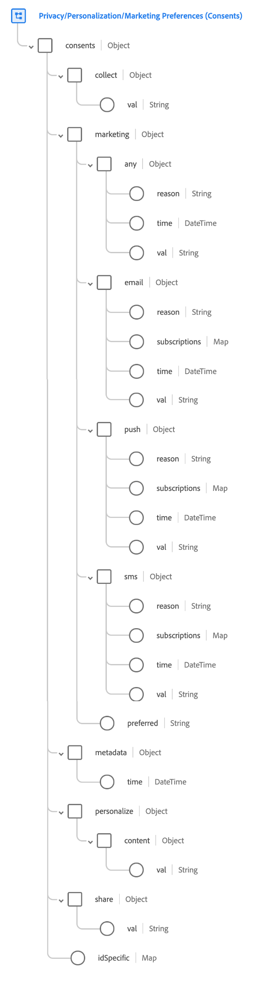

# [!UICONTROL Consents and Preferences] field group

[!UICONTROL Consents and Preferences] is a standard field group for the [[!DNL XDM Individual Profile] class](../../classes/individual-profile.md) that captures consent and preference information for an individual customer.

>[!NOTE]
>
>Since this field group is only compatible with [!DNL XDM Individual Profile], it cannot be used for [!DNL XDM ExperienceEvent] schemas. If you want to include consent and preference data in your Experience Event schema, add the [[!UICONTROL Consent for Privacy, Personalization and Marketing Preferences] data type](../../data-types/consents.md) to the schema through the use of a [custom field group](../../ui/resources/field-groups.md#create) instead.

## Field group structure {#structure} 

The [!UICONTROL Consents and Preferences] field group provides a single object-type field, `consents`, to capture consent and preference information. This field extends the [[!UICONTROL Consent for Privacy, Personalization and Marketing Preferences] data type](../../data-types/consents.md), removing the `adID` field and adding an `idSpecific` map field.



>[!TIP]
>
>See the guide on [exploring XDM resources](../../ui/explore.md) to for steps on how to look up any XDM resource and inspect its structure in the Platform UI.

The following JSON shows an example of the type of data that the [!UICONTROL Consents and Preferences] field group can process. For information on how to use most of the fields provided by the field group, refer to the guide on the [Consents and Preferences data type](../../data-types/consents.md). The subsections below focus on the unique attributes that the field group adds to the data type.

```json
{
  "consents": {
    "collect": {
      "val": "VI"
    },
    "share": {
      "val": "y"
    },
    "personalize": {
      "content": {
        "val": "y"
      }
    },
    "marketing": {
      "preferred": "email",
      "any": {
        "val": "y"
      },
      "email": {
        "val": "y"
      }
    },
    "idSpecific": {
      "ECID": {
        "37784337855396895622558625508046772577": {
          "adID": {
            "val": "n",
          },
          "share": {
            "val": "n"
          },
          "marketing": {
            "push": {
              "val": "n",
              "time": "2020-09-30T01:02:33+00:00",
              "reason": "not relevant"
            }
          }
        }
      },
      "email": {
        "john@xyz.com": {
          "marketing": {
            "email": {
              "val": "y"
            }
          }
        }
      }
    },
    "metadata": {
      "time": "2019-01-01T15:52:25+00:00"
    }
  }
}
```

>[!TIP]
>
>You can generate sample JSON data for any XDM schema that you define in Experience Platform in order to help visualize how your customer consent and preference data should be mapped. See the following documentation for more information:
>
>* [Generate sample data in the UI](../../ui/sample.md)
>* [Generate sample data in the API](../../api/sample-data.md)

### `idSpecific`

`idSpecific` can be used when a particular consent or preference does not universally apply to a customer, but is restricted to a single device or ID. For example, a customer can opt out of receiving emails to one address, while potentially allowing emails on another.

>[!IMPORTANT]
>
>Channel-level consents and preferences (i.e. those provided under `consents` outside of `idSpecific`) apply to all IDs within that channel. Therefore, all channel-level consents and preferences directly effect whether equivalent ID- or device-specific settings are honored:
>
>* If the customer has opted out at the channel level, then any equivalent consents or preferences in `idSpecific` are ignored.
>* If the channel-level consent or preference is not set, or the customer has opted in, then the equivalent consents or preferences in `idSpecific` are honored.

Each key in the `idSpecific` object represents a specific identity namespace recognized by Adobe Experience Platform Identity Service. While you can define your own custom namespaces to categorize different identifiers, it is recommended that you use one of the standard namespaces provided by Identity Service to reduce storage sizes for Real-Time Customer Profile. For more information on identity namespaces, see the [identity namespace overview](../../../identity-service/features/namespaces.md) in the Identity Service documentation.

The keys for each namespace object represent the unique identity values that the customer has set preferences for. Each identity value can contain a complete set of consents and preferences, formatted in the same way as `consents`.

```json
"idSpecific": {
  "email": {
    "jdoe@example.com": {
      "marketing": {
        "email": {
          "val": "n"
        }
      }
    }
  },
  "ECID": {
    "37784337855396895622558625508046772577": {
      "collect": {
        "val": "y"
      },
      "adID": {
        "val": "n"
      },
      "marketing": {
        "push": {
          "val": "n"
        }
      }
    }
  }
}
```

Within `marketing` objects provided in the `idSpecific` section, the `any` and `preferred` fields are not supported. These fields can only be configured at the user level. In addition, the `idSpecific` marketing preferences for `email`, `sms`, and `push` do not support `subscriptions` fields.

There is also a consent that can only be provided in the `idSpecific` section: `adID`. This field is covered in the subsection below.

#### `adID`

The `adID` consent represents the customer's consent for whether an advertiser ID (IDFA or GAID) can be used to link the customer across apps on this device. This value can only be configured under the `ECID` identity namespace in the `idSpecific` section, and cannot be set for other namespaces or at the user level for this field group.

```json
"idSpecific": {
  "ECID": {
    "37784337855396895622558625508046772577": {
      "collect": {
        "val": "y"
      },
      "adID": {
        "val": "n"
      },
      "marketing": {
        "push": {
          "val": "n"
        }
      }
    }
  }
}
```

>[!NOTE]
>
>You are not expected to set this value directly, since the Adobe Experience Platform Mobile SDK automatically sets it when appropriate.

## Ingesting data using the field group {#ingest}

In order to use the [!UICONTROL Consents and Preferences] field group to ingest consent data from your customers, you must create a dataset based on a schema that contains that field group.

See the tutorial on [creating a schema in the UI](https://www.adobe.com/go/xdm-schema-editor-tutorial-en) for steps on how to assign field groups to fields. Once you have created a schema containing a field with the [!UICONTROL Consents and Preferences] field group, refer to the section on [creating a dataset](../../../catalog/datasets/user-guide.md#create) in the dataset user guide, following the steps to create a dataset with an existing schema.

>[!IMPORTANT]
>
>If you want to send consent data to [!DNL Real-Time Customer Profile], it is required that you create a [!DNL Profile]-enabled schema based on the [!DNL XDM Individual Profile] class that contains the [!UICONTROL Consents and Preferences] field group. The dataset that you create based on that schema must also be enabled for [!DNL Profile]. Refer to the tutorials linked above for specific steps related to [!DNL Real-Time Customer Profile] requirements for schemas and datasets.
>
>In addition, you must also ensure that your merge policies are configured to prioritize the dataset(s) that contain the latest consent and preference data, in order for customer profiles to be updated correctly. See the overview on [merge policies](../../../rtcdp/profile/merge-policies.md) for more information.

## Handling consent and preference changes

When a customer changes their consents or preferences on your website, these changes should be collected and immediately enforced using the [Adobe Experience Platform Web SDK](/help/web-sdk/consent/supporting-consent.md). If a customer opts out of data collection, all data collection must immediately cease. If a customer opts out of personalization, then there should be no personalization present on the next page they visit. 

## Next steps

This document covered the structure and use of the [!UICONTROL Consents and Preferences] field group. For more information on the other fields provided by the field group, see the document on the [[!UICONTROL Consent for Privacy, Personalization and Marketing Preferences] data type](../../data-types/consents.md).
