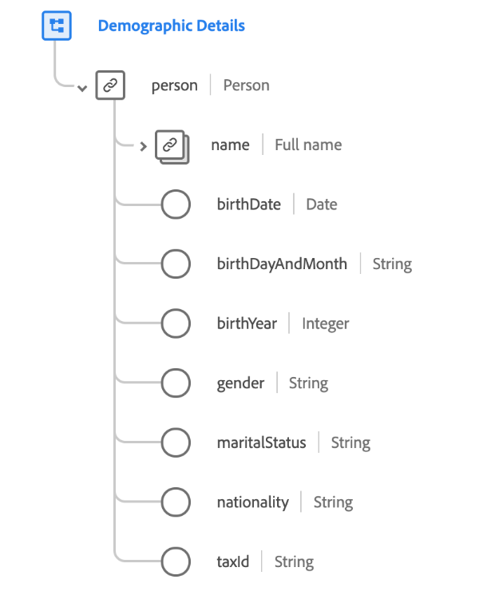

# [!UICONTROL Demographic Details] schema field group

>[!NOTE]
>
>The names of several schema field groups have changed. See the document on [field group name updates](../name-updates.md) for more information.

[!UICONTROL Demographic Details] is a standard schema field group for the [[!DNL XDM Individual Profile] class](../../classes/individual-profile.md). The field group provides a root-level `person` object, whose sub-fields describe information about an individual person.

| Property | Data type | Description |
| --- | --- | --- |
| `person.name` | [Person name](../../data-types/person-name.md)  | An object whose sub-fields describe various elements of a person's name. |
| `person.birthDate` | Date | The full date a person was born on, in the form of an ISO 8601 timestamp. |
| `person.birthDayAndMonth` | String | The day and month a person was born, in the format MM-DD. This field should be used when the day and month of a person's birth is known, but not the year. |
| `person.birthYear` | Integer  | The year a person was born, including the century (such as 1989). This field should be used when only the person's age is known, not the full birth date. |
| `person.gender` | String | The gender identity of the person. |
| `person.martialStatus` | String | Describes a person's relationship with a significant other. |
| `person.nationality` | String | The legal relationship between a person and their state represented using the ISO 3166-1 Alpha-2 code. |
| `person.taxId` | String | The tax/fiscal ID of the person, such the TIN in the US or the CIF/NIF in Spain. |

{style="table-layout:auto"}

For more details on the field group, refer to the public XDM repository:

* [Populated example](https://github.com/adobe/xdm/blob/master/components/fieldgroups/profile/profile-person-details.example.1.json)
* [Full schema](https://github.com/adobe/xdm/blob/master/components/fieldgroups/profile/profile-person-details.schema.json)