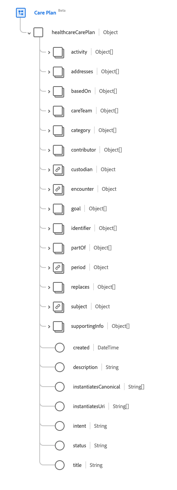

# [!UICONTROL Care Plan] schema field group

[!UICONTROL Care Plan] is a standard schema field group for the [[!DNL XDM Individual Profile] class](../../classes/individual-profile.md). It provides a single object-type field `healthcareCarePlan` which captures a healthcare plan for a patient or group. 

| Property | Data type | Description |
| --- | --- | --- |
| `activity` | ?? | ?? |
| `addresses`| ?? | ?? |
| `basedOn` | ?? | ?? |
| `careTeam` | ?? | ??|
| `category` | ?? | ?? |
| `contributor` | ?? | ?? |
| `custodian` | ?? | ?? |
| `encounter` | ?? | ?? |
| `goal` | ?? | ?? |
| `identifier` | ?? | ?? |
| `partOf` | ?? | ?? |
| `period` | ?? | ?? |
| `replaces` | ?? | ?? |
| `subject` | ?? | ?? |
| `supportingInfo` | ?? | ?? |
| `created` | DateTime | ?? |
| `description` | String | ?? |
| `instantiatesCanonical` | Array of Strings | ?? |
| `instantiatesUri` | Array of Strings | ?? |
| `intent` | String | ?? |
| `status` | String | ?? |
| `title` | String | ?? |

{style="table-layout:auto"}

For more details on the field group, refer to the public XDM repository:

* [Populated example](https://github.com/adobe/xdm/blob/master/extensions/industry/healthcare/fhir/fieldgroups/careplan.example.1.json)
* [Full schema](https://github.com/adobe/xdm/blob/master/extensions/industry/healthcare/fhir/fieldgroups/careplan.schema.json)
