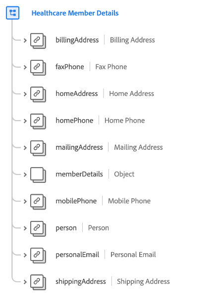
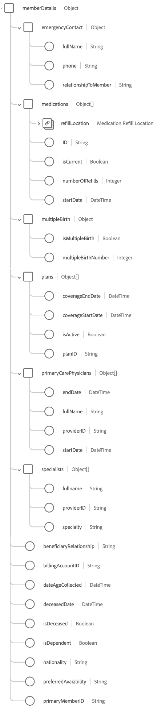

# [!UICONTROL Healthcare Member Details] schema field group

[!UICONTROL Healthcare Member Details] is a standard schema field group for the [[!DNL XDM Individual Profile] class](../../classes/individual-profile.md) that captures details of a person that has or will receive medical service or care, such as contact information, primary care physician, and plan information.

| Property | Data type | Description |
| --- | --- | --- |
| `billingAddress` | [[!UICONTROL Postal address]](../../data-types/postal-address.md) | The person's billing address. |
| `faxPhone` | [[!UICONTROL Phone number]](../../data-types/phone-number.md) | The person's fax phone number. |
| `homeAddress` | [[!UICONTROL Postal address]](../../data-types/postal-address.md) | The person's home address. |
| `homePhone` | [[!UICONTROL Phone number]](../../data-types/phone-number.md) | The person's home phone number. |
| `mailingAddress` | [[!UICONTROL Postal address]](../../data-types/postal-address.md) | The person's mailing address. |
| `memberDetails` | Object | An object that contains detailed information about the person's healthcare-related attributes and relationships. See the [subsection below](#memberDetails) for more information on the object's structure. |
| `mobilePhone` | [[!UICONTROL Phone number]](../../data-types/phone-number.md) | The person's mobile phone number. |
| `person` | [[!UICONTROL Person]](../../data-types/person.md) | An individual actor, contact, or owner related to the person's healthcare membership. |
| `personalEmail` | [[!UICONTROL Email address]](../../data-types/email-address.md) | The person's personal email address. |
| `shippingAddress` | [[!UICONTROL Postal address]](../../data-types/postal-address.md) | The person's shipping address. |

{style="table-layout:auto"}

## `memberDetails` {#memberDetails}

`memberDetails` is an object that contains detailed information about the person's healthcare-related attributes and relationships. The structure of `memberDetails` is described below.

| Property | Data type | Description |
| --- | --- | --- |
| `emergencyContact` | Object | Captures the following emergency contact details for the person: <ul><li>`fullName`: (String) The full name of the emergency contact.</li><li>`phone`: (String) The phone number for the emergency contact.</li><li>`relationshipToMember`: (String) The emergency contact's relationship to the person.</li></ul>| 
| `medications` | Array of objects | Lists the details of current and past medications associated with the person. Each array item is an object that captures the following details: <ul><li>`refillLocation`: ([[!UICONTROL Postal address]](../../data-types/postal-address.md)) The refill location for the medication.</li><li>`ID`: (String) Medication ID.</li><li>`isCurrent`: (Boolean) Indicates whether the medication is current or past.</li><li>`numberOfRefills`: (Integer) The number of refills prescribed by the provider of this medication.</li><li>`startDate`: (DateTime) The date on which the person began taking the medication.</li></ul> | 
| `multipleBirth` | Object | Captures details related to multiple births: <ul><li>`isMultipleBirth`: (Boolean) Indicates whether the person gave multiple births.</li><li>`multipleBirthNumber`: (Integer) The number of babies born if `isMultipleBirth` is true.</li></ul> | 
| `plans` | Array of objects | Lists the details of current and past medical plans associated with the person. Each array item is an object that captures the following details: <ul><li>`coverageEndDate`: (DateTime) The date on which the plan coverage ends.</li><li>`coverageStartDate`: (DateTime) The date on which the plan coverage starts.</li><li>`isActive`: (Boolean) Indicates whether the plan is active.</li><li>`planId`: (String) The plan ID.</li></ul> | 
| `primaryCarePhysicians` | Array of objects |  Lists the details of primary care physicians associated with the person. Each array item is an object that captures the following details: <ul><li>`endDate`: (DateTime) The date on which the primary care physician ended care for the person.</li><li>`fullname`: (String) The full name of the physician.</li><li>`providerId`: (String) A unique identifier for the physician.</li><li>`startDate`: (DateTime) The date on which the primary care physician started care for the person.</li></ul> | 
| `specialists` | Array of objects | Lists the details of healthcare specialists associated with the person. Each array item is an object that captures the following details: <ul><li>`fullname`: (String) The full name of the specialist.</li><li>`providerId`: (String) A unique identifier for the specialist.</li><li>`specialty`: (String) The specialty of the provider (such as anesthesiology, urology, radiology, dermatology, and so on).</li></ul> | 
| `beneficiaryRelationship` | String | The beneficiary relationship to the healthcare member if the person is a dependent (examples include self, spouse, child, and so on). | 
| `billingAccountID` | String | A unique identifier for the person's billing account. | 
| `dateAgeCollected` | DateTime | The date the person's age was collected. | 
| `deceasedDate` | DateTime | The date the person died if they are deceased. | 
| `isDeceased` | Boolean | Indicates whether the person is deceased. | 
| `isDependent` | Boolean |  Indicates whether the person is a dependent. | 
| `nationality` | String | The legal relationship between the person and their state, represented using the ISO 3166-1 Alpha-2 code. | 
| `preferredAvailability` | String | The person's preferred day and time availability for an appointment. | 
| `primaryMemberID` | String | A unique identifier of the primary subscriber if the person is a dependent. | 

{style="table-layout:auto"}

For more details on the field group, refer to the public XDM repository:

* [Populated example](https://github.com/adobe/xdm/blob/master/components/fieldgroups/profile/profile-healthcare-member.example.1.json)
* [Full schema](https://github.com/adobe/xdm/blob/master/components/fieldgroups/profile/profile-healthcare-member.schema.json)

Refer to the industry schema documentation for more information on how this field group can be used to serve common [healthcare industry use cases](../../schema/industries/healthcare.md).
