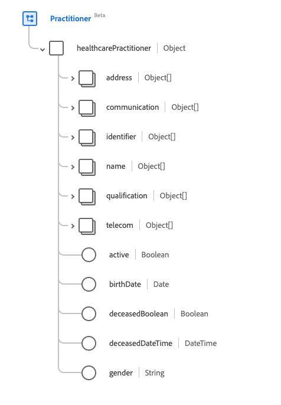

# [!UICONTROL Practioner] schema field group

[!UICONTROL Practioner] is a standard schema field group for the [[!DNL XDM Individual Profile] class](../../classes/individual-profile.md) and the [[!DNL Provider class]](../../classes/provider.md). It provides a single object-type field `healthcarePractioner` which is contains information about a person who is directly or indirectly involved in the provisioning of healthcare or related services.

| Property | Data type | Description |
| --- | --- | --- |
| `address` | ?? | ?? |
| `communication`| ?? | ?? |
| `identifier` | ?? | ?? |
| `name` | ?? | ??|
| `qualification` | ?? | ?? |
| `telecom` | ?? | ?? |
| `active` | Boolean | ?? |
| `birthDate` | Date | ?? |
| `deceasedBoolean` | Boolean | ?? |
| `deceasedDateTime` | DateTime | ?? |
| `gender` | String | ?? |

{style="table-layout:auto"}

For more details on the field group, refer to the public XDM repository:

* [Populated example](https://github.com/adobe/xdm/blob/master/extensions/industry/healthcare/fhir/fieldgroups/practitioner.example.1.json)
* [Full schema](https://github.com/adobe/xdm/blob/master/extensions/industry/healthcare/fhir/fieldgroups/practitioner.schema.json)
