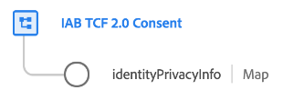

# [!UICONTROL IAB TCF 2.0 Consent] schema field group

>[!NOTE]
>
>This document covers the [!UICONTROL IAB TCF 2.0 Consent] schema field group for the XDM Individual Profile class. For the field group intended for the XDM ExperienceEvent class, refer to the following [document](../event/iab.md) instead.

[!UICONTROL IAB TCF 2.0 Consent] is a standard schema field group for the [[!DNL XDM Individual Profile] class](../../classes/individual-profile.md) used to capture a timestamped series IAB consent strings, in order to track consent-change patterns over time.



| Property | Data type | Description |
| --- | --- | --- |
| `identityPrivacyInfo` | Map  | A map-type object that associates a customer's individual identity values with different TCF consent strings. An example of this object's structure is provided below. |

{style="table-layout:auto"}

The following JSON demonstrates the structure of the `identityPrivacyInfo` map. 

```json
{
  "identityPrivacyInfo": {
    "ECID": {
      "13782522493631189": {
        "identityIABConsent": {
          "consentTimestamp": "2020-04-11T05:05:05Z",
          "consentString": {
            "consentStandard": "IAB TCF",
            "consentStandardVersion": "2.0",
            "consentStringValue": "BObdrPUOevsguAfDqFENCNAAAAAmeAAA.PVAfDObdrA.DqFENCAmeAENCDA",
            "gdprApplies": true,
            "containsPersonalData": false
          }
        }
      }
    }
  }
}
```

As the example shows, each root-level key of `xdm:identityPrivacyInfo` corresponds with an identity namespace recognized by Identity Service. In turn, each namespace property must have at least one sub-property whose key matches the customer's corresponding identity value for that namespace. In this example, the customer is identified with an Experience Cloud ID (`ECID`) value of `13782522493631189`.

For each identity value, an `identityIABConsent` property must provided, which provides the TCF consent value for the identity. The value for this property must conform to the [[!UICONTROL Consent String] data type](../../data-types/consent-string.md).

See the guide on [IAB TCF 2.0 support in Platform](../../../landing/governance-privacy-security/consent/iab/overview.md) for more information on the use case of this field group. For more details on the field group itself, refer to the public XDM repository:

* [Populated example](https://github.com/adobe/xdm/blob/master/components/fieldgroups/profile/profile-privacy.example.1.json)
* [Full schema](https://github.com/adobe/xdm/blob/master/components/fieldgroups/profile/profile-privacy.schema.json)
