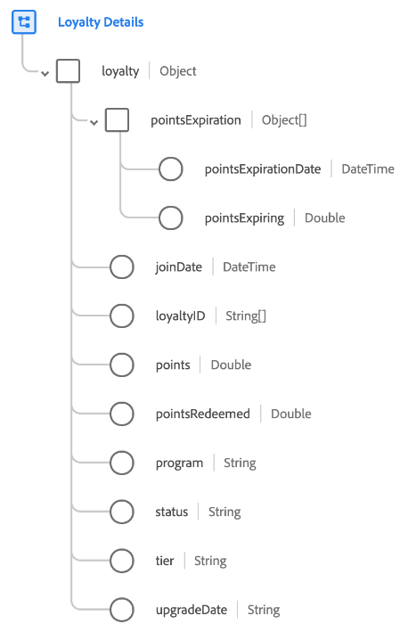

# [!UICONTROL Loyalty Details] schema field group

>[!NOTE]
>
>The names of several schema field groups have changed. See the document on [field group name updates](../name-updates.md) for more information.

[!UICONTROL Loyalty Details] is a standard schema field group for the [[!DNL XDM Individual Profile] class](../../classes/individual-profile.md). The field group provides a single object-type field, `loyalty`, which captures information related to a person's membership in a customer loyalty program.

| Property | Data type | Description |
| --- | --- | --- |
| `pointsExpiration` | Array of objects | Lists any loyalty points (or groups of loyalty points) that are going to expire, and the dates they will expire on. Each array item must be an object that contains the following two properties: <ul><li>`pointsExpirationDate`: An ISO 8601 datetime of when the points will expire.</li><li>`pointsExpiring`: The point balance expiring as of the associated expiration date.</li></ul> |
| `joinDate` | DateTime | An ISO 8601 datetime of when the person joined the loyalty program. |
| `loyaltyID` | Array of strings | Represents the loyalty program ID(s) associated with the loyalty program member.  |
| `points` | Double | The current balance of loyalty points or awards for the loyalty member. |
| `pointsRedeemed` | Double | The amount of points the loyalty member has applied towards a purchase or has otherwise redeemed. |
| `program` | String | The name of the loyalty program in which the person is enrolled.  |
| `status` | String | The current status of the person's loyalty membership, such as `active`, `disabled`, or `suspended`. |
| `tier` | String | Captures the loyalty program tier in which the person is enrolled. |
| `upgradeDate` | String | The date when the loyalty member was upgraded to their most recent tier level. |

{style="table-layout:auto"}

For more details on the field group, refer to the public XDM repository:

* [Populated example](https://github.com/adobe/xdm/blob/master/components/fieldgroups/profile/profile-loyalty-details.example.1.json)
* [Full schema](https://github.com/adobe/xdm/blob/master/components/fieldgroups/profile/profile-loyalty-details.schema.json)
