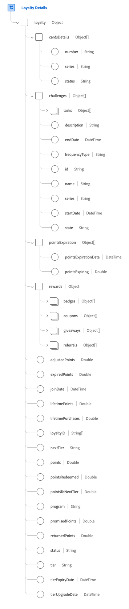

# [!UICONTROL Loyalty Details] schema field group

[!UICONTROL Loyalty Details] is a standard schema field group for the [[!UICONTROL XDM Individual Profile] class](../../classes/individual-profile.md). It provides a single object-type field, `loyalty`, that models a customer's loyalty program membership state, including loyalty IDs, points balances, tier assignments, rewards, challenges, and card details.

This page is for schema designers and data engineers familiar with XDM Individual Profile and [schema field groups](../../ui/resources/field-groups.md). After reading this page, you can map loyalty profile data to the correct `loyalty` field paths.

>[!IMPORTANT]
>
>This field group captures loyalty membership state. Individual loyalty events are typically modeled in [[!UICONTROL XDM ExperienceEvent]](../../classes/experienceevent.md) schemas.

## When to use this field group {#when-to-use}

Use this field group when all of the following conditions apply.

- The schema class is XDM Individual Profile and represents a loyalty program member's current state.
- The schema stores persistent loyalty attributes in Real-Time Customer Profile.
- Downstream use cases require loyalty membership state for segmentation or personalization.

Use [[!UICONTROL XDM ExperienceEvent]](../../classes/experienceevent.md) schemas for event-based loyalty activity such as points accrual, challenge completions, or tier change events.



## Field group structure {#structure}

The `loyalty` object contains the following properties.

| Property | Data type | Description |
| --- | --- | --- |
| `adjustedPoints` | Double | Points adjusted due to corrections, returns, or other modifications. |
| `cardsDetails` | Array of objects | Lists loyalty cards associated with the member. See the [cardsDetails subsection](#cardsDetails) for more information. |
| `challenges` | Array of objects | Lists loyalty challenges associated with the member. See the [challenges subsection](#challenges) for more information. |
| `expiredPoints` | Double | Total number of points that have expired and are no longer available for use. |
| `joinDate` | DateTime | An ISO 8601 datetime indicating when the person joined the loyalty program. |
| `lifetimePoints` | Double | Total points earned throughout the customer's loyalty program membership. |
| `lifetimePurchases` | Double | Total monetary value of all purchases made throughout the customer's loyalty program membership. |
| `loyaltyID` | Array of strings | Loyalty program identifiers associated with the member. |
| `nextTier` | String | The next loyalty tier the member can obtain. |
| `points` | Double | Current balance of loyalty points or awards for the member. |
| `pointsExpiration` | Array of objects | Lists loyalty points, or groups of loyalty points, that are scheduled to expire. Each array item contains: <ul><li>`pointsExpirationDate`: The date and time when the points expire.</li><li>`pointsExpiring`: The number of points expiring on the associated date.</li></ul> |
| `pointsRedeemed` | Double | Total amount of points redeemed toward purchases or other rewards. |
| `pointsToNextTier` | Double | Number of points required before the member qualifies for the next loyalty tier. |
| `program` | String | Name of the loyalty program in which the person is enrolled. |
| `promisedPoints` | Double | Points promised to the customer but not yet credited to the account. |
| `returnedPoints` | Double | Points returned to the customer's account due to refunds or adjustments. |
| `rewards` | Object | Captures rewards available or assigned to the member through the loyalty program. See the [rewards subsection](#rewards) for more information. |
| `status` | String | Current status of the loyalty membership, such as `active`, `disabled`, or `suspended`. |
| `tier` | String | Current loyalty tier in which the member is enrolled. |
| `tierExpiryDate` | DateTime | Date and time when the customer's current loyalty tier expires. |
| `tierUpgradeDate` | DateTime | Date and time when the customer was upgraded to the next loyalty tier level. |
| `upgradeDate` | String | Deprecated. Use `tierUpgradeDate` instead. Update existing schemas and source mappings that reference `upgradeDate` to use `tierUpgradeDate`. |

{style="table-layout:auto"}

The following example shows the `loyalty` object with representative values for the nested structures. See the [populated example](https://github.com/adobe/xdm/blob/master/components/fieldgroups/profile/profile-loyalty-details.example.1.json) in the XDM repository for a complete valid payload.

```json
{
  "loyalty": {
    "program": "Acme Rewards",
    "tier": "gold",
    "points": 4200,
    "pointsExpiration": [
      { "pointsExpirationDate": "2026-12-31T00:00:00Z", "pointsExpiring": 500 }
    ],
    "cardsDetails": [
      { "number": "LC-0042", "status": "active" }
    ],
    "challenges": [
      {
        "id": "CH-001",
        "state": "active",
        "tasks": [{ "name": "Make 3 purchases", "goal": 3, "progress": 1 }]
      }
    ],
    "rewards": {
      "badges": [
        { "id": "BDG-100", "state": "active" }
      ]
    }
  }
}
```

## `cardsDetails` {#cardsDetails}

`cardsDetails` is an array of objects that captures information about loyalty cards associated with the member.

| Property | Data type | Description |
| --- | --- | --- |
| `number` | String | Loyalty card number or identifier. |
| `series` | String | Series or collection to which the loyalty card belongs. |
| `status` | String | Current loyalty card status, such as `active`, `inactive`, or `suspended`. |

{style="table-layout:auto"}

## `challenges` {#challenges}

`challenges` is an array of objects that captures loyalty challenges associated with the member, including challenge progress and related tasks.

| Property | Data type | Description |
| --- | --- | --- |
| `description` | String | Detailed description of the loyalty challenge. |
| `endDate` | DateTime | Date and time when the challenge ends. |
| `frequencyType` | String | Frequency associated with the challenge, such as daily, weekly, or monthly. |
| `id` | String | Unique identifier for the loyalty challenge. |
| `name` | String | Name of the loyalty challenge. |
| `series` | String | Series or collection to which the challenge belongs. |
| `startDate` | DateTime | Date and time when the challenge begins. |
| `state` | String | Current challenge state, such as `active`, `completed`, or `expired`. |
| `tasks` | Array of objects | Lists tasks associated with the loyalty challenge. Each array item contains: <ul><li>`endDate`: The task end date and time.</li><li>`entity`: The entity associated with the task.</li><li>`goal`: The target value for the task.</li><li>`name`: The task name.</li><li>`progress`: Current progress toward the task goal.</li><li>`startDate`: The task start date and time.</li><li>`state`: Current task state.</li><li>`type`: Task type or category.</li></ul> |

{style="table-layout:auto"}

## `rewards` {#rewards}

The `rewards` object captures rewards associated with the loyalty program.

| Property | Data type | Description |
| --- | --- | --- |
| `badges` | Array of objects | Achievement badges earned by the member. Each array item contains: <ul><li>`id`: Badge identifier.</li><li>`name`: Badge name.</li><li>`series`: Badge series or collection.</li><li>`startDate`: Date and time when the badge became active.</li><li>`endDate`: Date and time when the badge expires.</li><li>`state`: Current badge state.</li></ul> |
| `coupons` | Array of objects | Loyalty coupons available to the member. Each array item contains: <ul><li>`discountValue`: Monetary discount value.</li><li>`endDate`: Coupon expiration date.</li><li>`id`: Coupon identifier.</li><li>`name`: Coupon name.</li><li>`redemptionCount`: Number of times the coupon has been redeemed.</li><li>`redemptionLimit`: Maximum number of coupon redemptions.</li><li>`series`: Coupon series or campaign.</li><li>`startDate`: Date and time when the coupon becomes valid.</li><li>`state`: Current coupon state.</li><li>`storeName`: Name of the associated store.</li></ul> |
| `giveaways` | Array of objects | Giveaway promotions associated with the member. Each array item contains: <ul><li>`endDate`: Giveaway end date.</li><li>`id`: Giveaway identifier.</li><li>`name`: Giveaway name.</li><li>`partnerId`: Partner identifier.</li><li>`partnerName`: Partner name.</li><li>`series`: Giveaway series or campaign.</li><li>`startDate`: Giveaway start date.</li><li>`state`: Current giveaway state.</li><li>`type`: Giveaway type or category.</li></ul> |
| `referrals` | Array of objects | Referral rewards earned by the member. Each array item contains: <ul><li>`endDate`: Referral end date.</li><li>`id`: Referral identifier.</li><li>`name`: Referral reward name.</li><li>`recipient`: Identifier or name of the referred person.</li><li>`series`: Referral series or campaign.</li><li>`startDate`: Referral start date.</li><li>`state`: Current referral state.</li></ul> |

{style="table-layout:auto"}

## Next steps {#next-steps}

Use the following resources when implementing loyalty profile schemas.

- Add this field group to an XDM Individual Profile schema using the [Schema Editor field group guide](../../ui/resources/field-groups.md) before ingesting loyalty profile data.
- Use the [populated example](https://github.com/adobe/xdm/blob/master/components/fieldgroups/profile/profile-loyalty-details.example.1.json) in the XDM repository to validate loyalty payload mappings.
- Consult the [full schema](https://github.com/adobe/xdm/blob/master/components/fieldgroups/profile/profile-loyalty-details.schema.json) for data type constraints and required field definitions.
