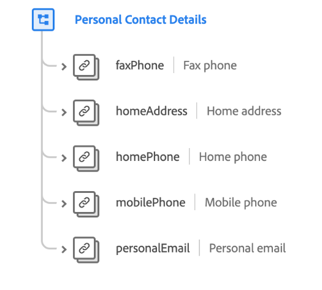

# [!UICONTROL Personal Contact Details] schema field group

>[!NOTE]
>
>The names of several schema field groups have changed. See the document on [field group name updates](../name-updates.md) for more information.

[!UICONTROL Personal Contact Details] is a standard schema field group for the [[!DNL XDM Individual Profile] class](../../classes/individual-profile.md) which describes the contact information for an individual person.

| Property | Data type | Description |
| --- | --- | --- |
| `faxPhone` | [Phone number](../../data-types/phone-number.md) | Describes the person's fax number. |
| `homeAddress` | [Postal address](../../data-types/postal-address.md) | Describes the person's residential address. |
| `homePhone` | [Phone number](../../data-types/phone-number.md) | Describes the person's home phone number. |
| `mobilePhone` | [Phone number](../../data-types/phone-number.md) | Describes the person's mobile phone number. |
| `personalEmail` | [Email address](../../data-types/email-address.md) | Describes the person's email address. |

{style="table-layout:auto"}

For more details on the field group, refer to the public XDM repository:

* [Populated example](https://github.com/adobe/xdm/blob/master/components/fieldgroups/profile/profile-personal-details.example.1.json)
* [Full schema](https://github.com/adobe/xdm/blob/master/components/fieldgroups/profile/profile-personal-details.schema.json)
