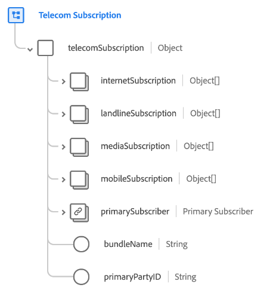
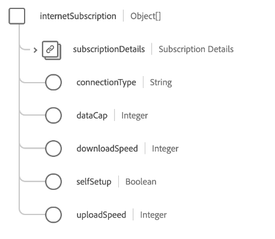
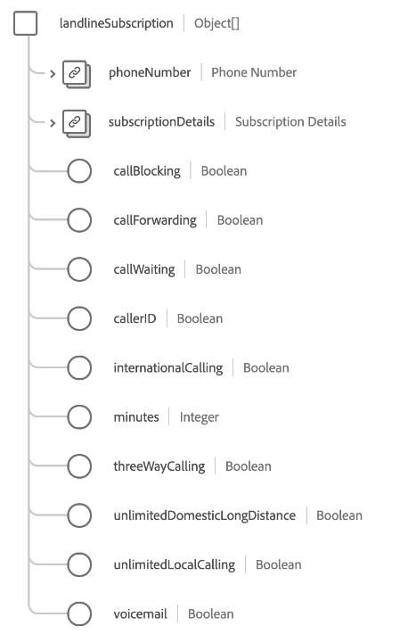
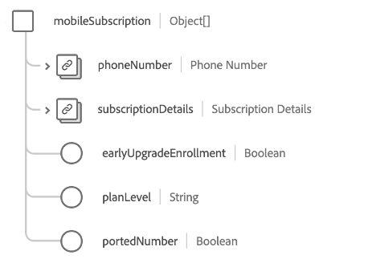

# [!UICONTROL Telecom Subscription] schema field group

>[!NOTE]
>
>The names of several schema field groups have changed. See the document on [field group name updates](../name-updates.md) for more information.

[!UICONTROL Telecom Subscription] is a standard schema field group for the [[!DNL XDM Individual Profile] class](../../classes/individual-profile.md) which describes a customer's telecom subscription plan, including pricing, packages, and individual product subscriptions.

The field group provides a single object-type field, `telecomSubscription`, whose properties are described below.

| Property | Data type | Description |
| --- | --- | --- |
| `internetSubscription` | Array of objects | Describes internet subscription plan details such as data cap, connection type, and speed details. See the [section below](#internetSubscription) for more information. |
| `landlineSubscription` | Array of objects | Describes landline subscription plan details, including selected features, minutes, and dialing plans. See the [section below](#landlineSubscription) for more information. |
| `mediaSubscription` | Array of objects | Describes media subscription plan details, including the number of channels and included streaming services. See the [section below](#mediaSubscription) for more information. |
| `mobileSubscription` | Array of objects | Describes mobile subscription plan details, including the number of lines, data rates, cost, and more. See the [section below](#mobileSubscription) for more information. |
| `primarySubscriber` | [[!UICONTROL Person]](../../data-types/person.md) | Describes the owner of the subscription.|
| `bundleName` | String | Captures the name of any type of subscription bundle in which the customer is enrolled, such as `Internet + Media`. |
| `primaryPartyID` | String | An identifier for the primary person responsible for the subscription, which typically could be their device phone number. |

{style="table-layout:auto"}

For more details on the field group, refer to the public XDM repository:

* [Populated example](https://github.com/adobe/xdm/blob/master/components/fieldgroups/profile/profile-personal-details.example.1.json)
* [Full schema](https://github.com/adobe/xdm/blob/master/components/fieldgroups/profile/profile-personal-details.schema.json)

## `internetSubscription` {#internetSubscription}

`internetSubscription` is provided as an array of objects. The structure of each object is described below.

| Property | Data type | Description |
| --- | --- | --- |
| `subscriptionDetails` | [[!UICONTROL Telecom Subscription]](../../data-types/telecom-subscription.md) | Describes general details about the subscription, including subscription length, fees, status, and more. Describes general details about the subscription, including subscription length, fees, status, and more. |
| `connectionType` | String | The connection type for the subscription. |
| `dataCap` | Integer | The data cap limit for the account, in megabytes (MB). |
| `downloadSpeed` | Integer | The maximum download speed available for the subscription, in megabytes (MB). |
| `selfSetup` | Boolean | Indicates whether a customer is eligible for internet setup without a visit from a technician. |
| `uploadSpeed` | Integer | The maximum upload speed available for the subscription, in megabytes (MB). |

{style="table-layout:auto"}

## `landlineSubscription` {#landlineSubscription}

`landlineSubscription` is provided as an array of objects. The structure of each object is described below.

| Property | Data type | Description |
| --- | --- | --- |
| `phoneNumber` | [[!UICONTROL Phone Number]](../../data-types/telecom-subscription.md) | The phone number assigned to this subscription. |
| `subscriptionDetails` | [[!UICONTROL Telecom Subscription]](../../data-types/telecom-subscription.md) | Describes general details about the subscription, including subscription length, fees, status, and more. |
| `callBlocking` | Boolean | Indicates whether the landline subscription features include call blocking. |
| `callForwarding` | Boolean | Indicates whether the landline subscription features include call forwarding. |
| `callWaiting` | Boolean | Indicates whether the landline subscription features include call waiting. |
| `callerID` | Boolean | Indicates whether the landline subscription features include caller ID. |
| `internationalCalling` | Boolean | Indicates whether the landline subscription features include international calling. |
| `minutes` | Integer | The number of monthly minutes available within the subscription. |
| `threeWayCalling` | Boolean | Indicates whether the landline subscription features include three-way calling. |
| `unlimitedDomesticLongDistance` | Boolean | Indicates whether the landline subscription features include unlimited domestic long-distance calling. |
| `unlimitedLocalCalling` | Boolean | Indicates whether the landline subscription features include unlimited local calling. |
| `voicemail` | Boolean | Indicates whether the landline subscription features include voicemail. |

{style="table-layout:auto"}

## `mediaSubscription` {#mediaSubscription}

`mediaSubscription` is provided as an array of objects. The structure of each object is described below.

| Property | Data type | Description |
| --- | --- | --- |
| `streamingServices` | Array of Objects | A list of all streaming services included with the subscription. Each array item includes the following properties: <ul><li>`promotionLength`: The length of the promotion, in months, if the streaming service was added as part of a promotion.</li><li>`promotionalAddition`: Indicates whether the streaming service was added as part of a promotion.</li><li>`serviceName`: The name of the streaming service.</li></ul> |
| `subscriptionDetails` | [[!UICONTROL Telecom Subscription]](../../data-types/telecom-subscription.md) | Describes general details about the subscription, including subscription length, fees, status, and more. |
| `channels` | Integer | The number of channels included with the media subscription. |

{style="table-layout:auto"}

## `mobileSubscription` {#mobileSubscription}

`mobileSubscription` is provided as an array of objects. The structure of each object is described below.

| Property | Data type | Description |
| --- | --- | --- |
| `phoneNumber` | [[!UICONTROL Phone Number]](../../data-types/telecom-subscription.md) | The phone number assigned to this subscription. |
| `subscriptionDetails` | [[!UICONTROL Telecom Subscription]](../../data-types/telecom-subscription.md) | Describes general details about the subscription, including subscription length, fees, status, and more. |
| `earlyUpgradeEnrollment` | Boolean | Indicates whether the customer opts in for early upgrades. |
| `planLevel` | String | The name of the mobile plan assigned to this subscription. |
| `portedNumber` | Boolean | Indicates whether the customer ports their number from another carrier. |

{style="table-layout:auto"}
