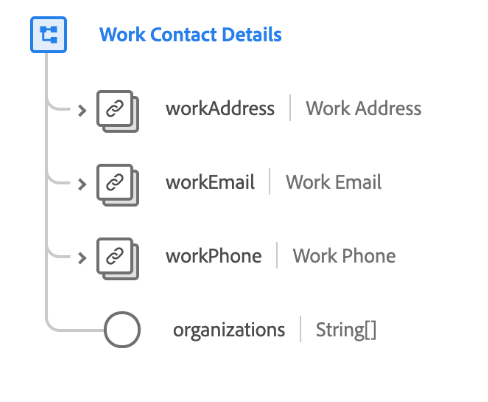

# [!UICONTROL Work Contact Details] schema field group

>[!NOTE]
>
>The names of several schema field groups have changed. See the document on [field group name updates](../name-updates.md) for more information.

[!UICONTROL Work Contact Details] is a standard schema field group for the [[!DNL XDM Individual Profile] class](../../classes/individual-profile.md). The field group provides several fields that capture occupational information regarding an individual person, such as work address, work email, work phone number, and organizations to which the person belongs.

| Property | Data type | Description |
| --- | --- | --- |
| `workAddress` | [Postal address](../../data-types/postal-address.md) | Describes the person's work address. |
| `workEmail` | [Email address](../../data-types/email-address.md) | Describes the person's work email address. |
| `workPhone` | [Phone number](../../data-types/phone-number.md) | Describes the person's work phone number. |
| `organizations` | String (Array) | An array of free-form strings that represent the organizations the person is a member of. |

{style="table-layout:auto"}

For more details on the field group, refer to the public XDM repository:

* [Populated example](https://github.com/adobe/xdm/blob/master/components/fieldgroups/profile/profile-work-details.example.1.json)
* [Full schema](https://github.com/adobe/xdm/blob/master/components/fieldgroups/profile/profile-work-details.schema.json)
