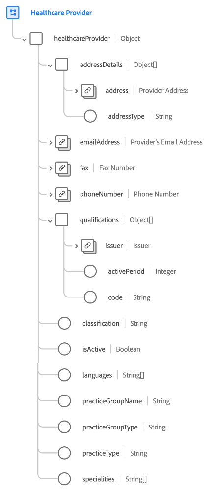

# [!UICONTROL Healthcare Provider] schema field group

[!UICONTROL Healthcare Provider] is a standard schema field group for the [[!UICONTROL Provider] class](../../classes/provider.md). It provides a single object-type field `healthcareProvider` which captures properties related to an individual health professional or a health facility organization licensed to provide health care diagnosis and treatment services.

| Property | Data type | Description |
| --- | --- | --- |
| `addressDetails` | Array of objects | Lists the address details for the provider. Each object includes the following properties: <ul><li>`address`: ([[!UICONTROL Postal address]](../../data-types/postal-address.md)): The postal address for the provider.</li><li>`addressType`: (String) The type of address, indicating where the provider provides services.</li></ul> |
| `emailAddress` | [[!UICONTROL Email address]](../../data-types/email-address.md) | The provider's email address. |
| `fax` | [[!UICONTROL Phone number]](../../data-types/phone-number.md) | The provider's fax number. |
| `phoneNumber` | [[!UICONTROL Phone number]](../../data-types/phone-number.md) | The provider's phone number. |
| `qualifications` | Array of objects | Lists the certifications, licenses, or training pertaining to the provision of care. Each object includes the following properties: <ul><li>`issuer`: ([[!UICONTROL Account details]](../../data-types/account-details.md)): The organization that regulates and issues the qualification.</li><li>`activePeriod`: (Integer) The year until which the qualification is valid.</li><li>`code`: (String) A coded representation of the qualification.</li></ul> |
| `classification` | String | The service provider classification based on class or category (such as patient care, non patient care, and so on). |
| `isActive` | Boolean | Indicates whether the provider is active. |
| `languages` | Array of strings | A list of languages that the provider conducts operations under. |
| `practiceGroupName` | String | The practice group name for the service provider. |
| `practiceGroupType` | String | The practice group type for the service provider. |
| `practiceType` | String | The practice type for the service provider. |
| `specialties` | Array of strings | A list of specialties offered by this provider. |

{style="table-layout:auto"}

For more details on the field group, refer to the [public XDM repository](https://github.com/adobe/xdm/blob/master/components/fieldgroups/provider/healthcare-provider-details.schema.json).
