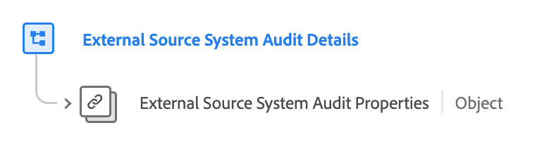

# [!UICONTROL External Source System Audit Details] field group

[!UICONTROL External Source System Audit Details] is a standard Experience Data Model (XDM) field group that extends the core 'External Source System Audit Attributes' data type by referencing its properties and adding contextual metadata. This allows for detailed audit tracking and flexible data integration from external sources.

| Display name                                     | Property                                 | Data type | Description                      | 
| -------------------------------------------------| ---------------------------------------- | --------- | --- |
| [!UICONTROL External Source System Audit Details] |  `external-source-system-audit-details`  | [[!UICONTROL External Source System Audit Attributes]](../../data-types/external-source-system-audit-attributes.md)  |  The '[!UICONTROL External Source System Audit Details]' field group extends the core 'External Source System Audit Attributes' data type by referencing its properties and adding contextual metadata. This facilitates detailed audit tracking and flexible data integration for external sources, accommodating the asynchronous nature of profile ingestion.  |

{style="table-layout:auto"}

For more details on the data type, refer to the public XDM repository:

* [Full schema](https://github.com/adobe/xdm/blob/master/docs/reference/fieldgroups/shared/external-source-system-audit-details.schema.json)
