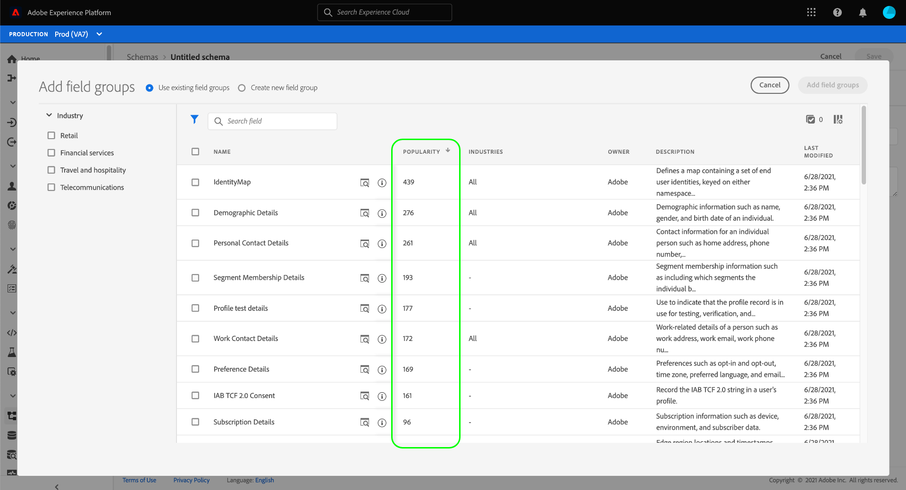
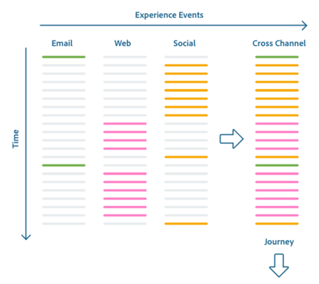

# XDM System overview

Standardization and interoperability are key concepts behind Adobe Experience Platform. [!DNL Experience Data Model] (XDM), driven by Adobe, is an effort to standardize customer experience data and define schemas for customer experience management. 

XDM is a publicly documented specification designed to improve the power of digital experiences. It provides common structures and definitions that allow any application to use to communicate with Platform services. By adhering to XDM standards, all customer experience data can be incorporated into a common representation that can deliver insights in a faster, more integrated way. You can gain valuable insights from customer actions, define customer audiences through segments, and express customer attributes for personalization purposes.

XDM is the foundational framework that allows Adobe Experience Cloud, powered by Experience Platform, to deliver the right message to the right person, on the right channel, at exactly the right moment. The methodology on which Experience Platform is built, XDM System, operationalizes [!DNL Experience Data Model] schemas for use by Platform services.

This document provides an overview of the role of XDM System within Experience Platform.

## XDM schemas

Experience Platform uses schemas to describe the structure of data in a consistent and reusable way. By defining data consistently across systems, it becomes easier to retain meaning and therefore gain value from data.

Before data can be ingested into Platform, a schema must be composed to describe the data's structure and provide constraints to the type of data that can be contained within each field. Schemas consist of a base class and zero or more schema field groups.

For more information on the schema composition model, including design principles and best practices, see the [basics of schema composition](schema/composition.md).

### Standard XDM components

XDM provides a robust collection of standard field groups and data types, which are intended to capture common concepts and use cases across different industries. Experience Platform allows you to filter these components by industry, enabling you to quickly and confidently construct schemas that best support your particular business needs.

When constructing schemas in the Experience Platform UI, listed field groups are shown with a popularity metric. This metric is determined by how often other Platform users employ the field group in their schemas. The higher the number, the more popular the field group. By default, results are displayed from most popular to least popular, keeping you informed of data modeling trends in your industry.

### [!DNL Schema Library]

Experience Platform provides a user interface and RESTful API from which you can view and manage all schema-related resources in the Experience Platform **[!DNL Schema Library]**. The [!DNL Schema Library] contains standard XDM components made available to you by Adobe, as well as resources from Experience Platform partners and vendors whose applications you use.

Using the [!DNL Schema Registry API] or the [!UICONTROL Schemas] workspace in the Platform UI, you can also create and manage new schemas and resources that are unique to your organization.

For more information on how to manage and interact with schemas in Platform, refer to the following documentation:

* [XDM UI guide](./ui/overview.md)
* [Schema Registry API guide](./api/overview.md)

## Data behaviors in XDM System {#data-behaviors}

>[!CONTEXTUALHELP]
>id="platform_schemas_behavior"
>title="Data behaviors"
>abstract="Data intended for use in Experience Platform is grouped into three behavior types: record, time-series, and ad hoc. Record schemas provide information about the attributes of a subject, while time-series schemas capture a snapshot of the system at the time an action was taken. Ad hoc schemas capture fields that are namespaces for use only by a single dataset. See the documentation for more information on data behaviors in Platform."

Data intended for use in Experience Platform is grouped into three behavior types:

* **Record**: Provides information about the attributes of a subject. A subject could be an organization or an individual.
* **Time-series**: Provides a snapshot of the system at the time an action was taken either directly or indirectly by a record subject.
* **Ad-hoc**: Captures fields that are namespaced for usage only by a single dataset. Ad-hoc schemas are used in various data ingestion workflows for Experience Platform, including ingesting CSV files and creating certain kinds of source connections.

All XDM schemas describe data that can be categorized as record or time series. The data behavior of a schema is defined by the schema's class, which is assigned to a schema when it is first created. XDM classes describe the smallest number of properties a schema must contain in order to represent a particular data behavior.

Although you are able to define your own classes within the [!DNL Schema Registry], it is recommended that you use the standard classes **[!UICONTROL XDM Individual Profile]** and **[!UICONTROL XDM ExperienceEvent]** for record and time-series data, respectively. These classes are outlined in more detail below.

>[!NOTE]
>
>There are no standard classes based on the ad-hoc behavior. Ad-hoc schemas are automatically generated by the Platform processes that utilize them, but they can also be [manually created using the Schema Registry API](./tutorials/ad-hoc.md).

### [!UICONTROL XDM Individual Profile] {#xdm-individual-profile}

[!UICONTROL XDM Individual Profile] is a record-based class that forms a singular representation of the attributes of both identified and partially-identified subjects. Profiles that are highly identified may be used for personal communications or targeted engagements, and can contain detailed personal information such as name, gender, date of birth, location, and contact information including phone numbers and email addresses. 

Less-identified profiles may consist only of anonymous behavioral signals like browser cookies. In this case, the sparse profile data is used to build an information base into which the interests and preferences of the anonymous profile are collated and stored. These identifiers may become more detailed over time as the subject signs up for notifications, subscriptions, purchases, and so on. This increase in profile attributes may eventually result in an identified subject and allow for a higher degree of targeted engagement. 

As a profile continues to grow, it becomes a robust repository of an individual's personal information, identification information, contact details, and communication preferences.

See the [[!UICONTROL XDM Individual Profile] reference guide](./classes/individual-profile.md) for more information on the structure and use-case of the fields provided by the class.

### [!UICONTROL XDM ExperienceEvent] {#xdm-experience-event}

XDM ExperienceEvent is a time-series-based class used to capture the state of the system when an event (or set of events) occurred, including the point in time and identity of the subject involved. Experience Events are immutable, factual records of what occurred at that point in time, representing what happened without aggregation or interpretation. They are critical for time-domain analytics as they can be used to analyze changes that occur in a given window of time, and to compare between multiple windows of time to track trends.

Experience Events can be either explicit or implicit. Explicit events are directly observable human actions taking place during a point in a journey. Implicit events are events that are raised without a direct human action, but still relate to an individual. Examples of implicit events can include the scheduled sending of email newsletters or battery voltage reaching a certain threshold.

While not all events are easily categorized across all data sources, it is extremely valuable to harmonize similar events into similar types where possible for processing. 

See the [[!UICONTROL XDM ExperienceEvent] reference guide](./classes/experienceevent.md) for more information on the structure and use-case of the fields provided by the class.

## XDM schemas and Experience Platform services

Experience Platform is schema-agnostic, meaning that any schema that conforms to the XDM standard is made available to Platform services. The ways in which different Platform services use schemas are outlined in more detail below.

### Catalog Service, Data Ingestion, and Data Lake

Catalog Service is the system of record for Experience Platform assets and their related schemas. Catalog does not contain the actual data files or directories, but rather it holds the metadata and descriptions of those files and directories.

Catalog data is stored in the Data Lake, a highly granular data store containing all data managed by Platform, regardless of origin or file format. 

To begin ingesting data into Experience Platform, you can use Catalog Service to create a dataset. The dataset references an XDM schema that describes the structure of the data to be ingested. If a dataset is created without a schema, Experience Platform derives an "observed schema" by inspecting the type and content of ingested data fields. Datasets are then tracked in Catalog and stored in the Data Lake alongside the schemas and observed schemas on which they are based. 

For more information on Catalog, see the [Catalog Service overview](../catalog/home.md). For more information on Adobe Experience Platform Data Ingestion, see the [Data Ingestion overview](../ingestion/home.md).

### Query Service

Adobe Experience Platform Query Service allows you to use standard SQL to query Experience Platform data to support many different use cases. 

After a schema has been composed and a dataset has been created which references that schema, data is then ingested and stored in the Data Lake. Using Query Service, you can join any datasets in the Data Lake and capture the query results as a new dataset for use in reporting, machine learning, or for ingestion into Real-Time Customer Profile. 

Refer to the [Query Service overview](../query-service/home.md) for more information on the service.

### Real-Time Customer Profile

Real-Time Customer Profile provides a centralized consumer profile for targeted and personalized experience management. Each profile contains data that is aggregated across all systems, as well as actionable timestamped accounts of events involving the individual that have taken place in any of the systems you use with Experience Platform.

Real-Time Customer Profile consumes schema-formatted data based on the [!UICONTROL XDM Individual Profile] and [!UICONTROL XDM ExperienceEvent] classes, and responds to queries based on that data. Profile does not support the use of schemas based on other classes.

The system maintains an instance of each customer profile, merging data together to form a "single source of truth" for the individual. This unified data is represented using what is known as a "union schema" (sometimes referred to as a "union view"). A union schema aggregates the fields of all schemas that implement the same class into a single schema.  When composing a schema using the UI or API, you can enable the schema for use with Real-Time Customer Profile and tag it for inclusion in the union. The tagged schema will then participate in the schema definition being fed to Profile.

As [!UICONTROL XDM Individual Profile] and [!UICONTROL XDM ExperienceEvent] data is ingested into the Data Lake, Real-Time Customer Profile ingests any data that has been enabled for its use. The more interactions and details that are ingested, the more robust individual profiles become.

[!UICONTROL XDM Individual Profile] data helps inform and empower actions across any channel or Adobe product integration. When paired with a rich history of behavioral and interaction data, this data can be used to power machine learning. The Real-Time Customer Profile API can also be used to enrich the functionality of third-party solutions, CRMs, and proprietary solutions.

See the [Real-Time Customer Profile overview](../profile/home.md) for more information.

### Data Science Workspace

Adobe Experience Platform Data Science Workspace uses machine learning and artificial intelligence to gain insights from data stored within Experience Platform. Data Science Workspace allows data scientists to build recipes based on [!UICONTROL XDM Individual Profile] and [!UICONTROL XDM ExperienceEvent] data about customers and their activities, facilitating predictions such as buying propensity and recommended offers that the individual is likely to appreciate and use.

With Data Science Workspace, data scientists can easily create intelligent service APIs powered by machine learning. These services work with other Adobe solutions, including Adobe Target and Adobe Analytics Cloud, to help you automate personalized, targeted digital experiences.

For more information on using Experience Platform data to power insights, see the [Data Science Workspace overview](../data-science-workspace/home.md).

## Next steps and additional resources

Now that you better understand the role of schemas throughout Experience Platform, you are ready to start composing your own.

To learn design principles and best practices for composing schemas to be used with Experience Platform, begin by reading the [basics of schema composition](schema/composition.md). For step-by-step instructions on how to create a schema, see the tutorials on creating a schema [using the API](tutorials/create-schema-api.md) or [using the user interface](tutorials/create-schema-ui.md).

To reinforce your understanding of [!DNL XDM System] in Experience Platform, watch the following video:

>[!VIDEO](https://video.tv.adobe.com/v/27105?quality=12&learn=on)
