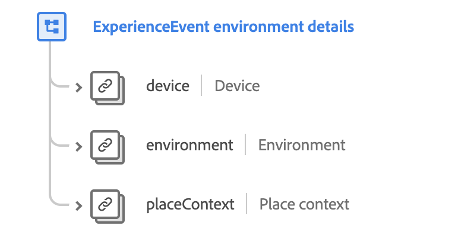

# [!UICONTROL Environment Details] mixin

>[!NOTE]
>
>The names of several mixins have changed. See the document on [mixin name updates](../name-updates.md) for more information.

[!UICONTROL Environment Details] is a standard mixin for the [[!DNL XDM ExperienceEvent] class](../../classes/individual-profile.md) used to capture information regarding environment details related to an Experience Event such as device details, browser information, local time, and other geographical information.

 

| Property | Data type | Description |
| --- | --- | --- |
| `device` | [Device](../../data-types/device.md)  | Describes an identified device, application or device browser instance that is trackable across sessions, normally by cookies. |
| `environment` | [Environment](../../data-types/environment.md) | Describes information about the situational context of the event observation, specifically detailing transitory information such as the network or software versions. |
| `placeContext` | [Place context](../../data-types/place-context.md) | Describes the transient circumstances related to the event observation. Examples include locale-specific information such as weather, local time, traffic, day of the week, workday vs. holiday, and working hours. |

For more details on the mixin, refer to the public XDM repository:

* [Populated example](https://github.com/adobe/xdm/blob/master/components/mixins/experience-event/experienceevent-environment-details.example.1.json)
* [Full schema](https://github.com/adobe/xdm/blob/master/components/mixins/experience-event/experienceevent-environment-details.schema.json)
