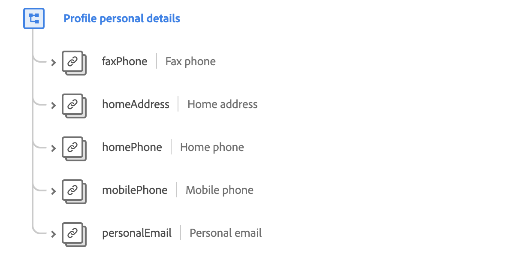

# [!UICONTROL Profile personal details] mixin

[!UICONTROL Profile personal details] is a standard mixin for the [[!DNL XDM Individual Profile] class](../../classes/individual-profile.md). The mixin provides a root-level `person` object, whose sub-fields describe contact information about an individual person.

 

| Property | Data type | Description |
| --- | --- | --- |
| `faxPhone` | [Phone number](../../data-types/phone-number.md) | Describes the person's fax number. |
| `homeAddress` | [Postal address](../../data-types/postal-address.md) | Describes the person's residential address. |
| `homePhone` | [Phone number](../../data-types/phone-number.md) | Describes the person's home phone number. |
| `mobilePhone` | [Phone number](../../data-types/phone-number.md) | Describes the person's mobile phone number. |
| `personalEmail` | [Email address](../../data-types/email-address.md) | Describes the person's email address. |

For more details on the mixin, refer to the public XDM repository:

* [Populated example](https://github.com/adobe/xdm/blob/master/components/mixins/profile/profile-personal-details.example.1.json)
* [Full schema](https://github.com/adobe/xdm/blob/master/components/mixins/profile/profile-personal-details.schema.json)
