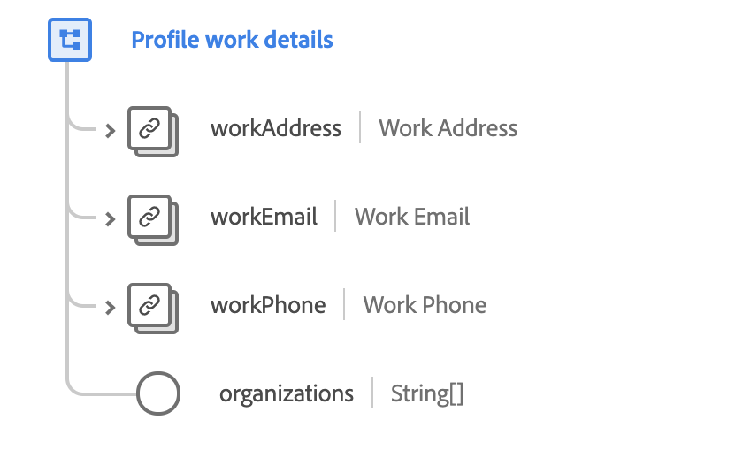

# [!UICONTROL Profile work details] mixin

[!UICONTROL Profile work details] is a standard mixin for the [[!DNL XDM Individual Profile] class](../../classes/individual-profile.md). The mixin provides several fields that capture occupational information regarding an individual person, such as work address, work email, work phone number, and organizations to which the person belongs.

 

| Property | Data type | Description |
| --- | --- | --- |
| `workAddress` | [Postal address](../../data-types/postal-address.md) | Describes the person's work address. |
| `workEmail` | [Email address](../../data-types/email-address.md) | Describes the person's work email address. |
| `workPhone` | [Phone number](../../data-types/phone-number.md) | Describes the person's work phone number. |
| `organizations` | String (Array) | An array of free-form strings that represent the organizations the person is a member of. |

For more details on the mixin, refer to the public XDM repository:

* [Populated example](https://github.com/adobe/xdm/blob/master/components/mixins/profile/profile-work-details.example.1.json)
* [Full schema](https://github.com/adobe/xdm/blob/master/components/mixins/profile/profile-work-details.schema.json)