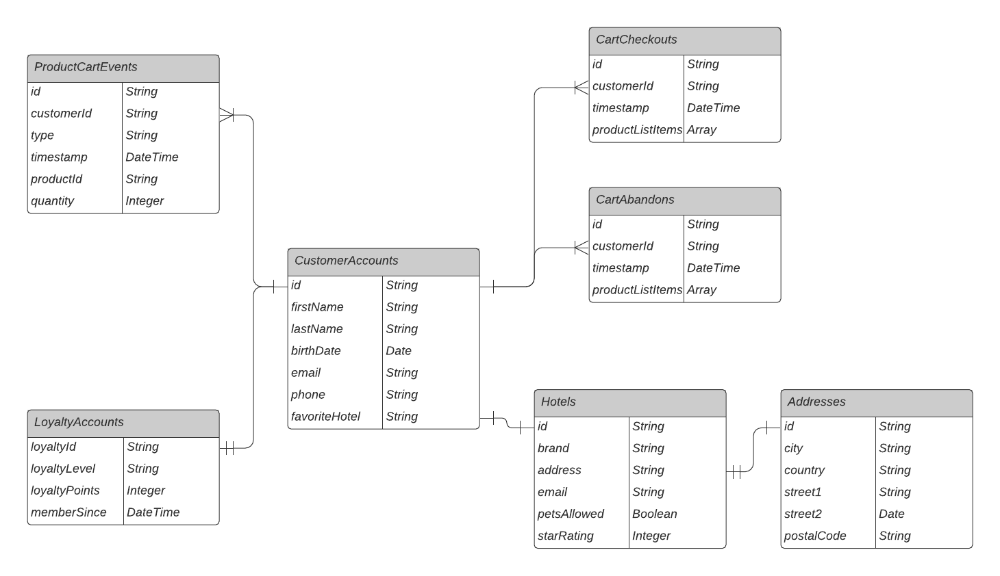
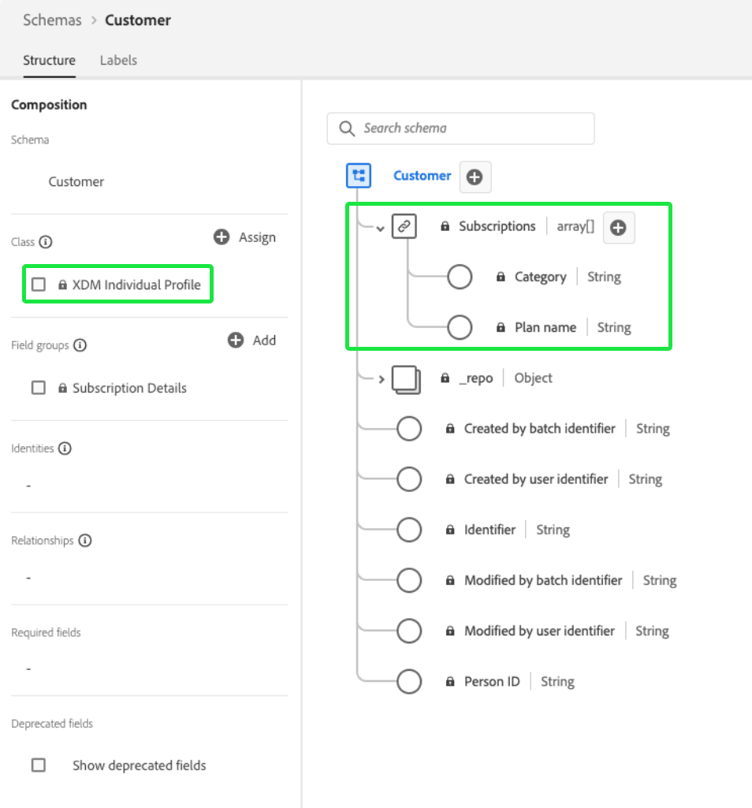
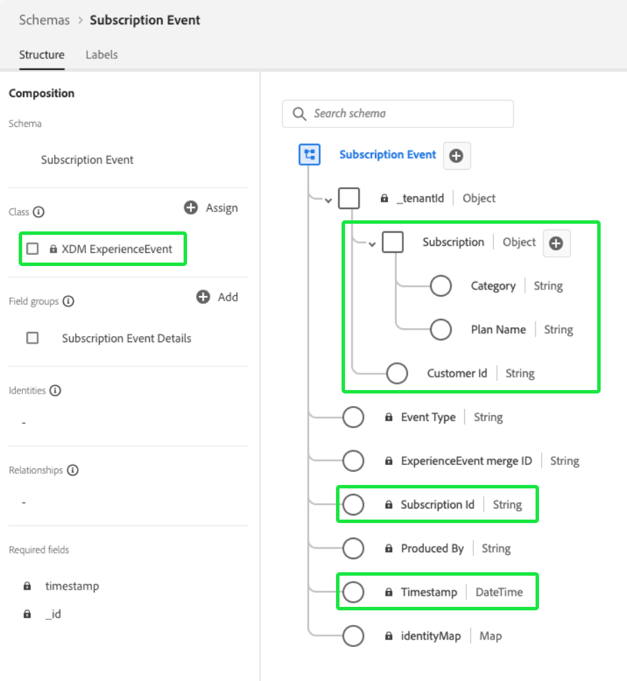
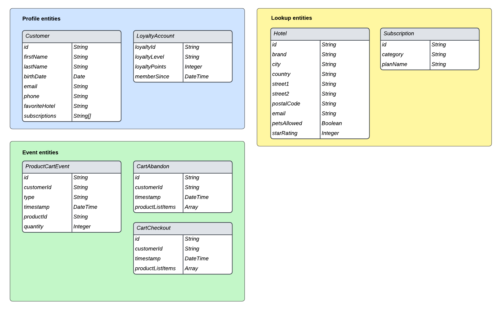
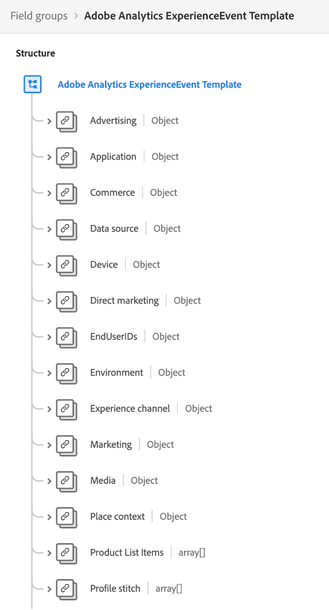

# Best practices for data modeling

[!DNL Experience Data Model] (XDM) is the core framework that standardizes customer experience data by providing common structures and definitions for use in downstream Adobe Experience Platform services. By adhering to XDM standards, all customer experience data can be incorporated into a common representation that allows you to gain valuable insights from customer actions, define customer audiences through segments, and express customer attributes for personalization purposes.

Since XDM is extremely versatile and customizable by design, it is therefore important to follow best practices for data modeling when designing your schemas. This document covers the key decisions and considerations you must make when mapping your customer experience data to XDM.

## Getting started

Before reading this guide, please review the [XDM System overview](../home.md) for a high-level introduction to XDM and its role within Experience Platform.

Additionally, this guide focuses exclusively on key considerations regarding schema design. It is therefore strongly recommended that you refer to the [basics of schema composition](./composition.md) for detailed explanations of the individual schema elements mentioned throughout this guide.

## Best practices summary

The recommended approach for designing your data model for use in Experience Platform can be summarized as follows:

1. Understand the business use cases for your data.
1. Identify the primary data sources that should be brought into [!DNL Platform] to address those use cases.
1. Identify any secondary data sources that could also be of interest. For example, if currently only one business unit in your organization is interested in porting their data to [!DNL Platform], a similar business unit might also be interested in porting similar data in the future. Considering these secondary sources helps standardize the data model across your entire organization.
1. Create a high-level entity relationship diagram (ERD) for the data sources that have been identified.
1. Convert the high-level ERD into a [!DNL Platform]-centric ERD (including profiles, Experience Events, and lookup entities).

The steps related to identifying the applicable data sources required to carry out your business use cases will vary from organization to organization. While the remainder of sections throughout this document focus on the latter steps of organizing and constructing an ERD after the data sources have been identified, the explanations of the diagram's various components may inform your decisions as to which of your data sources should be migrated to [!DNL Platform].

## Create a high-level ERD

Once you have determined the data sources you wish to bring into [!DNL Platform], create a high-level ERD to help guide the process of mapping your data to XDM schemas.

The example below represents a simplified ERD for a company who wants to bring data into [!DNL Platform]. The diagram highlights the essential entities that should be sorted into XDM classes, including customer accounts, hotels, addresses, and several common e-commerce events.

## Sort entities into profile, lookup, and event categories

Once you have created an ERD to identify the essential entities you would like to bring into [!DNL Platform], these entities must be sorted into profile, lookup, and event categories:

| Category | Description |
| --- | --- |
| Profile entities | Profile entities represent attributes relating to an individual person, typically a customer. Entities that fall under this category should be represented by schemas based on the **[!DNL XDM Individual Profile] class**. |
| Lookup entities | Lookup entities represent concepts that can relate to an individual person, but cannot be directly used to identify the individual. Entities that fall under this category should be represented by schemas based on **custom classes**, and are linked to profiles and events through [schema relationships](../tutorials/relationship-ui.md). |
| Event entities | Event entities represent concepts related to actions a customer can take, system events, or any other concept where you may want to track changes over time. Entities that fall under this category should be represented by schemas based on the **[!DNL XDM ExperienceEvent] class**. |

{style="table-layout:auto"}

### Considerations for entity sorting

The sections below provide further guidance for how to sort your entities into the above categories.

#### Mutable and immutable data

A primary way of sorting between entity categories is whether the data being captured is mutable or not.

Attributes belonging to profiles or lookup entities are typically mutable. For example, a customer's preferences might change over time, and the parameters of a subscription plan can be updated depending on market trends.

By contrast, event data is typically immutable. Since events are attached to a specific timestamp, the "system snapshot" that an event provides does not change. For example, an event can capture a customer's preferences when they checkout a cart, and does not change even if the customer's preferences end up changing later on. Event data cannot be changed after it has been recorded.

To summarize, profiles and lookup entities contain mutable attributes and represent the most current information about the subjects they capture, while events are immutable records of the system at a specific time.

#### Customer attributes

If an entity contains any attributes related to an individual customer, it is most likely a profile entity. Examples of customer attributes include:

* Personal details such as name, birth date, gender, and account ID(s).
* Location information such as addresses and GPS information.
* Contact information such as phone numbers and email addresses.

#### Tracking data over time

If you want to analyze how certain attributes within an entity change over time, it is most likely an event entity. For example, adding product items to a cart can be tracked as add-to-cart events in [!DNL Platform]:

| Customer ID | Type | Product ID | Quantity | Timestamp |
| --- | --- | --- | --- | --- |
| 1234567 | Add | 275098 | 2 | Oct 1, 10:32 AM |
| 1234567 | Remove | 275098 | 1 | Oct 1, 10:33 AM |
| 1234567 | Add | 486502 | 1 | Oct 1, 10:41 AM |
| 1234567 | Add | 910482 | 5 | Oct 3, 2:15 PM |

{style="table-layout:auto"}

#### Segmentation use cases

When categorizing your entities, it is important to think about the audience segments you may want to build to address your particular business use cases.

For example, a company wants to know all of the "Gold" or "Platinum" members of their loyalty program that have made more than five purchases in the last year. Based on this segment logic, the following conclusions can be made regarding how relevant entities should be represented:

* "Gold" and "Platinum" represent loyalty statuses applicable to an individual customer. Since the segment logic is only concerned with the current loyalty status of customers, this data can be modeled as part of a profile schema. If you wished to track changes in loyalty status over time, you could also create an additional event schema for loyalty status changes.
* Purchases are events which occur at a particular time, and the segment logic is concerned with purchase events within a specified time window. This data should therefore be modeled as an event schema.

#### Activation use cases

In addition to considerations regarding segmentation use cases, you should also review the activation use cases for those segments in order to identify additional relevant attributes.

For example, a company has built an audience segment based on the rule that `country = US`. Then, when activating that segment to certain downstream targets, the company wants to filter all exported profiles based on home state. Therefore, a `state` attribute should also be captured in the applicable profile entity.

#### Aggregated values

Based on the use case and granularity of your data, you should decide whether certain values need to be pre-aggregated before being included in a profile or event entity.

For example, a company wants to build a segment based on the number of cart purchases. You can choose to incorporate this data at the lowest granularity by including each timestamped purchase event as its own entity. However, this can sometimes increase the number of recorded events exponentially. To reduce the number of ingested events, you can choose to create an aggregate value `numberOfPurchases` over a weeklong or monthlong period. Other aggregate functions like MIN and MAX can also apply to these situations.

>[!CAUTION]
>
>Experience Platform does not currently perform automatic value aggregation, although this is planned for future releases. If you choose to use aggregated values, you must perform the calculations externally before sending the data to [!DNL Platform].

#### Cardinality

The cardinalities established in your ERD can also provide some clues as to how to categorize your entities. If there is a one-to-many relationship between two entities, the entity that represents the "many" will likely be an event entity. However, there are also cases where the "many" is a set of lookup entities that are provided as an array within a profile entity.

>[!NOTE]
>
>Since there is no universal approach to fit all use cases, it is important to consider the pros and cons of each situation when categorizing entities based on cardinality. See the [next section](#pros-and-cons) for more information.

The following table outlines some common entity relationships and the categories that can be derived from them:

| Relationship | Cardinality | Entity categories |
| --- | --- | --- |
| Customers and Cart Checkouts | One to many | A single customer may have many cart checkouts, which are events that can be tracked over time. Customers would therefore be a profile entity, while Cart Checkouts would be an event entity. |
| Customers and Loyalty Accounts | One to one | A single customer can only have one loyalty account, and vice versa. Since the relationship is one-to-one, both Customers and Loyalty Accounts represent profile entities. |
| Customers and Subscriptions | One to many | A single customer may have many subscriptions. Since the company is only concerned with a customer's current subscriptions, Customers is a profile entity, while Subscriptions is a lookup entity. |

{style="table-layout:auto"}

### Pros and cons of different entity classes {#pros-and-cons}

While the previous section provided some general guidelines for deciding how to categorize your entities, it is important to understand that there can often be pros and cons for choosing one entity category over another. The following case study is intended to illustrate how you might consider your options in these situations.

A company tracks active subscriptions for their customers, where one customer can have many subscriptions. The company also wants to include subscriptions for segmentation use cases, such as finding all users with active subscriptions.

In this scenario, the company has two potential options for representing a customer's subscriptions in their data model:

1. [Use profile attributes](#profile-approach)
1. [Use event entities](#event-approach)

#### Approach 1: Use profile attributes {#profile-approach}

The first approach would be to include an array of subscriptions as attributes within the profile entity for Customers. Objects in this array would contain fields for `category`, `status`, `planName`, `startDate`, and `endDate`.

 

**Pros**

* Segmentation is feasible for the intended use case.
* The schema will only preserve the latest subscription records for a customer.

**Cons**

* The entire array must be restated every time changes occur to any field in the array.
* If different data sources or business units are feeding data into the array, it will become challenging to keep the latest updated array synced across all channels.

#### Approach 2: Use event entities {#event-approach}

The second approach would be to use event schemas to represent subscriptions. This entails ingesting the same subscription fields as the first approach, with addition of a subscription ID, a customer ID, and a timestamp of when the subscription event occurred.

 

**Pros**

* Segmentation rules can be more flexible (such as finding all customers those who changed their subscriptions in the last 30 days).
* When a customer's subscription status changes, you no longer have to update a long, potentially complex array within the customer's profile attributes. This is especially useful if simultaneous changes to the customer's subscription list are occurring from multiple sources.

**Cons**

* Segmentation becomes more complex for the original intended use case (identifying the status of customers' most recent subscriptions). The segment now needs additional logic to flag the last subscription event for a customer in order to check its status.
* Events have a higher risk of automatically expiring and being purged from the Profile store. See the guide on [Experience Event expirations](../../profile/event-expirations.md) for more information.

## Create schemas based on your categorized entities

Once you have sorted your entities into profile, lookup, and event categories, you can start converting your data model into XDM schemas. For demonstration purposes, the example data model shown earlier has been sorted into appropriate categories in the following diagram:

 

The category that an entity has been sorted under should determine the XDM class you base its schema on. To reiterate:

* Profile entities should use the [!DNL XDM Individual Profile] class.
* Event entities should use the [!DNL XDM ExperienceEvent] class.
* Lookup entities should use custom XDM classes defined by your organization. Profile and event entities can then reference these lookup entities through schema relationships.

>[!NOTE]
>
>While event entities will almost always be represented by separate schemas, entities in the profile or lookup categories may be combined together in a single XDM schema, depending on their cardinality.
>
>For example, since the Customers entity has a one-to-one relationship with the LoyaltyAccounts entity, the schema for the Customers entity could also include a `LoyaltyAccount` object to contain the appropriate loyalty fields for each customer. If the relationship is one to many, however, the entity that represents the "many" could be represented by a separate schema or an array of profile attributes, depending on its complexity.

The sections below provide general guidance on constructing schemas based on your ERD.

### Adopt an iterative modeling approach

The [rules of schema evolution](./composition.md#evolution) dictate that only non-destructive changes can be made to schemas once they have been implemented. In other words, once you add a field to a schema and data has been ingested against that field, the field can no longer be removed. It is therefore essential to adopt an iterative modeling approach when you are first creating your schemas, starting with a simplified implementation which progressively gains complexity over time.

If you are not sure whether a particular field is necessary to include in a schema, the best practice is to leave it out. If it is later determined that the field is necessary, it can always be added in the next iteration of the schema.

### Identity fields

In Experience Platform, XDM fields marked as identities are used to stitch together information about individual customers coming from multiple data sources. Although a schema can have multiple fields marked as identities, a single primary identity must be defined in order for the schema to be enabled for use in [!DNL Real-Time Customer Profile]. See the section on [identity fields](./composition.md#identity) in the basics of schema composition for more detailed information on the use case of these fields.

When designing your schemas, any primary keys in your relational database tables will be likely candidates for primary identities. Other examples of applicable identity fields are customer email addresses, phone numbers, account IDs, and [ECID](../../identity-service/ecid.md).

### Adobe application schema field groups

Experience Platform provides several out-of-the-box XDM schema field groups for capturing data related to the following Adobe applications:

* Adobe Analytics
* Adobe Audience Manager
* Adobe Campaign
* Adobe Target

For example, the [[!UICONTROL Adobe Analytics ExperienceEvent Template] field group](https://github.com/adobe/xdm/blob/master/extensions/adobe/experience/analytics/experienceevent-all.schema.json) allows you to map [!DNL Analytics]-specific fields to your XDM schemas. Depending on the Adobe applications you are working with, you should be using these Adobe-provided field groups in your schemas.

 

Adobe application field groups automatically assign a default primary identity through the use of the `identityMap` field, which is a system-generated, read-only object that maps standard identity values for an individual customer.

For Adobe Analytics, ECID is the default primary identity. If an ECID value is not provided by a customer, the primary identity will instead default to AAID.

>[!IMPORTANT]
>
>When using Adobe application field groups, no other fields should be marked as the primary identity. If there are additional properties that need to be marked as identities, these fields need to be assigned as secondary identities instead.

## Next steps

This document covered the general guidelines and best practices for designing your data model for Experience Platform. To summarize:

* Use a top-down approach by sorting your data tables into profile, lookup, and event categories before constructing your schemas.
* There are often multiple approaches and options when it comes to designing schemas for different purposes.
* Your data model should support your business use cases such as segmentation or customer journey analysis.
* Make your schemas as simple as possible, and only add new fields when absolutely necessary.

Once you are ready, see the tutorial on [creating a schema in the UI](../tutorials/create-schema-ui.md) for step-by-step instructions on how to create a schema, assign the appropriate class for the entity, and add fields to map your data to.
