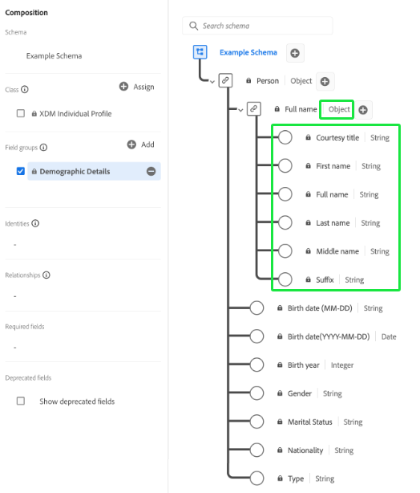

# Basics of schema composition

Learn about Experience Data Model (XDM) schemas and the building blocks, principles, and best practices for composing schemas in Adobe Experience Platform. For general information on XDM and how it is used within [!DNL Platform], see the [XDM System overview](../home.md).

## Understanding schemas {#understanding-schemas}

A schema is a set of rules that represent and validate the structure and format of data. At a high level, schemas provide an abstract definition of a real-world object (such as a person) and outline what data should be included in each instance of that object (such as first name, last name, birthday, and so on).

In addition to describing the structure of data, schemas apply constraints and expectations to data so it can be validated as it moves between systems. These standard definitions allow data to be interpreted consistently, regardless of origin, and remove the need for translation across applications.

Experience Platform maintains this semantic normalization by using schemas. Schemas are the standard way of describing data in Experience Platform, allowing all data that conforms to schemas to be reused across an organization without conflicts, or even shared between multiple organizations.

XDM schemas are ideal for storing vast amounts of complex data in a self-contained format. See the sections on [embedded objects](#embedded) and [big data](#big-data) in the appendix to this document for more information on how XDM accomplishes this.

### Schema-based workflows in Experience Platform {#schema-based-workflows}

Standardization is a key concept behind Experience Platform. XDM, driven by Adobe, is an effort to standardize customer experience data and define standard schemas for customer experience management. 

The infrastructure on which Experience Platform is built, known as [!DNL XDM System], facilitates schema-based workflows and includes the [!DNL Schema Registry], [!DNL Schema Editor], schema metadata, and service consumption patterns. See the [XDM System overview](../home.md) for more information.

There are several key benefits to using schemas in Experience Platform. First, schemas allow for better data governance and data minimization, which is especially important with privacy regulations. Second, building schemas with Adobe's standard components allows for out-of-the-box insights and use of AI/ML services with minimal customizations. Last, schemas provide infrastructure for data sharing insights and efficient orchestration.

## Planning your schema {#planning}

The first step in building a schema is to determine the concept, or real-world object, that you are trying to capture within the schema. Once you identify the concept that you are trying to describe, begin planning your schema by thinking about things like the type of data, potential identity fields, and how the schema may evolve in the future.

### Data behaviors in Experience Platform {#data-behaviors}

Data intended for use in Experience Platform is grouped into two behavior types:

* **Record data**: Provides information about the attributes of a subject. A subject could be an organization or an individual.
* **Time series data**: Provides a snapshot of the system at the time that an action was taken either directly or indirectly by a record subject.

All XDM schemas describe data that can be categorized as record or time series. The data behavior of a schema is defined by the schema's class, which is assigned to a schema when it is first created. XDM classes are described in further detail later in this document.

Both record and time series schemas contain a map of identities (`xdm:identityMap`). This field contains the identity representation of a subject, drawn from fields marked as "Identity" as described in the next section.

### [!UICONTROL Identity] {#identity}

>[!CONTEXTUALHELP]
>id="platform_schemas_identities"
>title="Identities in schemas"
>abstract="Identities are key fields within a schema that can be used to identify a subject, such as an email address or a marketing ID. These fields are used to construct the identity graph for each individual and build customer profiles. See the documentation for more information on identities in schemas."

Schemas are used for ingesting data into Experience Platform. This data can be used across multiple services to create a single, unified view of an individual entity. Therefore, it is important when designing schemas for customer identities to consider which fields can be used to identify a subject, regardless of where the data may be coming from.

To help with this process, key fields within your schemas can be marked as identities. Upon data ingestion, the data in those fields is inserted into the "[!UICONTROL Identity Graph]" for that individual. The graph data can then be accessed by [[!DNL Real-Time Customer Profile]](../../profile/home.md) and other Experience Platform services to provide a stitched-together view of each individual customer.

Fields that are commonly marked as "[!UICONTROL Identity]" include: email address, phone number, [[!DNL Experience Cloud ID (ECID)]](https://experienceleague.adobe.com/docs/id-service/using/home.html), CRM ID, or other unique ID fields. Consider any unique identifiers specific to your organization, as they may be good "[!UICONTROL Identity]" fields as well.

It is important to think about customer identities during the schema planning phase to help ensure that data is being brought together to build the most robust profile possible. To learn more about how identity information can help you deliver digital experiences to your customers, see the [Identity Service overview](../../identity-service/home.md). See the data modelling best practices document for [tips on the use of identities when creating a schema](./best-practices.md#data-validation-fields). 

There are two ways to send identity data to Platform:

1. Adding identity descriptors to individual fields, either through the [Schema Editor UI](../ui/fields/identity.md) or using the [Schema Registry API](../api/descriptors.md#create)
1. Using an [`identityMap` field](#identityMap)

#### `identityMap` {#identityMap}

`identityMap` is a map-type field that describes the various identity values for an individual, along with their associated namespaces. This field can be used to provide identity information for your schemas, instead of defining identity values within the structure of the schema itself.

The main drawback of using `identityMap` is that identities become embedded in the data and become less visible as a result. If you are ingesting raw data, you should define individual identity fields within the actual schema structure instead.

>[!NOTE]
>
>A schema that uses `identityMap` can be used as a source schema in a relationship, but cannot be used as a reference schema. This is because all reference schemas must have a visible identity that can be mapped in a reference field within the source schema. Refer to the UI guide on [relationships](../tutorials/relationship-ui.md) for more information on the requirements of source and reference schemas.

However, identity maps can be useful if there are a variable number of identities for a schema, or you are bringing in data from sources that store identities together (such as [!DNL Airship] or Adobe Audience Manager). In addition, identity maps are required if you are using the [Adobe Experience Platform Mobile SDK](https://developer.adobe.com/client-sdks/home/).

An example of a simple identity map would look like the following:

```json
"identityMap": {
  "email": [
    {
      "id": "jsmith@example.com",
      "primary": true
    }
  ],
  "ECID": [
    {
      "id": "87098882279810196101440938110216748923",
      "primary": false
    },
    {
      "id": "55019962992006103186215643814973128178",
      "primary": false
    }
  ],
  "CRMID": [
    {
      "id": "2e33192000007456-0365c00000000000",
      "primary": false
    }
  ]
}
```

As the example above shows, each key in the `identityMap` object represents an identity namespace. The value for each key is an array of objects, representing the identity values (`id`) for the respective namespace. Refer to the [!DNL Identity Service] documentation for a [list of standard identity namespaces](../../identity-service/troubleshooting-guide.md#standard-namespaces) recognized by Adobe applications. 

>[!NOTE]
>
>A boolean value for whether the value is a primary identity (`primary`) can also be provided for each identity value. You only need to set primary identities for schemas intended to be used in [!DNL Real-Time Customer Profile]. See the section on [union schemas](#union) for more information.

### Schema evolution principles {#evolution}

As the nature of digital experiences continues to evolve, so must the schemas used to represent them. A well-designed schema is therefore able to adapt and evolve as needed, without causing destructive changes to previous versions of the schema.

Since maintaining backwards compatibility is crucial for schema evolution, Experience Platform enforces a purely additive versioning principle. This principle ensures that any revisions to the schema only result in non-destructive updates and changes. In other words, **breaking changes are not supported.**

>[!NOTE]
>
>You can only introduce a breaking change to a schema if it has not yet been used to ingest data into Experience Platform and hasn't been enabled for use in Real-Time Customer Profile. However, once the schema has been used in [!DNL Platform], it must adhere to the additive versioning policy.

The following table breaks down which changes are supported when editing schemas, field groups, and data types:

| Supported changes | Breaking changes (Not supported) |
| --- | --- |
| <ul><li>Adding new fields to the resource</li><li>Making a required field optional</li><li>Introducing new required fields*</li><li>Changing the resource's display name and description</li><li>Enabling the schema to participate in Profile</li></ul> | <ul><li>Removing previously defined fields</li><li>Renaming or redefining existing fields</li><li>Removing or restricting previously supported field values</li><li>Moving existing fields to a different location in the tree</li><li>Deleting the schema</li><li>Disabling the schema from participating in Profile</li></ul> |

\**Refer to the section below for important considerations regarding [setting new required fields](#post-ingestion-required-fields).*

### Required fields

Individual schema fields can be [marked as required](../ui/fields/required.md), which means that any ingested records must contain data in those fields to pass validation. For example, setting a schema's primary identity field as required can help ensure that all ingested records will participate in Real-Time Customer Profile. Equally, setting a timestamp field as required ensures that all time-series events are chronologically preserved.

>[!IMPORTANT]
>
>Regardless of whether a schema field is required or not, Platform does not accept `null` or empty values for any ingested field. If there is no value for particular field in a record or event, the key for that field should be excluded from the ingestion payload.

#### Setting fields as required after ingestion {#post-ingestion-required-fields}

If a field has been used to ingest data and was not originally set as required, that field may have a null value for some records. If you set this field as required post-ingestion, all future records must contain a value for this field even though historical records may be null.

When setting a previously optional field as required, keep the following in mind:

1. If you query historical data and write the results into a new dataset, some rows will fail because they contain null values for the required field.
1. If the field participates in [Real-Time Customer Profile](../../profile/home.md) and you export data before setting it as required, it may be null for some profiles.
1. You can use the Schema Registry API to view a timestamped changelog for all XDM resources in Platform, including new required fields. See the guide on the [audit log endpoint](../api/audit-log.md) for more information.

### Schemas and data ingestion

In order to ingest data into Experience Platform, a dataset must first be created. Datasets are the building blocks for data transformation and tracking for [[!DNL Catalog Service]](../../catalog/home.md), and generally represent tables or files that contain ingested data. All datasets are based on existing XDM schemas, which provide constraints for what the ingested data should contain and how it should be structured. See the overview on [Adobe Experience Platform Data Ingestion](../../ingestion/home.md) for more information.

## Building blocks of a schema {#schema-building-blocks}

Experience Platform uses a composition approach in which standard building blocks are combined to create schemas. This approach promotes the reusability of existing components and drives standardization across the industry to support vendor schemas and components in [!DNL Platform].

Schemas are composed using the following formula:

**Class + Schema Field Group&ast; = XDM Schema**

&ast;A schema is composed of a class and zero or more schema field groups. This means that you could compose a dataset schema without using field groups at all.

### Class {#class}

>[!CONTEXTUALHELP]
>id="platform_schemas_class"
>title="Class"
>abstract="Every schema is based on a single class. The class defines the schema's behavior and the common properties that all schemas based on that class must contain. See the documentation to learn more about how classes are involved in schema composition."

Composing a schema begins by assigning a class. Classes define the behavioral aspects of the data that the schema will contain (record or time-series). In addition to this, classes describe the smallest number of common properties that all schemas based on that class would need to include and provide a way for multiple compatible datasets to be merged. 

A schema's class determines which field groups are eligible for use in that schema. This is discussed in more detail in the [next section](#field-group). 

Adobe provides several standard ("core") XDM classes. Two of these classes, [!DNL XDM Individual Profile] and [!DNL XDM ExperienceEvent], are required for nearly all downstream Platform processes. In addition these core classes, you can also create your own custom classes to describe more specific use cases for your organization. Custom classes are defined by an organization when there are no Adobe-defined core classes available to describe a unique use case.

The following screenshot demonstrates how classes are represented in the Platform UI. Since the example schema shown does not contain any field groups, all of the displayed fields are provided by the schema's class ([!UICONTROL XDM Individual Profile]).

![The [!UICONTROL XDM Individual Profile] within the Schema Editor.](../images/schema-composition/class.png)

For the most up-to-date list of available standard XDM classes, refer to the [official XDM repository](https://github.com/adobe/xdm/tree/master/components/classes). Alternatively, you can refer to the guide on [exploring XDM components](../ui/explore.md) if you prefer to view resources in the UI.

### Field group {#field-group}

>[!CONTEXTUALHELP]
>id="platform_schemas_fieldgroup"
>title="Field group"
>abstract="Field groups are reusable components that allow you to extend schemas with additional attributes. Most field groups are only compatible with certain classes. You can use standard field groups defined by Adobe or you can manually define your own custom field groups. See the documentation to learn more about how field groups are involved in schema composition."

>[!CONTEXTUALHELP]
>id="platform_schemas_fieldgroup_requiredFieldgroup"
>title="Required field group"
>abstract="This field group is required by the source that you are using. For this reason, you cannot delete it from your schema."

A field group is a reusable component that defines one or more fields that implement certain functions such as personal details, hotel preferences, or address. Field groups are intended to be included as part of a schema that implements a compatible class. 

Field groups define which class or classes they are compatible with, based on the behavior of the data they represent (record or time series). This means that not all field groups are available for use with all classes.

Experience Platform includes many standard Adobe field groups while also allowing vendors to define field groups for their users, and individual users to define field groups for their own specific concepts.

For example, to capture details such as "[!UICONTROL First Name]" and "[!UICONTROL Home Address]" for your "[!UICONTROL Loyalty Members]" schema, you would be able to use standard field groups that define those common concepts. However, concepts that are more specific to your organization (such as custom loyalty program details or product attributes) that may not be covered by standard field groups. In this case, you must define your own field group to capture this information.

>[!NOTE]
>
>You are strongly recommended to use standard field groups whenever possible in your schemas, since these fields are implicitly understood by Experience Platform services and provide greater consistency when used across [!DNL Platform] components.
>
>Fields provided by standard components (such as "First Name" and "Email Address") contain added connotations beyond basic scalar field types. They tell [!DNL Platform] that any fields sharing the same data type will behave in the same way. This behavior can be trusted to be consistent regardless of where the data is coming from, or in which [!DNL Platform] service the data is being used.

Remember that schemas are composed of "zero or more" field groups, so this means that you could compose a valid schema without using any field groups at all.

The following screenshot demonstrates how field groups are represented in the Platform UI. A single field group ([!UICONTROL Demographic Details]) is added to a schema in this example, which provides a grouping of fields to the schema's structure.

![The Schema Editor with the [!UICONTROL Demographic Details] field group highlighted in an example schema.](../images/schema-composition/field-group.png)

For the most up-to-date list of available standard XDM field groups, refer to the [official XDM repository](https://github.com/adobe/xdm/tree/master/components/fieldgroups). Alternatively, you can refer to the guide on [exploring XDM components](../ui/explore.md) if you prefer to view resources in the UI.

### Data type {#data-type}

Data types are used as reference field types in classes or schemas in the same way as basic literal fields. The key difference is that data types can define multiple subfields in the same way as field groups. The key difference between them, is that data types can be included anywhere in a schema by adding it as the "data type" of a field. While field groups are only compatible with certain classes, data types can be included in any parent class or field group.

>[!NOTE]
>
>If a field is defined as a specific data type, you cannot create the same field with a different datatype in another schema. This constraint applies across your organization's tenant.

Experience Platform provides a number of common data types as part of the [!DNL Schema Registry] to support the use of standard patterns for describing common data structures. This is explained in more detail in the [Schema Registry tutorials](../tutorials/create-schema-api.md) and will become clearer as you walk through the steps to define data types.

The following screenshot demonstrates how data types are represented in the Platform UI. One of the fields provided by the [!UICONTROL Demographic Details] field group uses the "[!UICONTROL Object]" data type, as indicated by the text following the pipe character (`|`) next to the field's name. This particular data type provides several subfields that relate to the name of an individual person, a construct that can be reused for other fields where a person's name needs to be captured.



For the most up-to-date list of available standard XDM data types, refer to the [official XDM repository](https://github.com/adobe/xdm/tree/master/components/datatypes). Alternatively, you can refer to the guide on [exploring XDM components](../ui/explore.md) if you prefer to view resources in the UI.

### Field {#field}

A field is the most basic building block of a schema. Fields provide constraints regarding the type of data that they can contain by defining a specific data type. These basic data types define a single field, whereas the [data types](#data-type) previously mentioned allow you to define multiple subfields and reuse the same multi-field structure throughout various schemas. So, in addition to defining a field's "data type" as one of the data types defined in the registry, Experience Platform supports basic scalar types such as:

* String
* Integer
* Double
* Boolean
* Array
* Object

>[!TIP]
>
>See the [appendix](#objects-v-freeform) for information on the pros and cons of using free-form fields over object-type fields.

The valid ranges of these scalar types can be further constrained to certain patterns, formats, minimums/maximums, or pre-defined values. Using these constraints, a wide range of more specific field types can be represented, including:

* Enum
* Long
* Short
* Byte
* Date
* Date-time
* Map

>[!NOTE]
>
>The "map" field type allows for key-value pair data, including multiple values for a single key. Maps can be found in standard XDM classes and field groups, but you can also define custom maps using the Schema Registry API. See the tutorial on [defining custom fields](../tutorials/custom-fields-api.md#custom-maps) for more information.

## Composition example {#composition-example}

Schemas are built using a composition model and represent the format and structure of data to be ingested into [!DNL Platform]. As previously mentioned, these schemas are composed of a class and zero or more field groups that are compatible with that class.

For example, a schema describing purchases made at a retail store might be called "[!UICONTROL Store Transactions]". The schema implements the [!DNL XDM ExperienceEvent] class combined with the standard [!UICONTROL Commerce] field group and a user-defined [!UICONTROL Product Info] field group. 

Another schema which tracks website traffic might be called "[!UICONTROL Web Visits]". It also implements the [!DNL XDM ExperienceEvent] class, but this time combines the standard [!UICONTROL Web] field group.

The diagram below shows these schemas and the fields contributed by each field group. It also contains two schemas based on the [!DNL XDM Individual Profile] class, including the "[!UICONTROL Loyalty Members]" schema mentioned previously in this guide.


### Union {#union}

While Experience Platform allows you to compose schemas for particular use cases, it also allows you to see a "union" of schemas for a specific class type. The previous diagram shows two schemas based on the XDM ExperienceEvent class and two schemas based on [!DNL XDM Individual Profile] class. The union, shown below, aggregates the fields of all schemas that share the same class ([!DNL XDM ExperienceEvent] and [!DNL XDM Individual Profile], respectively). 


By enabling a schema for use with [!DNL Real-Time Customer Profile], it is included in the union for that class type. [!DNL Profile] delivers robust, centralized profiles of customer attributes and a timestamped account of every event that customer has had across any system integrated with [!DNL Platform]. [!DNL Profile] uses the union view to represent this data and provide a holistic view of each individual customer.

For more information on working with [!DNL Profile], see the [Real-Time Customer Profile overview](../../profile/home.md).

## Mapping datafiles to XDM schemas {#mapping-datafiles}

All datafiles that are ingested into Experience Platform must conform to the structure of an XDM schema. For more information on how to format datafiles to comply with XDM hierarchies (including sample files), see the document on [sample ETL transformations](../../etl/transformations.md). For general information about ingesting datafiles into Experience Platform, see the [batch ingestion overview](../../ingestion/batch-ingestion/overview.md).

## Schemas for external audiences

If you are bringing audiences from external systems into Platform, you must use the following components to capture them in your schemas:

* [[!UICONTROL Segment definition] class](../classes/segment-definition.md): Use this standard class to capture key attributes of an external segment definition.
* [[!UICONTROL Segment Membership Details] field group](../field-groups/profile/segmentation.md): Add this field group to your [!UICONTROL XDM Individual Profile] schema to associate customer profiles with specific audiences.

## Next steps

Now that you understand the basics of schema composition, you are ready to begin exploring and building schemas using the [!DNL Schema Registry].

To review the structure of the two core XDM classes and their commonly used compatible field groups, see the following reference documentation:

* [[!DNL XDM Individual Profile]](../classes/individual-profile.md)
* [[!DNL XDM ExperienceEvent]](../classes/experienceevent.md)

The [!DNL Schema Registry] is used to access the [!DNL Schema Library] within Adobe Experience Platform, and provides a user interface and RESTful API from which all available library resources are accessible. The [!DNL Schema Library] contains Industry resources defined by Adobe, Vendor resources defined by Experience Platform partners, and classes, field groups, data types, and schemas that have been composed by members of your organization.

To begin composing schema using the UI, follow along with the [Schema Editor tutorial](../tutorials/create-schema-ui.md) to build the "Loyalty Members" schema mentioned throughout this document.

To begin using the [!DNL Schema Registry] API, start by reading the [Schema Registry API developer guide](../api/getting-started.md). After reading the developer guide, follow the steps outlined in the tutorial on [creating a schema using the Schema Registry API](../tutorials/create-schema-api.md).

## Appendix

The following sections contain additional information regarding the principles of schema composition.

### Relational tables versus embedded objects {#embedded}

When working with relational databases, best practices involve normalizing data, or taking an entity and dividing it into discrete pieces that are then displayed across multiple tables. To read the data as a whole or update the entity, read and write operations must be made across many individual tables using JOIN.

By using embedded objects, XDM schemas can directly represent complex data and store it in self-contained documents with a hierarchical structure. One of the main benefits to this structure is that it allows you to query the data without having to reconstruct the entity by expensive joins to multiple denormalized tables. There are no hard restrictions to how many levels your schema hierarchy can be.

### Schemas and big data {#big-data}

Modern digital systems generate vast amounts of behavioral signals (transaction data, web logs, internet of things, display, and so on). This big data offers extraordinary opportunities to optimize experiences, but is challenging to use due to the scale and variety of the data. To gain value from the data, its structure, format, and definitions must be standardized so that it can be processed consistently and efficiently.

Schemas solve this problem by allowing data to be integrated from multiple sources, standardized through common structures and definitions, and shared across solutions. This allows subsequent processes and services to answer any type of question being asked of the data. It moves away from the traditional approach to data modeling where all the questions to be asked of the data are known in advance, and the data is modeled to conform to those expectations.

### Objects versus free-form fields {#objects-v-freeform}

There are some key factors to consider when choosing objects over free-form fields when designing your schemas:

| Objects | Free-form fields |
| --- | --- |
| Increases nesting | Less or no nesting |
| Creates logical field groupings | Fields are placed in ad hoc locations |

{style="table-layout:auto"}

#### Objects

The pros and cons of using objects over free-form fields are listed below.

**Pros**:

* Objects are best used when you want to create a logical grouping of certain fields.
* Objects organize the schema in a more structured manner.
* Objects indirectly help in creating a good menu structure in the Segment Builder UI. The grouped fields within the schema are directly reflected in the folder structure provided in the Segment Builder UI.

**Cons**:

* Fields become more nested.
* When using [Adobe Experience Platform Query Service](../../query-service/home.md), longer reference strings must be provided to query fields that are nested in objects.

#### Free-form fields

The pros and cons of using free-form fields over objects are listed below.

**Pros**:

* Free-form fields are created directly under the root object of the schema (`_tenantId`), increasing visibility.
* Reference strings for free-form fields tend to be shorter when using Query Service.

**Cons**:

* The location of free-form fields within the schema is ad hoc, meaning they appear in alphabetical order within the Schema Editor. This can make schemas less structured, and similar free-form fields can end up being far separated depending on their names.
