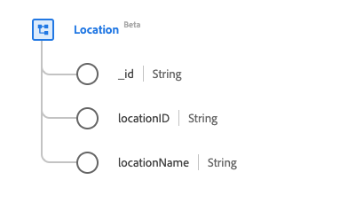

# [!UICONTROL Location] class

In Experience Data Model (XDM), the [!UICONTROL Location] class captures live event location information, such as a travel hall or sports arena.

| Display Name | Property | Data type | Description |
| --- | --- | --- | --- |
| [!UICONTROL Identifier] | `_id` | [!UICONTROL String] | A unique, system-generated string identifier for the record. This field is used to track the uniqueness of an individual record, prevent duplication of data, and to look up that record in downstream services.  Since this field is system-generated, it does not need to be supplied an explicit value during data ingestion. However, you can still opt to supply your own unique ID values if you wish. |
| [!UICONTROL Location Identifier] | `locationID` | [!UICONTROL String] | A unique identifier for the location. |
| [!UICONTROL Location Name] | `locationName` | [!UICONTROL String] | The name of the location. |

The class can be extended with the [[!UICONTROL Location] field group](../field-groups/location.md) to describe further details about a location.
