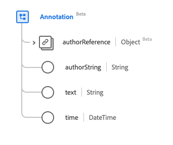

# [!UICONTROL Annotation] data type

[!UICONTROL Annotation] is a standard Experience Data Model (XDM) data type that contains a text node with attribution to the author. This data type is created as per the HL7 FHIR Release 5 specifications.

| Display Name | Property | Data type | Description |
| --- | --- | --- | --- |
| [!UICONTROL Author Reference] | `authorReference` | [[!UICONTROL Reference]](../data-types/reference.md) | A reference to the author. |
| [!UICONTROL Author] |`authorString` | String | The individual responsible for the annotation. |
| [!UICONTROL Text] |`text` | String | The content of the annotation. |
| [!UICONTROL Time] | `time` | DateTime | When the annotation was made. |

For more details on the data type, refer to the public XDM repository:

* [Populated example](https://github.com/adobe/xdm/blob/master/extensions/industry/healthcare/fhir/datatypes/annotation.example.1.json)
* [Full schema](https://github.com/adobe/xdm/blob/master/extensions/industry/healthcare/fhir/datatypes/annotation.schema.json)
