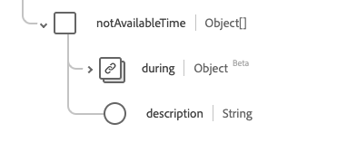

# [!UICONTROL Availability] data type

[!UICONTROL Availability] is a standard Experience Data Model (XDM) data type that describes availability data for an item. This data type is created as per the HL7 FHIR Release 5 specifications.

| Display Name | Property | Data type | Description |
| --- | --- | --- | --- |
| [!UICONTROL Available Time] | `availableTime` | Array of objects | The times the item is available. See the [section below](#available-time) for more information. |
| [!UICONTROL Not Available Time] |`notAvailableTime` | String | The times the item is not available, with a provided reason. See the [section below](#not-available-time) for more information. |

For more details on the data type, refer to the public XDM repository:

* [Populated example](https://github.com/adobe/xdm/blob/master/extensions/industry/healthcare/fhir/datatypes/availability.example.1.json)
* [Full schema](https://github.com/adobe/xdm/blob/master/extensions/industry/healthcare/fhir/datatypes/availability.schema.json)

## `availableTime` {#available-time}

`availableTime` is provided as an array of objects. The structure of each object is described below.

| Display Name | Property | Data type | Description |
| --- | --- | --- | --- |
| [!UICONTROL All Day] | `allDay` | Boolean | A boolean indicating if the item is always available. |
| [!UICONTROL Available End Time] |`availableEndTime` | String | The time of day the item stops being available. This is ignored if `allDay` is `true`. |
| [!UICONTROL Available Start Time] | `availableStartTime` | String | The time of day the item starts being available. This is ignored if `allDay` is `true`.  |
| [!UICONTROL Days Of Week] |`daysOfWeek` | Array of strings | An array of strings detailing which days are available. The values of this property must be equal to one or more of the following known enum values. <li> `mon` </li> <li> `tues` </li> <li> `wed` </li> <li> `thurs`</li>  <li> `fri` </li> <li> `sat`</li> <li> `sun`</li> |

## `notAvailableTime` {#not-available-time}

`notAvailableTime` is provided as an array of objects. The structure of each object is described below.

| Display Name | Property | Data type | Description |
| --- | --- | --- | --- |
| [!UICONTROL During] | `during` | [[!UICONTROL Period]](../data-types/period.md) | The period of time the item stops being available. |
| [!UICONTROL Description] |`description` | String | The reason for the item not being available. |
