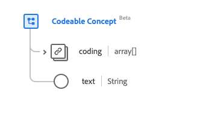

# [!UICONTROL Codeable Concept] data type

[!UICONTROL Codeable Concept] is a standard Experience Data Model (XDM) data type that describes a reference from one resource to another. This data type is created as per the HL7 FHIR Release 5 specifications.

| Display Name | Property | Data type | Description |
| --- | --- | --- | --- |
| [!UICONTROL Coding] | `coding` | Array of [[!UICONTROL Coding]](../data-types/coding.md) | Code defined by a terminology system. |
| [!UICONTROL Text] |`text` | String | The plain text representation of the concept. |

For more details on the data type, refer to the public XDM repository:

* [Populated example](https://github.com/adobe/xdm/blob/master/extensions/industry/healthcare/fhir/datatypes/codeablereference.example.1.json)
* [Full schema](https://github.com/adobe/xdm/blob/master/extensions/industry/healthcare/fhir/datatypes/codeableconcept.schema.json)
