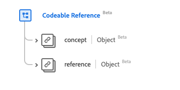

# [!UICONTROL Codeable Reference] data type

[!UICONTROL Codeable Reference] is a standard Experience Data Model (XDM) data type that describes a reference to a resource or a concept. This data type is created as per the HL7 FHIR Release 5 specifications.

| Display Name | Property | Data type | Description |
| --- | --- | --- | --- |
| [!UICONTROL Concept] | `concept` | [[!UICONTROL Codeable Concept]](../data-types/codeable-concept.md) | A reference to a concept (by class). |
| [!UICONTROL Reference] |`reference` | [[!UICONTROL Reference]](../data-types/reference.md) | A reference to a resource. |

For more details on the data type, refer to the public XDM repository:

* [Populated example](https://github.com/adobe/xdm/blob/master/extensions/industry/healthcare/fhir/datatypes/codeablereference.example.1.json)
* [Full schema](https://github.com/adobe/xdm/blob/master/extensions/industry/healthcare/fhir/datatypes/codeablereference.schema.json)
