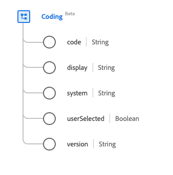

# [!UICONTROL Coding] data type

[!UICONTROL Coding] is a standard Experience Data Model (XDM) data type that describes a reference to a code defined by a terminology system. This data type is created as per the HL7 FHIR Release 5 specifications.

| Display Name | Property | Data type | Description |
| --- | --- | --- | --- |
| [!UICONTROL Code] | `code` | String | The symbol in the syntax defined by the system. |
| [!UICONTROL Display] |`display` | String | The representation defined by the system. |
| [!UICONTROL System] | `system` | String | The namespace for the identifier value, respresented as a URI. |
| [!UICONTROL Is Selected By User] |`userSelected` | Boolean | An idicator of whether this coding was chosen by the user. The default value is false.|
| [!UICONTROL Version] | `version` | String | The version of the system. |

For more details on the data type, refer to the public XDM repository:

* [Populated example](https://github.com/adobe/xdm/blob/master/extensions/industry/healthcare/fhir/datatypes/coding.example.1.json)
* [Full schema](https://github.com/adobe/xdm/blob/master/extensions/industry/healthcare/fhir/datatypes/coding.schema.json)
