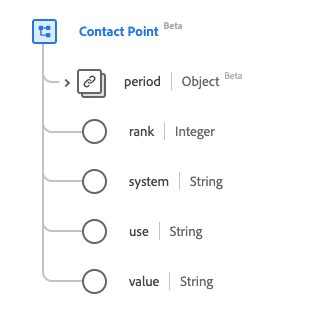

# [!UICONTROL Contact Point] data type

[!UICONTROL Contact Point] is a standard Experience Data Model (XDM) data type that describes contact details for a person. This data type is created as per the HL7 FHIR Release 5 specifications.

| Display Name | Property | Data type | Description |
| --- | --- | --- | --- |
| [!UICONTROL Period] | `period` | [[!UICONTROL Period]](../data-types/period.md) | The time period when the contact point was/is in use. |
| [!UICONTROL Rank] |`rank` | Integer | The rank indicating the preferred use of the contact point. The minimum value is `1` and the maximum value is `2147483647` where `1` is the highest specificity. |
| [!UICONTROL System] | `system` | String | The system through which they can be contacted. The value of this property must be equal to one of the following known enum values. <li> `phone` </li> <li> `fax` </li> <li> `email` </li> <li> `pager`</li> <li> `url`</li> <li> `sms`</li> <li> `other`</li> |
| [!UICONTROL Use] |`use` | String | The purpose of the contact point. The value of this property must be equal to one of the following known enum values. <li> `home` </li> <li> `work` </li> <li> `temp` </li> <li> `old`</li> <li> `mobile`</li> |
| [!UICONTROL Value] | `value` | String | The details of the contact point. |

For more details on the data type, refer to the public XDM repository:

* [Populated example](https://github.com/adobe/xdm/blob/master/extensions/industry/healthcare/fhir/datatypes/contactpoint.example.1.json)
* [Full schema](https://github.com/adobe/xdm/blob/master/extensions/industry/healthcare/fhir/datatypes/contactpoint.schema.json)
