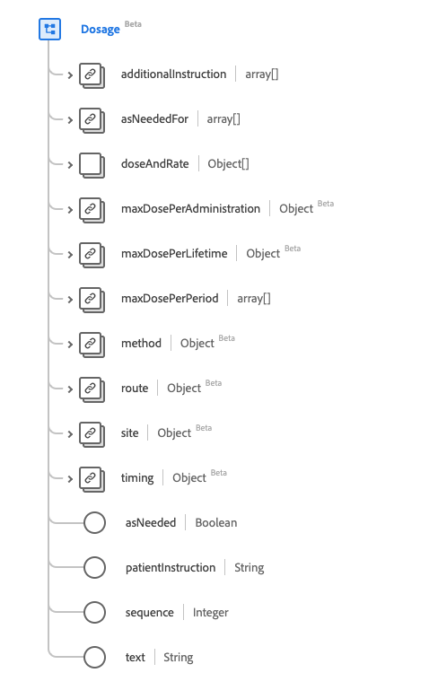
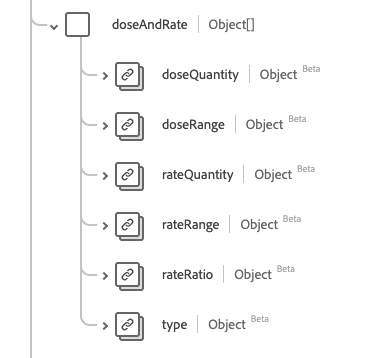

# [!UICONTROL Dosage] data type

[!UICONTROL Dosage] is a standard Experience Data Model (XDM) data type that describes how the medication is/was taken or should be taken. This data type is created as per the HL7 FHIR Release 5 specifications.

| Display Name | Property | Data type | Description |
| --- | --- | --- | --- |
| [!UICONTROL Additional Instructions] | `additionalInstruction` | Array of [[!UICONTROL Codeable Concept]](../data-types/codeable-concept.md) | Supplemental instructions or warnings to the patient. |
| [!UICONTROL As Needed For] |`asNeededFor` | Array of [[!UICONTROL Codeable Concept]](../data-types/codeable-concept.md) | Describes what issue the medication should be taken as needed for. |
| [!UICONTROL Dose And Rate] | `doseAndRate` | Array of objects | The amount of medication administered, to be administered, or the typical amount to be administered. See the [section below](#dose-and-rate) for more information |
| [!UICONTROL Max Dose Per Administration] |`maxDosePerAdministration` | [[!UICONTROL Simple Quantity]](../data-types/simple-quantity.md) | The upper limit of medication per administration. |
| [!UICONTROL Max Dose Per Lifetime] | `maxDosePerLifetime` | [[!UICONTROL Simple Quantity]](../data-types/simple-quantity.md) | The upper limit of medication per lifetime of the patient. |
| [!UICONTROL Max Dose Per Period] |`maxDosePerPeriod` | Array of [[!UICONTROL Ratio]](../data-types/ratio.md) | The upper limit of medication per unit of time. |
| [!UICONTROL Method] | `method` | [[!UICONTROL Codeable Concept]](../data-types/codeable-concept.md) | The technique for administering medication. |
| [!UICONTROL Route] |`route` | [[!UICONTROL Codeable Concept]](../data-types/codeable-concept.md) | How the drug should enter the body. |
| [!UICONTROL Body Site] | `site` | [[!UICONTROL Codeable Concept]](../data-types/codeable-concept.md) | The body site to administer the drug. |
| [!UICONTROL Timing] |`timing` | [[!UICONTROL Timing]](../data-types/timing.md) | When medication should be administered. |
| [!UICONTROL As Needed] | `asNeeded` | Boolean | An indicator for whether the medication should be taken as needed. |
| [!UICONTROL Patient Instructions] |`patientInstruction` | String | Instructions in terms to be understood by the patient or consumer. |
| [!UICONTROL Sequence] | `Integer` | [[!UICONTROL Codeable Concept]](../data-types/codeable-concept.md) | The order of the dosage instructions. |
| [!UICONTROL Text] |`text` | String | Plan text dosage instructions. |

For more details on the data type, refer to the public XDM repository:

* [Populated example](https://github.com/adobe/xdm/blob/master/extensions/industry/healthcare/fhir/datatypes/dosage.example.1.json)
* [Full schema](https://github.com/adobe/xdm/blob/master/extensions/industry/healthcare/fhir/datatypes/dosage.schema.json)

## `doseAndRate` {#dose-and-rate}

`doseAndRate` is provided as an array of objects. The structure of each object is described below.

| Display Name | Property | Data type | Description |
| --- | --- | --- | --- |
| [!UICONTROL Dose Quantity] | `doseQuantity` | [[!UICONTROL Simple Quantity]](../data-types/simple-quantity.md) | The amount of medication per dose. |
| [!UICONTROL Dose Range] |`doseRange` | [[!UICONTROL Range]](../data-types/range.md) | The amount of medication per dose. |
| [!UICONTROL Rate Quantity] | `rateQuantity` | [[!UICONTROL Simple Quantity]](../data-types/simple-quantity.md) | The amount of medication per unit of time.  |
| [!UICONTROL Rate Range] |`rateRange` | [[!UICONTROL Range]](../data-types/range.md) | The amount of medication per unit of time. |
| [!UICONTROL Rate Ratio] |`rateRatio` | [[!UICONTROL Ratio]](../data-types/ratio.md) | The amount of medication per unit of time. |
| [!UICONTROL Type] | `type` | [[!UICONTROL Codeable Concept]](../data-types/codeable-concept.md) | The kind of dose or rate specified.  |
