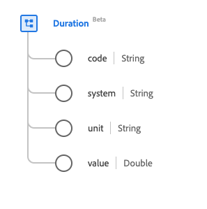

# [!UICONTROL Duration] data type

[!UICONTROL Duration] is a standard Experience Data Model (XDM) data type that describes a length of time. This data type is created as per the HL7 FHIR Release 5 specifications.

| Display Name | Property | Data type | Description |
| --- | --- | --- | --- |
| [!UICONTROL Code] | `code` | String | The coded form of the unit of time. |
| [!UICONTROL System] |`system` | String | The system that describes the coded unit, represented as a URI. |
| [!UICONTROL Unit] | `unit` | String | The unit of time represented in milliseconds, seconds, minutes, hours, days, weeks, months, or years. The values of this property must be equal to one or more of the following known enum values. <li> `ms` (milliseconds) </li> <li> `s` (seconds) </li> <li> `min` (minutes) </li> <li> `h` (hours) </li>  <li> `d` (days) </li> <li> `wk` (weeks) </li> <li> `mo` (months) </li> <li> `a` (years) </li> |
| [!UICONTROL Value] |`value` | Double | The numerical value for the unit of time. |

For more details on the data type, refer to the public XDM repository:

* [Populated example](https://github.com/adobe/xdm/blob/master/extensions/industry/healthcare/fhir/datatypes/duration.example.1.json)
* [Full schema](https://github.com/adobe/xdm/blob/master/extensions/industry/healthcare/fhir/datatypes/duration.schema.json)
