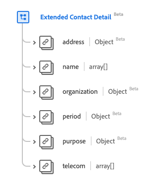

# [!UICONTROL Extended Contact Detail] data type

[!UICONTROL Extended Contact Detail] is a standard Experience Data Model (XDM) data type that describes an extended contact's information. This data type is created as per the HL7 FHIR Release 5 specifications.

| Display Name | Property | Data type | Description |
| --- | --- | --- | --- |
| [!UICONTROL Address] | `address` | [[!UICONTROL Address]](../data-types/address.md) | The address of the contact. |
| [!UICONTROL Name] |`name` | Array of [[!UICONTROL Human Name]](../data-types/human-name.md) | The name(s) of the individual(s) to contact. |
| [!UICONTROL Organization] | `organization` | [[!UICONTROL Reference]](../data-types/reference.md) | The organization that handles/monitors the contact details. |
| [!UICONTROL Period] |`period` | [[!UICONTROL Period]](../data-types/period.md) | The period that the contact is or was valid for usage. |
| [!UICONTROL Purpose] |`purpose` | [[!UICONTROL Codeable Concept]](../data-types/codeable-concept.md) | The type of contact. |
| [!UICONTROL Telecom] |`telecom` | Array of [[!UICONTROL Contact Point]](../data-types/contact-point.md) | The contact details. |

For more details on the data type, refer to the public XDM repository:

* [Populated example](https://github.com/adobe/xdm/blob/master/extensions/industry/healthcare/fhir/datatypes/extendedcontactdetail.example.1.json)
* [Full schema](https://github.com/adobe/xdm/blob/master/extensions/industry/healthcare/fhir/datatypes/extendedcontactdetail.schema.json)
