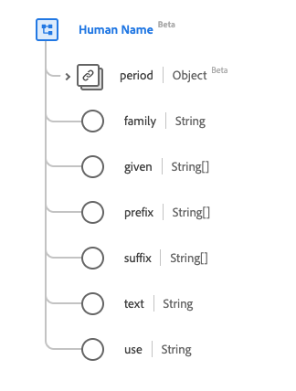

# [!UICONTROL Human Name] data type

[!UICONTROL Human Name] is a standard Experience Data Model (XDM) data type that provides information about the name of a human or other living entity. This data type is created as per the HL7 FHIR Release 5 specifications.

| Display Name | Property | Data type | Description |
| --- | --- | --- | --- |
| [!UICONTROL Period] | `period` | [[!UICONTROL Period]](../data-types/period.md) | The time period when the name is or was in use. |
| [!UICONTROL Family] | `family` | String | The family or surname. |
| [!UICONTROL Given] | `given` | Array of strings | The given name, including any middle name(s). |
| [!UICONTROL Prefix] | `prefix` | Array of strings | Any parts of the name before the given or first name. |
| [!UICONTROL Suffix] | `suffix` | Array of strings | Any parts of the name after the family or surname. |
| [!UICONTROL Text] | `text` | String | The plain text representation of the full name. |
| [!UICONTROL Use] | `use` | String | The use of the name. The values of this property must be equal to one or more of the following known enum values. <li> `usual` </li> <li> `offical` </li> <li> `temp` </li> <li> `nickname` </li> <li> `anonymous` </li> <li> `old` </li> <li> `maiden` </li>|

For more details on the data type, refer to the public XDM repository:

* [Populated example](https://github.com/adobe/xdm/blob/master/extensions/industry/healthcare/fhir/datatypes/humanname.example.1.json)
* [Full schema](https://github.com/adobe/xdm/blob/master/extensions/industry/healthcare/fhir/datatypes/humanname.schema.json)
