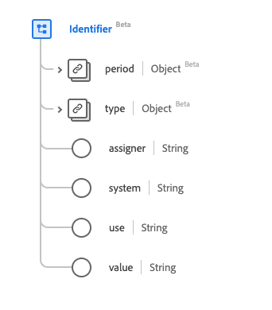

# [!UICONTROL Identifier] data type

[!UICONTROL Identifier] is a standard Experience Data Model (XDM) data type that provides an identifier intended for computation. This data type is created as per the HL7 FHIR Release 5 specifications.

| Display Name | Property | Data type | Description |
| --- | --- | --- | --- |
| [!UICONTROL Period] | `period` | [[!UICONTROL Period]](../data-types/period.md) | The time period when the ID is or was valid for use. |
| [!UICONTROL Type] | `type` | [[!UICONTROL Codeable Concept]](../data-types/codeable-concept.md) | The description of the identifier. |
| [!UICONTROL Assigner] | `assigner` | String | The organization that issued the ID. |
| [!UICONTROL System] | `system` | String | The namespace for the identifier value, represented as a URI. |
| [!UICONTROL Use] | `use` | String | The use of the identifier. The values of this property must be equal to one or more of the following known enum values. <li> `usual` </li> <li> `offical` </li> <li> `temp` </li> <li> `secondary` </li> <li> `old` </li> |
| [!UICONTROL Value] | `value` | String | The unique value of the ID. |

For more details on the data type, refer to the public XDM repository:

* [Populated example](https://github.com/adobe/xdm/blob/master/extensions/industry/healthcare/fhir/datatypes/identifier.example.1.json)
* [Full schema](https://github.com/adobe/xdm/blob/master/extensions/industry/healthcare/fhir/datatypes/identifier.schema.json)
