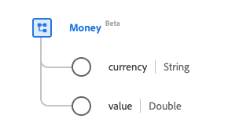

# [!UICONTROL Money] data type

[!UICONTROL Money] is a standard Experience Data Model (XDM) data type that provides an amount of economic utility in some recognized currency. This data type is created as per the HL7 FHIR Release 5 specifications.

| Display Name | Property | Data type | Description |
| --- | --- | --- | --- |
| [!UICONTROL Currency] | `currency` | String | The ISO 4217 currency code. |
| [!UICONTROL Value] | `value` | Double | The numerical value. |

For more details on the data type, refer to the public XDM repository:

* [Populated example](https://github.com/adobe/xdm/blob/master/extensions/industry/healthcare/fhir/datatypes/money.example.1.json)
* [Full schema](https://github.com/adobe/xdm/blob/master/extensions/industry/healthcare/fhir/datatypes/money.schema.json)
