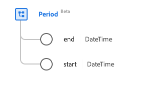

# [!UICONTROL Period] data type

[!UICONTROL Period] is a standard Experience Data Model (XDM) data type that provides a time period defined by a start and end date/time. This data type is created as per the HL7 FHIR Release 5 specifications.

| Display Name | Property | Data type | Description |
| --- | --- | --- | --- |
| [!UICONTROL End] | `end` | DateTime | The end date and time. |
| [!UICONTROL Start] | `start` | DateTime | The start date and time. |

For more details on the data type, refer to the public XDM repository:

* [Populated example](https://github.com/adobe/xdm/blob/master/extensions/industry/healthcare/fhir/datatypes/period.example.1.json)
* [Full schema](https://github.com/adobe/xdm/blob/master/extensions/industry/healthcare/fhir/datatypes/period.schema.json)
