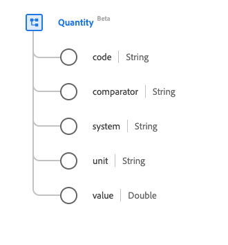

# [!UICONTROL Quantity] data type

[!UICONTROL Quantity] is a standard Experience Data Model (XDM) data type that provides a measured or measurable amount. This data type is created as per the HL7 FHIR Release 5 specifications.

| Display Name | Property | Data type | Description |
| --- | --- | --- | --- |
| [!UICONTROL Code] | `code` | String | The coded form of the unit. |
| [!UICONTROL Comparator] | `comparator` | String | The comparison operator. The value of this property must be equal to one of the following known enum values. <li> `<` </li> <li> `<=` </li> <li> `>=` </li> <li> `>`</li> <li> `ad`</li>  |
| [!UICONTROL System] | `system` | String | The system that defines the coded unit form, represented as a URI. |
| [!UICONTROL Unit] | `unit` | String | The unit representation. |
| [!UICONTROL Value] | `value` | Double | The numerical value. |

For more details on the data type, refer to the public XDM repository:

* [Populated example](https://github.com/adobe/xdm/blob/master/extensions/industry/healthcare/fhir/datatypes/quantity.example.1.json)
* [Full schema](https://github.com/adobe/xdm/blob/master/extensions/industry/healthcare/fhir/datatypes/quantity.schema.json)
