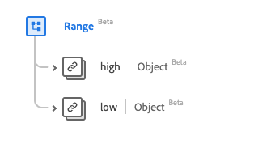

# [!UICONTROL Range] data type

[!UICONTROL Range] is a standard Experience Data Model (XDM) data type that provides a set of values bound by low and high values. This data type is created as per the HL7 FHIR Release 5 specifications.

| Display Name | Property | Data type | Description |
| --- | --- | --- | --- |
| [!UICONTROL High] | `high` | [[!UICONTROL Simple Quantity]](../data-types/simple-quantity.md) | The highest limit. |
| [!UICONTROL Low] | `low` | [[!UICONTROL Simple Quantity]](../data-types/simple-quantity.md) | The lowest limit. |

For more details on the data type, refer to the public XDM repository:

* [Populated example](https://github.com/adobe/xdm/blob/master/extensions/industry/healthcare/fhir/datatypes/range.example.1.json)
* [Full schema](https://github.com/adobe/xdm/blob/master/extensions/industry/healthcare/fhir/datatypes/range.schema.json)
