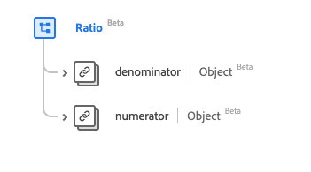

# [!UICONTROL Ratio] data type

[!UICONTROL Ratio] is a standard Experience Data Model (XDM) data type that provides a ratio of two [[!UICONTROL Quantity]](../data-types/quantity.md) values through a numerator and a denominator. This data type is created as per the HL7 FHIR Release 5 specifications.

| Display Name | Property | Data type | Description |
| --- | --- | --- | --- |
| [!UICONTROL Denominator] | `denominator` | [[!UICONTROL Simple Quantity]](../data-types/simple-quantity.md) | The value of the denominator. |
| [!UICONTROL Numerator] | `numerator` | [[!UICONTROL Quantity]](../data-types/quantity.md) | The value of the numerator. |

>[!NOTE]
>
> The `denominator` and `numerator` have different data types due to the specification created as per the HL7 FHIR Release 5.

For more details on the data type, refer to the public XDM repository:

* [Populated example](https://github.com/adobe/xdm/blob/master/extensions/industry/healthcare/fhir/datatypes/ratio.example.1.json)
* [Full schema](https://github.com/adobe/xdm/blob/master/extensions/industry/healthcare/fhir/datatypes/ratio.schema.json)
