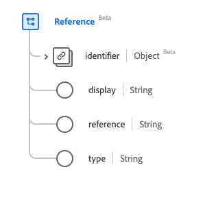

# [!UICONTROL Reference] data type

[!UICONTROL Reference] is a standard Experience Data Model (XDM) data type provides a reference from one resource to another. This data type is created as per the HL7 FHIR Release 5 specifications.

| Display Name | Property | Data type | Description |
| --- | --- | --- | --- |
| [!UICONTROL Identifier] | `identifier` | [[!UICONTROL Identifier]](../data-types/identifier.md) | The logical reference when the literal reference is not known. |
| [!UICONTROL Display] | `display` | String | The text alternative for the reference. |
| [!UICONTROL Reference] | `reference` | String | The literal reference, relative, internal, or absolute URL. |
| [!UICONTROL Type] | `type` | String | The type the reference refers to, respresented as a URI. |

For more details on the data type, refer to the public XDM repository:

* [Populated example](https://github.com/adobe/xdm/blob/master/extensions/industry/healthcare/fhir/datatypes/reference.example.1.json)
* [Full schema](https://github.com/adobe/xdm/blob/master/extensions/industry/healthcare/fhir/datatypes/reference.schema.json)
