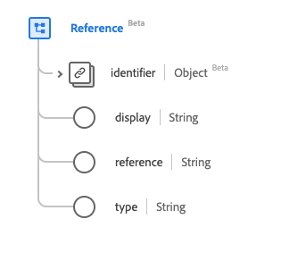

# [!UICONTROL Repeat] data type

[!UICONTROL Repeat] is a standard Experience Data Model (XDM) data type that provides a set of rules that describe when an event is scheduled. This data type is created as per the HL7 FHIR Release 5 specifications.

| Display Name | Property | Data type | Description |
| --- | --- | --- | --- |
| [!UICONTROL Bound Period] | `boundsPeriod` | [[!UICONTROL Period]](../data-types/period.md) | The start and end times. |
| [!UICONTROL Bound Range] | `boundsRange` | [[!UICONTROL Range]](../data-types/range.md) | The range limit. |
| [!UICONTROL Bound Duration] | `boundsDuration` | [[!UICONTROL Duration]](../data-types/duration.md) | The duration limit. |
| [!UICONTROL Count] | `count` | Integer | The number of times to repeat, with a minimum value of `0`. |
| [!UICONTROL Maximum Count] | `countMax` | Integer | The maximum number of times to repeat, with a minimum value of `0`. |
| [!UICONTROL Day Of Week] | `dayOfWeek` | Array of strings | An array of strings detailing which days are available. The values of this property must be equal to one or more of the following known enum values. <li> `mon` </li> <li> `tues` </li> <li> `wed` </li> <li> `thurs`</li>  <li> `fri` </li> <li> `sat`</li> <li> `sun`</li> |
| [!UICONTROL Duration] | `duration` | Double | The length of time. |
| [!UICONTROL Maximum Duration] | `durationMax` | Double | The maximum length of time. |
| [!UICONTROL Duration Unit] | `durationUnit` | String| The unit of duration. The values of this property must be equal to one or more of the following known enum values. <li> `s` (seconds) </li> <li> `min` (minutes) </li> <li> `h` (hourly) </li> <li> `d` (daily) </li>  <li> `wk` (weekly) </li> <li> `mo` (monthly) </li> <li> `a` (annual)</li>|
| [!UICONTROL Frequency] | `frequency` | Double | The number of repetitions that should occur within a period, with a minumum value of `0`. |
| [!UICONTROL Maximum Frequency] | `frequencyMax` | Double | The maximum number of repetitions that should occur with a period, with a minimum value of `0`. |
| [!UICONTROL Offset] | `offset` | Integer | The minute(s) until the event (before or after). |
| [!UICONTROL Period] | `period` | Double | The duration during which the frequency applies. |
| [!UICONTROL Maximum Period] | `periodMax` | Double | The upper limit of the period. |
| [!UICONTROL Period Unit] | `periodUnit` | String | The unit of time. The values of this property must be equal to one or more of the following known enum values. <li> `s` (seconds) </li> <li> `min` (minutes) </li> <li> `h` (hourly) </li> <li> `d` (daily) </li>  <li> `wk` (weekly) </li> <li> `mo` (monthly) </li> <li> `a` (annual)</li> |
| [!UICONTROL Time Of Day] | `timeOfDay` | Array of strings | The time of day for the action to occur. |
| [!UICONTROL When] | `when` | Array of strings | The code for the action's time period. |

For more details on the data type, refer to the public XDM repository:

* [Populated example](https://github.com/adobe/xdm/blob/master/extensions/industry/healthcare/fhir/datatypes/repeat.example.1.json)
* [Full schema](https://github.com/adobe/xdm/blob/master/extensions/industry/healthcare/fhir/datatypes/repeat.schema.json)
