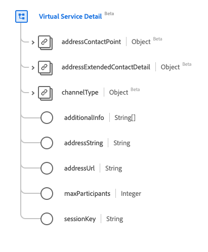

# [!UICONTROL Virtual Service Detail] data type

[!UICONTROL Virtual Service Detail] is a standard Experience Data Model (XDM) data type that describes virtual service contact details. This data type is created as per the HL7 FHIR Release 5 specifications.

| Display Name | Property | Data type | Description |
| --- | --- | --- | --- |
| [!UICONTROL Address Contact Point] | `addressContactPoint` | [[!UICONTROL Contact Point]](../data-types/contact-point.md) | The details of a technology mediated contact point such as a phone, fax, or email. |
| [!UICONTROL Address Extended Contact Detail] | `addressExtendedContactDetail` | [[!UICONTROL Extended Contact Detail]](../data-types/extended-contact-detail.md) | Extended contact information. |
| [!UICONTROL Channel Type] | `channelType` | [[!UICONTROL Coding]](../data-types/coding.md) | The type of virtual service to connect to, such as Teams, Zoom, or WhatsApp. |
| [!UICONTROL Additional Info] | `additionalInfo` | Array of strings | The address to see alternative connection details, represented as a URI. |
| [!UICONTROL Address String] | `addressString` | String | The address to be used to connect to the virtual service. |
| [!UICONTROL Address Url] | `addressUrl` | String | The URL to be used to connect to the virtual service, represented as a URI. |
| [!UICONTROL Max Participants] | `maxParticipants` | Integer | The maximum number of participants supported, with a minimum value of `0`. |
| [!UICONTROL Session Key] | `sessionKey` | String | The session key required by the virtual service. |

For more details on the data type, refer to the public XDM repository:

* [Populated example](https://github.com/adobe/xdm/blob/master/extensions/industry/healthcare/fhir/datatypes/simplequantity.example.1.json)
* [Full schema](https://github.com/adobe/xdm/blob/master/extensions/industry/healthcare/fhir/datatypes/simplequantity.schema.json)
