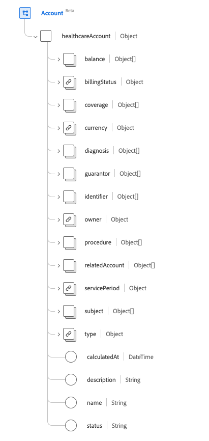
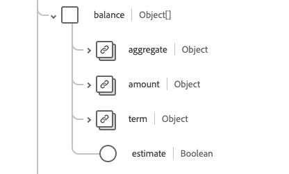
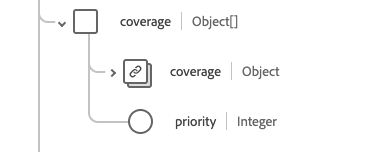
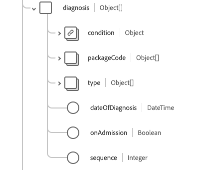
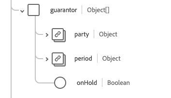
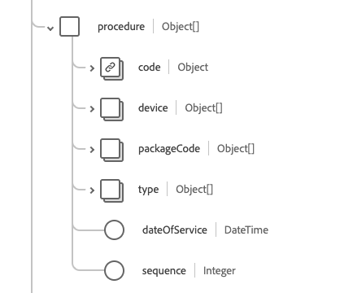
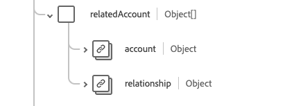

# [!UICONTROL Account] schema field group

[!UICONTROL Account] is a standard schema field group for the [[!DNL XDM Individual Profile] class](../../../classes/individual-profile.md) and the [[!DNL Provider class]](../../../classes/provider.md). It provides a single object-type field `healthcareAccount` which is used to record transactions, services, and other financial information related to healthcare services provided to a patient or a group of individuals (such as for an insurance policy or billing purposes).

| Display Name | Property | Data type | Description |
| --- | --- | --- | --- |
| [!UICONTROL Balance] | `balance` | Array of objects | The account balances which are calculated and processed by the finance system. See the [section-below](#balances) for more information.|
| [!UICONTROL Billing Status] | `billingStatus`| [[!UICONTROL Codeable Concept]](../data-types/codeable-concept.md) | This tracks the lifecycle of the account through the billing process. It indicates how transactions are treated when they are allocated to the account. |
| [!UICONTROL Coverage] | `coverage` | Array of objects | The party(s) responsible for covering the costs of this account, and in what order should they be applied. See the [section below](#coverage) for more information. |
| [!UICONTROL Currency] | `currency` | [[!UICONTROL Codeable Concept]](../data-types/codeable-concept.md) | The default currency for the account. |
| [!UICONTROL Diagnosis] | `diagnosis` | Array of objects | The set of diagnoses that are relevant for billing are stored here on the account where they are able to be sequenced appropriately prior to processing to produce claim(s). See the [section below](#diagnosis) for more information. |
| [!UICONTROL Guarantor] | `guarantor` | Array of objects | The parties responsible for balancing the account if other payment options fall short. See the [section below](#guarantor) for more information. |
| [!UICONTROL Identifier] | `identifier` | Array of [[!UICONTROL Identifier]](../data-types/identifier.md) | A unique identifier used to reference the account. It may or may not be intended for human use (e.g. credit card number). |
| [!UICONTROL Owner] | `owner` | [[!UICONTROL Reference]](../data-types/reference.md) | Indicates the service area, hospital, department, etc. with responsibility for managing the account. |
| [!UICONTROL Procedure] | `procedure` | Array of objects | The set of procedures relevant for billing are stored here on the account where they are able to be sequenced appropriately prior to processing to produce claim(s). See the [section below](#procedure) for more information. |
| [!UICONTROL Related Account] | `relatedAccount` | Array of objects | Other associated accounts related to this account. See the [section below](#related-account) for more information. |
| [!UICONTROL Service Period] | `servicePeriod` | [[!UICONTROL Period]](../data-types/period.md) | The date range of services associated with this account. |
| [!UICONTROL Subject] | `subject` | Array of [[!UICONTROL Reference]](../data-types/reference.md) | Identifies the entity which incurs the expenses. While the immediate recipients of services or goods might be entities related to the subject, the expenses were ultimately incurred by the subject of the account. |
| [!UICONTROL Type] | `type` | [[!UICONTROL Codeable Concept]](../data-types/codeable-concept.md) | Categorizes the account for reporting and searching purposes. |
| [!UICONTROL Calculated At] | `calculatedAt` | DateTime | The time the balance was calculated. |
| [!UICONTROL Description] | `description` | String | Provides additional information about what the account tracks and how it is used. |
| [!UICONTROL Name] | `name` | String | The account's name. |
| [!UICONTROL Status] | `status` | String | The status of the account. The value of this property must be equal to one of the following known enum values. <li> `active` </li> <li> `inactive` </li> <li> `entered-in-error` </li> <li> `on-hold` </li> <li> `unknown`</li> |

For more details on the field group, refer to the public XDM repository:

* [Populated example](https://github.com/adobe/xdm/blob/master/extensions/industry/healthcare/fhir/fieldgroups/account.example.1.json)
* [Full schema](https://github.com/adobe/xdm/blob/master/extensions/industry/healthcare/fhir/fieldgroups/account.schema.json)

## `balances` {#balances}

`balances` is provided as an array of objects. The structure of each object is described below.

| Display Name | Property | Data type | Description |
| --- | --- | --- | --- |
| [!UICONTROL Aggregate] | `aggregate` | [[!UICONTROL Codeable Concept]](../data-types/codeable-concept.md) | Who is expected to pay this part of the balance. |
| [!UICONTROL Amount] | `amount`| [[!UICONTROL Money]](../data-types/money.md) | The actual balance calculated for the age defined in the term property. |
| [!UICONTROL Term] | `term` | [[!UICONTROL Codeable Concept]](../data-types/codeable-concept.md) | The term of the account. |
| [!UICONTROL Estimate] | `estimate`| Boolean | If the amount is an estimated value. |

## `coverage` {#coverage}

`coverage` is provided as an array of objects. The structure of each object is described below.

| Display Name | Property | Data type | Description |
| --- | --- | --- | --- |
| [!UICONTROL Coverage] | `coverage` | [[!UICONTROL Reference]](../data-types/reference.md) | The party(s) responsible for covering the costs of this account, and in what order should they be applied. |
| [!UICONTROL Priority] | `priority`| Integer | The priority of the coverage in the context of this account, with a minimum value of `0`. |

## `diagnosis` {#diagnosis}

`diagnosis` is provided as an array of objects. The structure of each object is described below.

| Display Name | Property | Data type | Description |
| --- | --- | --- | --- |
| [!UICONTROL Condition] | `condition` | [[!UICONTROL Codeable Reference]](../data-types/codeable-reference.md) | The diagnosis relevant to the account. |
| [!UICONTROL Package Code] | `packageCode`| Array of [[!UICONTROL Codeable Concept]](../data-types/codeable-concept.md) | The package code can be used to group diagnoses that may be priced or delivered as a single product (such as DRGs). |
| [!UICONTROL Type] | `type`| Array of [[!UICONTROL Codeable Concept]](../data-types/codeable-concept.md) | Type that this diagnosis has relevant to the account (e.g. admission, billing, discharge …). |
| [!UICONTROL Date Of Diagnosis] | `dateOfDiagnosis` | DateTime | Date of the diagnosis (when coded diagnosis). |
| [!UICONTROL On Admission] | `onAdmission`| Boolean | Whether the diagnosis was present on admission. |
| [!UICONTROL Squence] | `sequence`| Integer | Ranking of the diagnosis (for each type), with a minimum value of `0`. |

## `guarantor` {#guarantor}

`guarantor` is provided as an array of objects. The structure of each object is described below.

| Display Name | Property | Data type | Description |
| --- | --- | --- | --- |
| [!UICONTROL Party] | `party` | [[!UICONTROL Reference]](../data-types/reference.md) | The entity who is responsible. |
| [!UICONTROL Period] | `period`| [[!UICONTROL Period]](../data-types/period.md) | The timeframe during which the guarantor accepts responsibility for the account. |
| [!UICONTROL On Hold] | `onHold`| Boolean | A guarantor may be placed on credit hold or otherwise have their role temporarily suspended. |

## `procedure` {#procedure}

`procedure` is provided as an array of objects. The structure of each object is described below.

| Display Name | Property | Data type | Description |
| --- | --- | --- | --- |
| [!UICONTROL Code] | `code` | [[!UICONTROL Codeable Reference]](../data-types/codeable-reference.md) | The procedure relevant to the account. |
| [!UICONTROL Device] | `device`| Array of [[!UICONTROL Reference]](../data-types/reference.md) | Any devices that were associated with the procedure relevant to the account. |
| [!UICONTROL Type] | `type`| Array of [[!UICONTROL Codeable Concept]](../data-types/codeable-concept.md) | How the procedure value should be used in charging the account. |
| [!UICONTROL Package Code] | `packageCode` | Array of [[!UICONTROL Codeable Concept]](../data-types/codeable-concept.md) | The package code can be used to group procedures that may be priced or delivered as a single product (such as DRGs). |
| [!UICONTROL Date Of Service] | `dateOfService`| DateTime | The date when using a coded procedure. If using a reference to a procedure, then the date of the procedure should be used. |
| [!UICONTROL Sequence] | `sequence`| Integer | Ranking of the procedure (for each type), with a minimum value of `0`. |

## `relatedAccount` {#related-account}

`relatedAccount` is provided as an array of objects. The structure of each object is described below.

| Display Name | Property | Data type | Description |
| --- | --- | --- | --- |
| [!UICONTROL Account] | `account` | [[!UICONTROL Reference]](../data-types/reference.md) | Reference to an associated account. |
| [!UICONTROL Relationship] | `relationship`| [[!UICONTROL Codeable Concept]](../data-types/codeable-concept.md) | Relationship of the associated account. |
