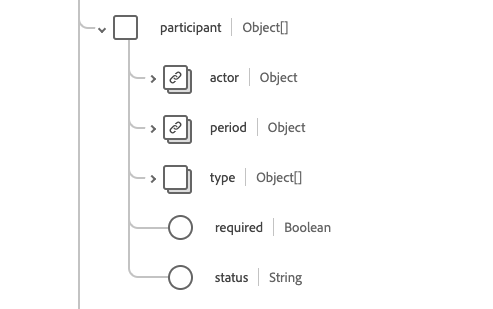
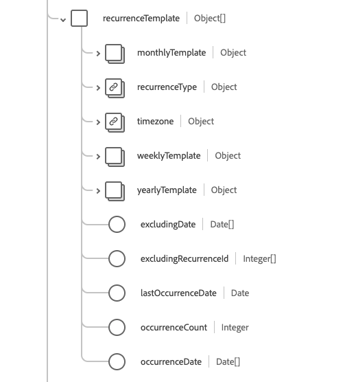
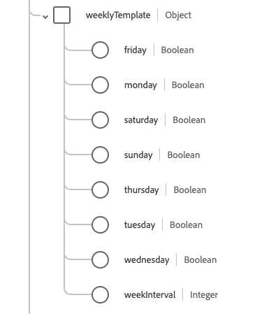
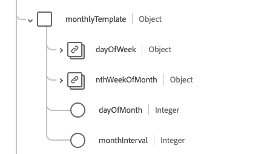

# [!UICONTROL Appointment] schema field group

[!UICONTROL Appointment] is a standard schema field group for the [[!DNL XDM Individual Profile] class](../../../classes/individual-profile.md) and the [[!DNL Provider class]](../../../classes/provider.md). It provides a single object-type field `healthcareAppointment` which contains information about a booking of a healthcare event among patients, practitioners, related persons, and/or devices for a specific date and time. 

| Display Name |Property | Data type | Description |
| --- | --- | --- | --- |
| [!UICONTROL Account] | `account` | Array of [[!UICONTROL Reference]](../data-types/reference.md) | The set of accounts that are expected to be used for billing. |
| [!UICONTROL Appointment Type] | `appointmentType`| [[!UICONTROL Codeable Concept]](../data-types/codeable-concept.md) | The style of appointment or patient that has been booked in the slot (not service type). |
| [!UICONTROL Based On] | `basedOn` | Array of [[!UICONTROL Reference]](../data-types/reference.md) | The request the appointment is allocated to assess, such as a procedure request. |
| [!UICONTROL Cancellation Reason] | `cancellationReason` | Array of [[!UICONTROL Codeable Concept]](../data-types/codeable-concept.md) | The coded reason for the appointment being cancelled. This is often used in reporting, billing, or processing to determine if further actions are required, or if specific fees apply. |
| [!UICONTROL Class] | `class` | Array of [[!UICONTROL Codeable Concept]](../data-types/codeable-concept.md) | Concepts representing the classification of a patient encounter such as ambulatory, outpatient, inpatient, or emergency. |
| [!UICONTROL Identifier] | `identifier` | Array of [[!UICONTROL Identifier]](../data-types/identifier.md) | A list of unique identifiers linked to the appointment. These identifiers are assigned based on business rules or when a direct URL link to the appointment isn't suitable. |
| [!UICONTROL Note] | `note` | Array of [[!UICONTROL Annotation]](../data-types/annotation.md) | Additional notes or comments about the appointment. |
| [!UICONTROL Originating Appointment] | `originatingAppointment` | [[!UICONTROL Reference]](../data-types/reference.md) | The originating appointment in a recurring set of related appointments. |
| [!UICONTROL Participant] | `participant` | Array of objects | A list of participants involved in the appointment. See the [section below](#participant) for more information.  |
| [!UICONTROL Patient Instruction] | `patientInstruction` | Array of [[!UICONTROL Codeable Reference]](../data-types/reference.md) | The diagnosis relevant to the appointment. |
| [!UICONTROL Previous Appointment] | `previousAppointment` | [[!UICONTROL Reference]](../data-types/reference.md) | The previous appointment in a series of related appointments. |
| [!UICONTROL Priority] | `priority` | [[!UICONTROL Codeable Concept]](../data-types/codeable-concept.md) | The priority of the appointment which can be used to make informed decisions if needing to re-prioritize appointments. The iCal Standard specifies `0` as undefined, `1` as highest priority, and `9` as lowest priority. |
| [!UICONTROL Reason] | `reason` | Array of [[!UICONTROL Codeable Concept]](../data-types/codeable-concept.md) | The reason the appointment is being scheduled, which is typically a condition or a procedure. |
| [!UICONTROL Reccurence Template] | `recurrenceTemplate` | Array of objects | Contains the details of the recurrence pattern or template used to create recurring appointments.  See the [section below](#recurrence) for more information. |
| [!UICONTROL Replaces] | `replaces` | Array of [[!UICONTROL Reference]](../data-types/reference.md) | The appointment being replaced by this appointment. In cases where there is a cancellation, the details of the cancellation can be found in the `cancellationReason` property on the referenced resource. |
| [!UICONTROL Requested Period] | `requestedPeriod` | Array of [[!UICONTROL Period]](../data-types/period.md) | A set of date ranges (possibly including times) during which the appointment is preferred to be scheduled. |
| [!UICONTROL Service Category] | `serviceCategory` | Array of [[!UICONTROL Codeable Concept]](../data-types/codeable-concept.md) | A broad categorization of the service that is to be performed during the appointment. |
| [!UICONTROL Service Type] | `serviceType` | Array of [[!UICONTROL Codeable Reference]](../data-types/codeable-reference.md) | The specific service that is to be performed during the appointment. |
| [!UICONTROL Slot] | `slot` | Array of [[!UICONTROL Reference]](../data-types/reference.md) | The time slots from the participants' schedules that will be filled by the appointment. |
| [!UICONTROL Speciality] | `speciality` | Array of [[!UICONTROL Codeable Concept]](../data-types/codeable-concept.md) | The speciality of a practitioner required to perform the service requested in this appointment. |
| [!UICONTROL Subject] | `subject` | Array of [[!UICONTROL Reference]](../data-types/reference.md) | The patient or group associated with the appointment. |
| [!UICONTROL Supporting Information] | `supportingInformation` | Array of [[!UICONTROL Reference]](../data-types/reference.md) | AAdditional information provided when making the appointment to support it. |
| [!UICONTROL Virtual Service] | `virtualService` | Array of [[!UICONTROL Virtual Service Detail]](../data-types/virtual-service-detail.md) | Connection details of a virtual service, such as a conference call. |
| [!UICONTROL Cancellation Date] | `cancellationDate` | DateTime | The date and time when the appointment was cancelled. |
| [!UICONTROL Created] | `created` | DateTime | The date and time the appointment was created. |
| [!UICONTROL Description] | `description` | String | A brief description of the appointment. Detailed or expanded information should be put in the `note` field. |
| [!UICONTROL End] | `end` | DateTime | The date and time the appointment concludes. |
| [!UICONTROL Minutes Duration] | `minutesDuration` | Integer | The number of minutes the appointment will take. This can be less than the duration between the start and end times. The minimum accepted value is `0`. |
| [!UICONTROL Occurence Changed] | `occurenceChanged` | Boolean | A flag indicating whether this appointment differs from the recurring pattern. |
| [!UICONTROL RecurrenceId] | `RecurrenceId` | Integer | The sequence number that identifies a specific appointment in a recurring pattern. The minimum value is `0`. |
| [!UICONTROL Start] | `start` | DateTime | The date and time that the appointment will take place. |
| [!UICONTROL Status] | `status` | String |  The status of the appointment. The value of this property must be equal to one of the following known enum values: <li> `proposed` </li> <li> `pending` </li> <li> `booked` </li> <li> `arrived` </li> <li> `fulfilled` </li> <li> `cancelled` </li> <li> `noshow` </li> <li> `entered-in-error` </li> <li> `checked-in` </li> <li> `waitlist` </li>  |

For more details on the field group, refer to the public XDM repository:

* [Populated example](https://github.com/adobe/xdm/blob/master/extensions/industry/healthcare/fhir/fieldgroups/appointment.example.1.json)
* [Full schema](https://github.com/adobe/xdm/blob/master/extensions/industry/healthcare/fhir/fieldgroups/appointment.schema.json)

## `participant` {#participant}

`participant` is provided as an array of objects. The structure of each object is described below.

| Display Name | Property | Data type | Description |
| --- | --- | --- | --- |
| [!UICONTROL Actor] | `actor` | [[!UICONTROL Reference]](../data-types/reference.md) | The individual, device, location, or service participating in the appointment. |
| [!UICONTROL Period] | `period`| [[!UICONTROL Period]](../data-types/period.md) | The time period during which the participant (actor) is involved in the appointment. |
| [!UICONTROL Type] | `type`| Array of [[!UICONTROL Codeable Concept]](../data-types/codeable-concept.md) | The role of the participant (actor) in the appointment. |
| [!UICONTROL Required] | `required`| Boolean | Whether this participant is required to be present. |
| [!UICONTROL status] | `status`| String | The acceptance status of the participant. The value of this property must be equal to one of the following known enum values: <li> `accepted` </li> <li> `declined` </li> <li> `tentative` </li> <li> `needs-action` </li> |

## `recurrenceTemplate` {#recurrence}

`recurrenceTemplate` is provided as an array of objects. The structure of each object is described below.

| Display Name | Property | Data type | Description |
| --- | --- | --- | --- |
| [!UICONTROL Monthly Template] | `monthlyTemplate` | Array of objects | Information about monthly recurring appointments. See the [section below](#monthly-template) for more information. |
| [!UICONTROL Recurrence Type] | `recurrenceType`| [[!UICONTROL Codeable Concept]](../data-types/codeable-concept.md) | How often the appointment series should recur, such as weekly, monthly, or yearly. |
| [!UICONTROL Timezone] | `timezone`| [[!UICONTROL Codeable Concept]](../data-types/codeable-concept.md) | The timezone of the recurring appointment. |
| [!UICONTROL Weekly Template] | `weeklyTemplate`| Array of objects | Information about weekly recurring appointments. See the [section below](#weekly-template) for moreinformation. |
| [!UICONTROL Yearly Template] | `yearlyTemplate`| Object | Information about yearly recurring appointments. Contains one property, `yearInterval`, which contains an integer value indicating every nth year the appointment reccurs. |
| [!UICONTROL Excluding Date] | `excludingDate`| Array of dates | Any dates, such as holidays, that should be excluded from the recurrence. |
| [!UICONTROL Excluding Recurrence Id] | `excludingRecurrenceId`| Array of integers | Any recurrence IDs that should be excluded from the recurrence. This is an alternative to `excludingDate` where you indicate the `reccurenceID` of the appointment to be excluded. |
| [!UICONTROL Last Occurence Date] | `lastOccurenceDate`| Date | The date after which no further recurring appointments will be scheduled. |
| [!UICONTROL Occurence Count] | `occurenceCount`| Integer | How many appointments are planned in the recurrence. The minimum value is `0`. |
| [!UICONTROL Occurence Date] | `occurenceDate`| Array of dates | A list of specific dates on which appointments are scheduled. |

## `weeklyTemplate` {#weekly-template}

`weeklyTemplate` is provided as an array of objects. The structure of each object is described below.

| Display Name | Property | Data type | Description |
| --- | --- | --- | --- |
| [!UICONTROL Friday] | `friday` | Boolean | Indicates that recurring appointments should occur on Fridays. |
| [!UICONTROL Monday] | `monday` | Boolean | Indicates that recurring appointments should occur on Mondays. |
| [!UICONTROL Saturday] | `saturday` | Boolean | Indicates that recurring appointments should occur on Saturdays. |
| [!UICONTROL Sunday] | `sunday` | Boolean | Indicates that recurring appointments should occur on Sundays. |
| [!UICONTROL Thursday] | `thursday` | Boolean | Indicates that recurring appointments should occur on Thursdays. |
| [!UICONTROL Tuesday] | `tuesday` | Boolean | Indicates that recurring appointments should occur on Tuesdays. |
| [!UICONTROL Wednesday] | `wednesday` | Boolean | Indicates that recurring appointments should occur on Wednesdays. |
| [!UICONTROL Week Interval] | `weekInterval` | Integer | Specifies how often the appointments recur, in terms of every nth week. The default is every week, so the typical value is 2 or higher. |

## `monthlyTemplate` {#monthly-template}

`monthlyTemplate` is provided as an array of objects. The structure of each object is described below.

| Display Name | Property | Data type | Description |
| --- | --- | --- | --- |
| [!UICONTROL Day Of Week] | `dayOfWeek` | [[!UICONTROL Coding]] | Indicates that appointments should occur on this specific day of the week. |
| [!UICONTROL nth Week Of Month] | `nthWeekOfMonth` | [[!UICONTROL Coding]](../data-types/coding.md) | Indicates the nth week of the month the appointment should reccur. |
| [!UICONTROL Day Of Month] | `dayOfMonth` | Integer | Indicates that appointments should occur on this specific day of the month.  |
| [!UICONTROL Month Interval] | `monthInterval` | Integer | Indicates that recurring appointments should occur every nth month. |

