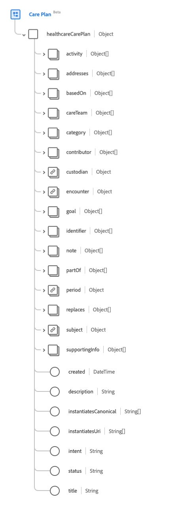
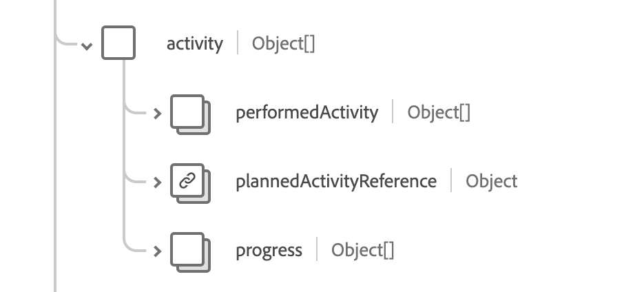

# [!UICONTROL Care Plan] schema field group

[!UICONTROL Care Plan] is a standard schema field group for the [[!DNL XDM Individual Profile] class](../../../classes/individual-profile.md). It provides a single object-type field `healthcareCarePlan` which captures a healthcare plan for a patient or group. 

| Display Name | Property | Data type | Description |
| --- | --- | --- | --- |
| [!UICONTROL Activity] | `activity` | Array of objects | Identifies an action that has occured or is planned to occur as part of the plan. See the [section below](#activity) for more information.|
| [!UICONTROL Addresses] | `addresses`| Array of [[!UICONTROL Codeable Reference]](../data-types/codeable-reference.md) | Identifies the conditions or concerns the care plan handles. |
| [!UICONTROL Based On] | `basedOn` | Array of [[!UICONTROL Reference]](../data-types/reference.md) | A higher-level request resource that is fulfilled in whole or in part by this care plan. |
| [!UICONTROL Care Team] | `careTeam` | Array of [[!UICONTROL Reference]](../data-types/reference.md) | Identifies all people and organizations who are expected to be involved in the care envisioned by this plan. |
| [!UICONTROL Category] | `category` | Array of [[!UICONTROL Codeable Concept]](../data-types/codeable-concept.md) | Identifies what kind of plan this is to support differentiation between multiple co-existing plans. |
| [!UICONTROL Contributor] | `contributor` | Array of [[!UICONTROL Reference]](../data-types/reference.md) | Identifies the individual(s), organization, or device who provided the contents of the care plan. |
| [!UICONTROL Custodian] | `custodian` | [[!UICONTROL Reference]](../data-types/reference.md) | When populated, the custodian is responsible for and attributed to the care plan. |
| [!UICONTROL Encounter] | `encounter` | [[!UICONTROL Reference]](../data-types/reference.md) | The encounter during which the care plan was created. |
| [!UICONTROL Goal] | `goal` | Array of [[!UICONTROL Reference]](../data-types/reference.md) | The intended objective(s) of carrying out the plan. |
| [!UICONTROL Identifier] | `identifier` | Array of [[!UICONTROL Identifier]](../data-types/identifier.md) | The business identifiers assigned to this care plan by the performer or other systems which remain constant as the resource is updated and propagates from server to server. |
| [!UICONTROL Note] | `note` | Array of [[!UICONTROL Annotation]](../data-types/annotation.md) | General notes about the care plan not covered in other attributes. |
| [!UICONTROL Part Of] | `partOf` | Array of [[!UICONTROL Reference]](../data-types/reference.md) | The larger care plan in which this particular care plan is a component or step. |
| [!UICONTROL Period] | `period` | [[!UICONTROL Period]](../data-types/period.md) | Indicates when the plan did (or is intended to) come into effect and when it ends. |
| [!UICONTROL Replaces] | `replaces` | Array of [[!UICONTROL Reference]](../data-types/reference.md) | The completed or terminated care plan whose function is taken over by this care plan. |
| [!UICONTROL Subject] | `subject` | [[!UICONTROL Reference]](../data-types/reference.md) | Identifies the patient or group whose intended care is described by the plan. |
| [!UICONTROL Supporting Info] | `supportingInfo` | Array of [[!UICONTROL Reference]](../data-types/reference.md) | Identifies portions of the patient's record that influenced the formation of the plan. These might include comorbidities, recent procedures, limitations, or recent assessments. |
| [!UICONTROL Created] | `created` | DateTime | Represents when this care plan was created in the system, which is often a system-generated date. |
| [!UICONTROL Description] | `description` | String | A description of the scope and nature of the plan. |
| [!UICONTROL Instantiates Canonical] | `instantiatesCanonical` | Array of strings | The URL pointing to a FHIR-defined protocol, guideline, questionnaire, or other definition that is adhered to in whole or in part by this plan. |
| [!UICONTROL Instantiates Uri] | `instantiatesUri` | Array of strings | The URL pointing to an externally maintained protocol, guideline, questionnaire, or other definition that is adhered to in whole or in part by this plan, represented as a URI. |
| [!UICONTROL Intent] | `intent` | String | The intent of the care plan. The value of this property must be equal to one of the following known enum values. <li> `proposal` </li> <li> `plan` </li> <li> `order` </li> <li> `option` </li> <li> `directive` </li> |
| [!UICONTROL Status] | `status` | String | The status of the care plan. The value of this property must be equal to one of the following known enum values. <li> `draft` </li> <li> `active` </li> <li> `on-hold` </li> <li> `revoked` </li> <li> `completed` </li> <li> `entered-in-error` </li> <li> `unknown` </li> |
| [!UICONTROL Title] | `title` | String | The name of the care plan. |

For more details on the field group, refer to the public XDM repository:

* [Populated example](https://github.com/adobe/xdm/blob/master/extensions/industry/healthcare/fhir/fieldgroups/careplan.example.1.json)
* [Full schema](https://github.com/adobe/xdm/blob/master/extensions/industry/healthcare/fhir/fieldgroups/careplan.schema.json)

## `activity` {#activity}

`activity` is provided as an array of objects. The structure of each object is described below.

| Display Name | Property | Data type | Description |
| --- | --- | --- | --- |
| [!UICONTROL Performed Activity] | `performedActivity` | Array of [[!UICONTROL Codeable Reference]](../data-types/codeable-reference.md) | The results of the activity, such as an appointment or a procedure. |
| [!UICONTROL Planned Activity Reference] | `plannedActivityReference`| [[!UICONTROL Reference]](../data-types/reference.md) | The details of the proposed activity. |
| [!UICONTROL Progress] | `progress`| Array of [[!UICONTROL Annotation]](../data-types/annotation.md) | Notes about the adherence, status, or progress of the activity. |
