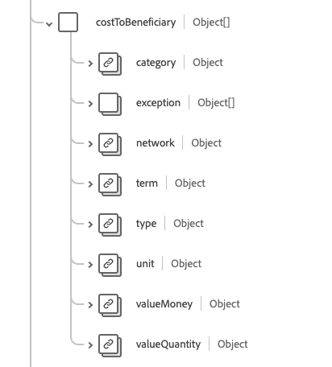

# [!UICONTROL Coverage] schema field group

[!UICONTROL Coverage] is a standard schema field group for the [[!DNL Plan] class](../../../classes/plan.md). It provides a single object-type field `healthcareCoverage` which is intended to provide the high-level identifiers and descriptors of an insurance plan, typically the information which would appear on an insurance card, which may be used to pay, in part or in whole, for the provision of health care products and services.

| Display Name | Property | Data type | Description |
| --- | --- | --- | --- |
| [!UICONTROL Plan Beneficiary] | `beneficiary` | [[!UICONTROL Reference]](../data-types/reference.md) | The party who benefits from the insurance coverage and the patient when products or services are provided. |
| [!UICONTROL Class] | `class`| Array of objects | A suite of underwriter specific classifiers. See the [section below](#class) for more information. |
| [!UICONTROL Contact] | `contract` | Array of [[!UICONTROL Reference]](../data-types/reference.md) | The policy(s) which constitute this insurance coverage. |
| [!UICONTROL Cost To Beneficiary] | `costToBeneficiary` | Array of objects | A suite of codes indicating the cost category and associated amount which have been detailed in the policy and may have been included on the health card. See the [section below](#cost-to-beneficiary) for more information. |
| [!UICONTROL Exception] | `exception` | Array of objects | A suite of codes indicating exceptions or reductions to patient costs and their effective periods. See the [section below](#exception) for more information. |
| [!UICONTROL Identifier] | `identifier` | Array of [[!UICONTROL Identifier]](../data-types/identifier.md) | The identifier of the coverage as issued by the insurer. |
| [!UICONTROL Insurance Plan] | `insurancePlan` | [[!UICONTROL Reference]](../data-types/reference.md) | The insurance plan details, benefits, and costs which constitute this insurance coverage. |
| [!UICONTROL Insurer] | `insurer` | [[!UICONTROL Reference]](../data-types/reference.md) | The program or plan underwriter, payor, or insurance company. |
| [!UICONTROL Payment By] | `paymentBy` | Array of objects | The link to the paying party and optionally what they will be responsible to pay. See the [section below](#payment-by) for more information. |
| [!UICONTROL Coverage Start And End Dates] | `period` | [[!UICONTROL Period]](../data-types/period.md) | The time period during which the coverage is active. A missing start date indicates the start date isn't known, a missing end date means the coverage is ongoing. |
| [!UICONTROL Policy Holder] | `policyHolder` | [[!UICONTROL Reference]](../data-types/reference.md) | The party who holds the insurance policy. |
| [!UICONTROL Beneficiary Relationship] | `relationship` | [[!UICONTROL Codeable Concept]](../data-types/codeable-concept.md) | The relationship of beneficiary to the subscriber. |
| [!UICONTROL Subscriber] | `subscriber` | [[!UICONTROL Reference]](../data-types/reference.md) | The party who holds the contractual relationship to the policy. |
| [!UICONTROL Subscriber Identifier] | `subscriberId` | Array of [[!UICONTROL Identifier]](../data-types/identifier.md) | The insurer assigned ID of the subscriber. |
| [!UICONTROL Type] | `type` | [[!UICONTROL Codeable Concept]](../data-types/codeable-concept.md) | The type of coverage. |
| [!UICONTROL Dependent Number] | `dependent` | String | The designator for a dependent under the coverage. |
| [!UICONTROL Kind] | `kind` | String | The kind of coverage. The value of this property must be equal to one of the following known enum values. <li> `insurance` </li> <li> `self-pay` </li> <li> `other` </li> |
| [!UICONTROL Insurer Network] | `network` | String | The network of providers to which the beneficiary may seek treatment which will be covered at the in-network rate, otherwise out-of-network terms and conditions apply. |
| [!UICONTROL Coverage Order] | `order` | Integer | The relative order of the coverage, with a minumum value of `0`. |
| [!UICONTROL Status] | `status` | String | The status of the coverage. The value of this property must be equal to one of the following known enum values. <li> `active` </li> <li> `cancelled` </li> <li> `draft` </li> <li> `entered-in-error` </li> |
| [!UICONTROL Subrogation] | `subrogation` | Boolean | When `true`, this insurance instance has been included not for adjudication, but to provide insurers with the details to recover costs. |

For more details on the field group, refer to the public XDM repository:

* [Populated example](https://github.com/adobe/xdm/blob/master/extensions/industry/healthcare/fhir/fieldgroups/coverage.example.1.json)
* [Full schema](https://github.com/adobe/xdm/blob/master/extensions/industry/healthcare/fhir/fieldgroups/coverage.schema.json)

## `class` {#class}

`class` is provided as an array of objects. The structure of each object is described below.

| Display Name | Property | Data type | Description |
| --- | --- | --- | --- |
| [!UICONTROL Type] | `type` | Array of [[!UICONTROL Codeable Concept]](../data-types/codeable-concept.md) | The type of classification for which an insurer-specific class label, or number and optional name, is provided. For example, type may be used to identify a class of coverage, employer group, policy, or plan. |
| [!UICONTROL Value] | `value`| [[!UICONTROL Identifier]](../data-types/identifier.md) | The alphanumeric identifier associated with the insurer issued label. |
| [!UICONTROL Name] | `name`| String | A short description for the class. |

## `costToBeneficiary` {#cost-to-beneficiary}

`costToBeneficiary` is provided as an array of objects. The structure of each object is described below.

| Display Name | Property | Data type | Description |
| --- | --- | --- | --- |
| [!UICONTROL Category] | `category` | [[!UICONTROL Codeable Concept]](../data-types/codeable-concept.md) | The code to identify the general type of benefits under which products and services are provided. |
| [!UICONTROL Network] | `network`| [[!UICONTROL Codeable Concept]](../data-types/codeable-concept.md) | The code to indicate whether the benefits refer to in-network or out-of-network providers. |
| [!UICONTROL Term] | `term`| [[!UICONTROL Codeable Concept]](../data-types/codeable-concept.md) | The term of the values such as maximum lifetime benefit. |
| [!UICONTROL Type] | `type`| [[!UICONTROL Codeable Concept]](../data-types/codeable-concept.md) | The category of patient centric costs associated with treatment. |
| [!UICONTROL Unit] | `unit`| [[!UICONTROL Codeable Concept]](../data-types/codeable-concept.md) | Indicates if the benefits apply to an individual or to the family. |

## `exception` {#exception}

`exception` is provided as an array of objects. The structure of each object is described below.

| Display Name | Property | Data type | Description |
| --- | --- | --- | --- |
| [!UICONTROL Type] | `type`| [[!UICONTROL Codeable Concept]](../data-types/codeable-concept.md) | The code for the specific exception. |
| [!UICONTROL Period] | `period`| [[!UICONTROL Period]](../data-types/period.md) | The timeframe the exception is active. |

## `paymentBy` {#payment-by}

`paymentBy` is provided as an array of objects. The structure of each object is described below.

| Display Name | Property | Data type | Description |
| --- | --- | --- | --- |
| [!UICONTROL Party] | `party` | [[!UICONTROL Reference]](../data-types/reference.md) | The list of parties providing non-insurance payments for the treatment costs. |
| [!UICONTROL Responsibility] | `responsibility`| String | The description of the financial responsibility. |
