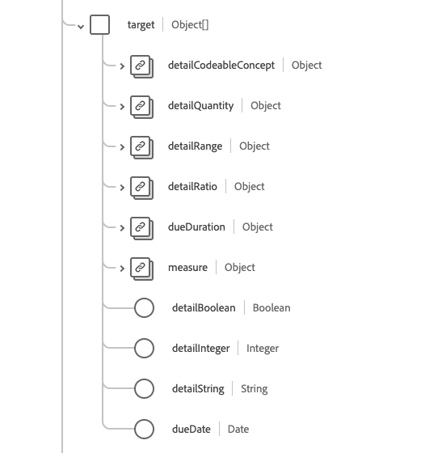

# [!UICONTROL Goal] schema field group

[!UICONTROL Goal] is a standard schema field group for the [[!DNL XDM Individual Profile] class](../../../classes/individual-profile.md) and the [[!DNL Provider class]](../../../classes/provider.md). It provides a single object-type field `healthcareGoal` which describes the intended objective(s) for a patient, group, or organization care.

| Display Name | Property | Data type | Description |
| --- | --- | --- | --- |
| [!UICONTROL Achievment Status] | `achievementStatus` | [[!UICONTROL Codeable Concept]](../data-types/codeable-concept.md) | Describes the progression, or lack thereof, towards the goal against the target. |
| [!UICONTROL Addresses] | `addresses`| Array of [[!UICONTROL Reference]](../data-types/reference.md) | The conditions and other health record elements that are intended to be addressed by the goal. |
| [!UICONTROL Category] | `category` | Array of [[!UICONTROL Codeable Concept]](../data-types/codeable-concept.md) | Indicates a category the goal falls within, such as dietary or behavioral. |
| [!UICONTROL Description] | `description` | [[!UICONTROL Codeable Concept]](../data-types/codeable-concept.md) | The code or text describing the goal. |
| [!UICONTROL Identifier] | `identifier` | Array of [[!UICONTROL Identifier]](../data-types/identifier.md) | The business identifiers assigned to this goal by the performer or other systems which remain constant as the resource is updated and propagates from server to server. |
| [!UICONTROL Note] | `note` | Array of [[!UICONTROL Annotation]](../data-types/annotation.md) | Comments regarding the goal. |
| [!UICONTROL Outcome] | `outcome` | Array of [[!UICONTROL Codeable Reference]](../data-types/codeable-reference.md) | Identifies the change (or lack of change) when the status of the goal is assessed. |
| [!UICONTROL Priority] | `priority` | [[!UICONTROL Codeable Concept]](../data-types/codeable-concept.md) | Identifies the mutually agreed upon level of importance associated with reaching or sustaining the goal. |
| [!UICONTROL Source] | `source` | [[!UICONTROL Reference]](../data-types/reference.md) | Indicates the source of the goal, such as the patient or practitioner. |
| [!UICONTROL Start Codeable Concept] | `startCodeableConcept` | [[!UICONTROL Codeable Concept]](../data-types/codeable-concept.md) | The event after which the goal should then be persued. |
| [!UICONTROL Subject | ]`subject` | [[!UICONTROL Reference]](../data-types/reference.md) | Identifies the patient, group, or organization for who the goal is being established. |
| [!UICONTROL Target] | `target` | Array of objects | Indicates the timeline of specific steps in the goal. See the [section below](#target) for more information. |
| [!UICONTROL Continous] | `continous` | Boolean | Indicates if after meeting the goal ongoing activity is needed to sustain the goal objective. |
| [!UICONTROL Lifecycle Status] | `lifecycleStatus` | String | The status of the goal's lifecycle. The value of this property must be equal to one of the following known enum values. <li> `proposed` </li> <li> `planned` </li> <li> `accepted` </li> <li> `active` </li> <li> `on-hold` </li> <li> `completed` </li> <li> `cancelled` </li> <li> `entered-in-error` </li> <li> `rejected` </li> |
| [!UICONTROL Start Date] | `startDate` | Date | The date after which the goal should begin being pursued. |
| [!UICONTROL Status Date] | `statusDate` | Date | Identifies when the status was created. |
| [!UICONTROL Status Reason] | `statusReason` | String | Captures the reason for the current status. |

For more details on the field group, refer to the public XDM repository:

* [Populated example](https://github.com/adobe/xdm/blob/master/extensions/industry/healthcare/fhir/fieldgroups/goal.example.1.json)
* [Full schema](https://github.com/adobe/xdm/blob/master/extensions/industry/healthcare/fhir/fieldgroups/goal.example.1.json)

## `target` {#target}

`target` is provided as an array of objects. The structure of each object is described below.

| Display Name | Property | Data type | Description |
| --- | --- | --- | --- |
| [!UICONTROL Detail Codeable Concept] | `detailCodeableConcept` | [[!UICONTROL Codeable Concept]](../data-types/codeable-concept.md) | The target code to be achieved to signify the fulfillment of the goal. |
| [!UICONTROL Detail Quantity] | `detailQuantity`| [[!UICONTROL Quantity]](../data-types/quantity.md) | The target quantity to be achieved to signify the fulfillment of the goal. |
| [!UICONTROL Detail Range] | `detailRange`| [[!UICONTROL Range]](../data-types/range.md) | The target range to be achieved to signify the fulfillment of the goal. |
| [!UICONTROL Detail Ratio] | `detailRatio`| [[!UICONTROL Ratio]](../data-types/ratio.md) | The target ratio to be achieved to signify the fulfillment of the goal. |
| [!UICONTROL Measure] | `measure`| [[!UICONTROL Codeable Concept]](../data-types/codeable-concept.md) | The parameter that's value is being tracked. |
| [!UICONTROL Detail Boolean] | `detailBoolean`| Boolean | Indicates the fulfillment of the goal. |
| [!UICONTROL Detail Integer] | `detailInteger`| Integer | The target number to be achieved to signify the fulfillment of the goal. |
| [!UICONTROL Detail String] | `detailString`| String | The target value to be achieved to signify the fulfillment of the goal. |
| [!UICONTROL Due Date] | `dueDate`| Date | The date by which the target should be met. |
