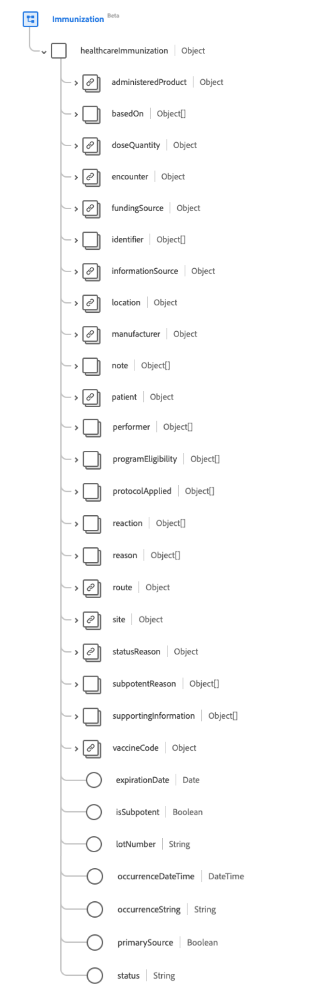
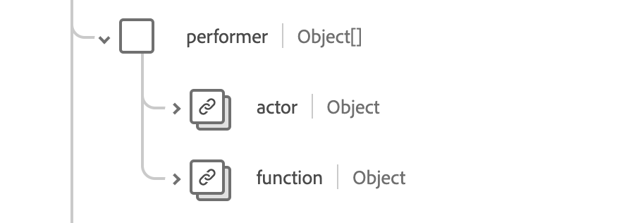
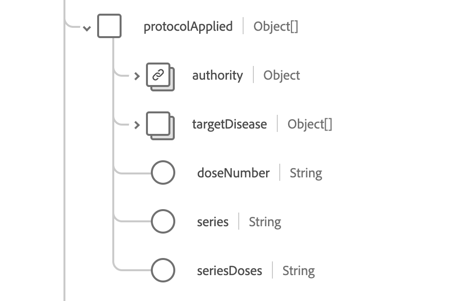
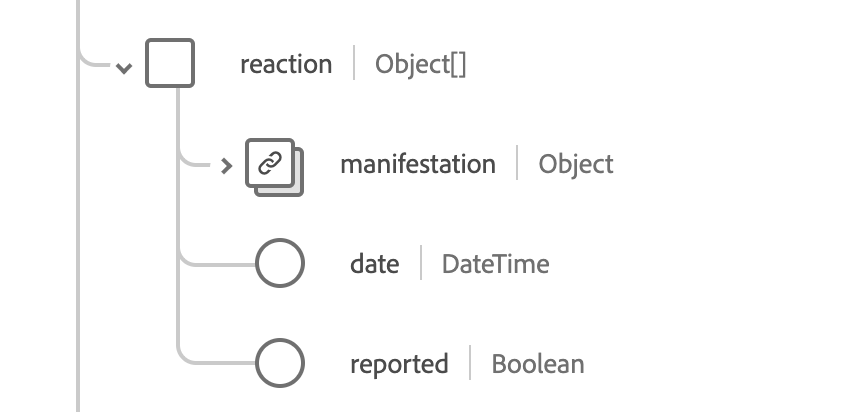

# [!UICONTROL Immunization] schema field group

[!UICONTROL Immunization] is a standard schema field group for the [[!DNL XDM Experience Event] class](../../../classes/experienceevent.md). It provides a single object-type field `healthcareImmunization` which captures immunization event information.

| Display Name | Property | Data type | Description |
| --- | --- | --- | --- |
| [!UICONTROL Administered Product] |`administeredProduct` | [[!UICONTROL Codeable Reference]](../data-types/codeable-reference.md) | The product that was administered.|
| [!UICONTROL Based On] | `basedOn`| Array of [[!UICONTROL Reference]](../data-types/reference.md) | The authority that the immunization event is based on. |
| [!UICONTROL Dose Quantity] | `doseQuantity` | [[!UICONTROL Simple Quantity]](../data-types/simple-quantity.md) | The amount of vaccine administered. |
| [!UICONTROL Encounter] |`encounter` | [[!UICONTROL Reference]](../data-types/reference.md) | The encounter the immunization was part of. |
| [!UICONTROL Funding Source] |`fundingSource` | [[!UICONTROL Codeable Concept]](../data-types/codeable-concept.md) | The funding source for the vaccine. |
| [!UICONTROL Identifier] |`identifier` | Array of [[!UICONTROL Identifier]](../data-types/identifier.md) | The business identifier. |
| [!UICONTROL Information Source] | `informationSource` | [[!UICONTROL Codeable Reference]](../data-types/codeable-reference.md) | Indicates the source of the reported record. |
| [!UICONTROL Location] | `location` | [[!UICONTROL Reference]](../data-types/reference.md) | The location where the immunization occured. |
| [!UICONTROL Manufacturer] |`manufacturer` | [[!UICONTROL Codeable Reference]](../data-types/codeable-reference.md) | The vaccine manufacturer. |
| [!UICONTROL Note] | `note` | Array of [[!UICONTROL Annotation]](../data-types/annotation.md) | Additional immunization notes. |
| [!UICONTROL Patient] | `patient` | [[!UICONTROL Reference]](../data-types/reference.md) | Who was immunized. |
| [!UICONTROL Batch] | `performer` | Array of objects | Who performed the immunization event. See the [section below](#performer) for more information. |
| [!UICONTROL Program Eligibility] | `programEligibility` | Array of objects | The patient eligibility for a specific vaccination program. See the [section below](#program-eligibility) for more information.|
| [!UICONTROL Protocol Applied] | `protocolApplied` | Array of objects | The protocol provided by the provider. See the [section below](#protocol-applied) for more information. |
| [!UICONTROL Reaction] | `reaction` | Array of objects | The details of a reaction following immunization. See the [section below](#reaction) for more information. |
| [!UICONTROL Reason] | `reason` | Array of [[!UICONTROL Codeable Reference]](../data-types/codeable-reference.md) | The reason for the immunization. |
| [!UICONTROL Route] | `route` | [[!UICONTROL Codeable Concept]](../data-types/codeable-concept.md) | How the vaccine entered the body. |
| [!UICONTROL Site] | `site` | [[!UICONTROL Codeable Concept]](../data-types/codeable-concept.md) | The site on the body the vaccine was administered |
| [!UICONTROL Status Reason] | `statusReason` | [[!UICONTROL Codeable Concept]](../data-types/codeable-concept.md) | The reason for the current status. |
| [!UICONTROL Subpotent Reason] | `subpotentReason` | Array of [[!UICONTROL Codeable Concept]](../data-types/codeable-concept.md) | The reason for the vaccine being subpotent. |
| [!UICONTROL Supporting Information] | `supportingInformation` | Array of [[!UICONTROL Reference]](../data-types/reference.md) | Additional information supporting the immunization. |
| [!UICONTROL Vaccine Code] | `vaccineCode` | [[!UICONTROL Codeable Concept]](../data-types/codeable-concept.md) | The code for the vaccine administered. |
| [!UICONTROL Expiration Date] | `expirationDate` | Date | The expiration date of the vaccine. |
| [!UICONTROL Is Subpotent] | `isSubpotent` | Boolean | The indicator for whether the vaccine is subpotent. |
| [!UICONTROL Lot Number] | `lotNumber` | String | The lot number of the vaccine. |
| [!UICONTROL Occurence DateTime] | `occurenceDateTime` | DateTime | The vaccine administration date. |
| [!UICONTROL Occurence String ] | `occurenceString` | String | The vaccine administration date. |
| [!UICONTROL Primary Source] | `primarySource` | Boolean | Indicates if the data was captured from a primary source. |
| [!UICONTROL Status] | `status` | String | The status of the immunization. The value of this property must be equal to one of the following known enum values. <li> `completed` </li> <li> `entered-in-error` </li> <li> `not-done` </li> |

For more details on the field group, refer to the public XDM repository:

* [Populated example](https://github.com/adobe/xdm/blob/master/extensions/industry/healthcare/fhir/fieldgroups/immunization.example.1.json)
* [Full schema](https://github.com/adobe/xdm/blob/master/extensions/industry/healthcare/fhir/fieldgroups/immunization.schema.json)

## `performer` {#performer}

`performer` is provided as an array of objects. The structure of each object is described below.

| Display Name | Property | Data type | Description |
| --- | --- | --- | --- |
| [!UICONTROL Actor] | `actor` | [[!UICONTROL Reference]](../data-types/reference.md) | The individual or organization who was performing. |
| [!UICONTROL Function] | `function`| [[!UICONTROL Codeable Concept]](../data-types/codeable-concept.md) | What type of performance was done. |

## `programEligibility` {#program-eligibility}

`programEligibility` is provided as an array of objects. The structure of each object is described below.

| Display Name | Property | Data type | Description |
| --- | --- | --- | --- |
| [!UICONTROL Program] | `program` | [[!UICONTROL Codeable Concept]](../data-types/codeable-concept.md) | The program that eligibility is declared for. |
| [!UICONTROL Program Status] | `programStatus`| [[!UICONTROL Codeable Concept]](../data-types/codeable-concept.md) | The patient's eligibility status for the program. |

## `protocolApplied` {#protocol-applied}

`protocolApplied` is provided as an array of objects. The structure of each object is described below.

| Display Name | Property | Data type | Description |
| --- | --- | --- | --- |
| [!UICONTROL Authority] | `authority` | [[!UICONTROL Reference]](../data-types/reference.md) | Who is responsible for publishing the recommendations. |
| [!UICONTROL Target Disease] | `targetDisease`| Array of [[!UICONTROL Codeable Concept]](../data-types/codeable-concept.md) | The preventable disease the vaccine is targeting. |
| [!UICONTROL Dose Number] | `doseNumber` | String | The dose number within the series. |
| [!UICONTROL Series] | `series`| String | The name of the vaccine series. |
| [!UICONTROL Series Doses] | `seriesDoses`| String | Reccommended number of doses for immunity. |

## `reaction` {#reaction}

`reaction` is provided as an array of objects. The structure of each object is described below.

| Display Name | Property | Data type | Description |
| --- | --- | --- | --- |
| [!UICONTROL Manifestation] | `manifestation` | [[!UICONTROL Codeable Reference]](../data-types/codeable-concept.md) | Additional information on the reaction. |
| [!UICONTROL Date] | `date`| DateTime | When the reaction started. |
| [!UICONTROL Reported] | `reported` | String | Indicates whether the reaction was self-reported. |
