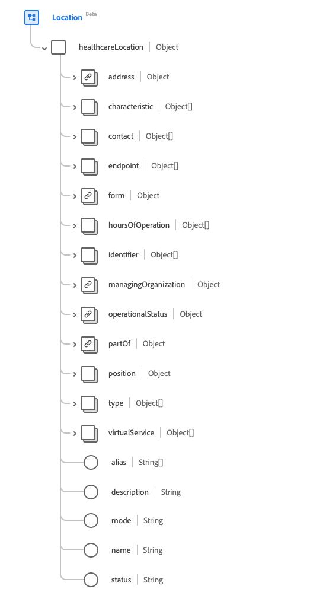

# [!UICONTROL Location] schema field group

[!UICONTROL Location] is a standard schema field group for the [[!DNL Location] class](../classes/location.md). It provides a single object-type field `healthcareLocation` which captures details and position information for a place.

| Display Name |Property | Data type | Description |
| --- | --- | --- | --- |
| [!UICONTROL Address] | `address` | [[!UICONTROL Address]](../data-types/address.md) | The address of the physical location. |
| [!UICONTROL Characteristic] | `characteristic`| Array of [[!UICONTROL Codeable Concept]](../data-types/codeable-concept.md) | A collection of the location's characteristics. |
| [!UICONTROL Contact] | `contact` | Array of [[!UICONTROL Extended Contact Details]](../data-types/extended-contact-detail.md) | The contact details for the location. |
| [!UICONTROL Endpoint] | `endpoint` | Array of [[!UICONTROL Reference]](../data-types/reference.md) | The technical endpoints providing access to operating services for the location. |
| [!UICONTROL Form] | `form` | [[!UICONTROL Codeable Concept]](../data-types/codeable-concept.md) | The physical form of the location. |
| [!UICONTROL Hours of Operation] | `hoursOfOperation` | Array of [[!UICONTROL Availability]](../data-types/availability.md) | What days and times this location is typically open (including exceptions). |
| [!UICONTROL Identifier] | `identifier` | Array of [[!UICONTROL Identifier]](../data-types/identifier.md) | The unique code or number identifying the location. |
| [!UICONTROL Managing Organization] | `managingOrganization` | [[!UICONTROL Reference]](../data-types/reference.md) | The organization responsible for provisioning and upkeep. |
| [!UICONTROL Operational Status] | `operationalStatus` | [[!UICONTROL Coding]](../data-types/coding.md) | The operational status for the location. |
| [!UICONTROL Part Of Location] | `partOf` | [[!UICONTROL Reference]](../data-types/reference.md) | The location that this location is a part of. |
| [!UICONTROL Position] | `position` | Object | The absolute geographical location. Contains three properties in Double format: <li>`longitude`: Longitude with WGS84 datum</li> <li>`latitude`: Latitude with WGS84 datum.</li> <li>`altitude`: Altitude with WGS84 datum.</li> |
| [!UICONTROL Type] | `type` | Array of [[!UICONTROL Codeable Concept]](../data-types/codeable-concept.md) | The type of function performed at the location. |
| [!UICONTROL Virtual Service] | `virtualService` | Array of [[!UICONTROL Virtual Service Detail]](../data-types/virtual-service-detail.md) | The connection details of a virtual service. |
| [!UICONTROL Alias] | `alias` | Array of strings | A list of alternate names that the location is or was known as. |
| [!UICONTROL Description] | `description` | String | Further information to identify the location beyond its name. |
| [!UICONTROL Mode] | `mode` | String | The location's mode. The value of this property must be equal to one of the following known enum values. <li> `instance` </li> <li> `kind` </li> |
| [!UICONTROL Name] | `name` | String | The name of the location. |
| [!UICONTROL Status] | `status` | String | The status of the location. The value of this property must be equal to one of the following known enum values. <li> `active` </li> <li> `inactive` </li> <li> `suspended` </li> |

For more details on the field group, refer to the public XDM repository:

* [Populated example](https://github.com/adobe/xdm/blob/master/extensions/industry/healthcare/fhir/fieldgroups/location.example.1.json)
* [Full schema](https://github.com/adobe/xdm/blob/master/extensions/industry/healthcare/fhir/fieldgroups/location.schema.json)
