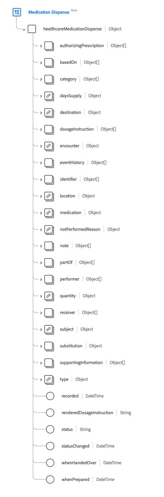
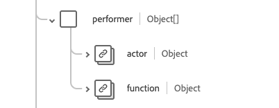

# [!UICONTROL Medication Dispense] schema field group

[!UICONTROL Medication Dispense] is a standard schema field group for the [[!DNL Medication] class](../../../classes/medication.md), the [[!DNL XDM Individual Profile] Class](../../../classes/individual-profile.md), and the [[!DNL Provider class]](../../../classes/provider.md). It provides a single object-type field `healthcareMedicationDispense` which captures information about a medication that is to be or has been dispensed for a named person/patient.

| Display Name | Property | Data type | Description |
| --- | --- | --- | --- |
| [!UICONTROL Authorizing Prescription] | `authorizingPrescription` | Array of [[!UICONTROL Reference]](../data-types/reference.md) | The order allowing for dispensing the prescription. |
| [!UICONTROL Based On] | `basedOn`| Array of [[!UICONTROL Reference]](../data-types/reference.md) | The plan the dispensing of the medication is based on. |
| [!UICONTROL Category] | `category` | Array of [[!UICONTROL Codeable Concept]](../data-types/codeable-concept.md) | The category the medication being dispensed falls under, such as the legal category of the medication or the drug classification. |
| [!UICONTROL Days Supply] | `daysSupply` | [[!UICONTROL Simple Quantity]](../data-types/simple-quantity.md) | The number of days the medication will supply the patient for. |
| [!UICONTROL Destintation] | `destination` | [[!UICONTROL Reference]](../data-types/reference.md) | The facility or location where the medication was or will be shipped to, as part of the dispense event. |
| [!UICONTROL Dosage Instruction] | `dosageInstruction` | Array of [[!UICONTROL Dosage]](../data-types/dosage.md) | Describes how the medication is to be used by the patient. |
| [!UICONTROL Encounter] | `encounter` | [[!UICONTROL Reference]](../data-types/reference.md) | The encounter that establishes the context for this event. |
| [!UICONTROL Event History] | `eventHistory` | Array of [[!UICONTROL Reference]](../data-types/reference.md) | A summary of the events that occurred surrounding the dispensing. |
| [!UICONTROL Identifier] | `identifier` | Array of [[!UICONTROL Identifier]](../data-types/identifier.md) | Identifiers associated with the dispensing. The identifiers should be defined by business processes and/or used to refer to it when a direct URL reference is not appropriate. |
| [!UICONTROL Location] | `location` | [[!UICONTROL Reference]](../data-types/reference.md) | The principal physical location where the medication was dispensed. |
| [!UICONTROL Medication] | `medication` | [[!UICONTROL Codeable Reference]](../data-types/codeable-reference.md) | Identifies the medication being requested. This should be a link to a resource that represents details of the medication, or a code that identifies the medication. |
| [!UICONTROL Not Performed Reason] | `notPerformedReason` | [[!UICONTROL Codeable Reference]](../data-types/codeable-reference.md) | The reason why the medication was not dispensed. |
| [!UICONTROL Note] | `note` | Array of [[!UICONTROL Annotation]](../data-types/annotation.md) | Additional information about the dispensing. |
| [!UICONTROL Part Of] | `partOf` | Array of [[!UICONTROL Reference]](../data-types/reference.md) | The procedure or medication request that triggered the dispensing. |
| [!UICONTROL Performer] | `performer` | Array of objects | Indicates who or what peformed the dispensing event. See the [section below](#performer) for more information. |
| [!UICONTROL Quantity] | `quantity` | [[!UICONTROL Simple Quantity]](../data-types/simple-quantity.md) | The amount of medication that has been dispensed, including the unit of measure. |
| [!UICONTROL Receiver] | `receiver` | Array of [[!UICONTROL Reference]](../data-types/reference.md) | Identifies the person who picked up the medication or the location of where the medication was delivered. |
| [!UICONTROL Subject] | `subject` | [[!UICONTROL Reference]](../data-types/reference.md) | A link to a resource representing the person or group to who the medication will be given. |
| [!UICONTROL Substitution] | `substitution` | Object | Indicates whether or not substitution was made as part of the dispense. Contains four properties: <li>`wasSubstituted`: A boolean value that is true if the dispenser requested a substitution.</li> <li>`type`: A [[!UICONTROL Codeable Concept]](../data-types/codeable-concept.md) value that provides a code signifying whether a substitution was made.</li> <li>`reason`: An array of [[!UICONTROL Codeable Concept]](../data-types/codeable-concept.md) values that contains the reason(s) for the substitution.</li> <li>`responsibleParty`: A [[!UICONTROL Reference]](../data-types/reference.md) value that provides the person or party responsible for the substitution. </li> |
| [!UICONTROL Supporting Information] | `supportingInformation` | Array of [[!UICONTROL Reference]](../data-types/reference.md) | Additional information that supports the medication being dispensed. |
| [!UICONTROL Type] | `type` | [[!UICONTROL Codeable Concept]](../data-types/codeable-concept.md) | Describes the type of dispensing event that is performed such as an emergency fill or partial fill. |
| [!UICONTROL Recorded] | `recorded` | DateTime | The date and time when the dispense activity started if `whenPrepared` or `whenHandedOver` is not populated. |
| [!UICONTROL Rendered Dosage Instruction] | `renderedDosageInstruction` | String | The complete representation of the dose included in all dosage instructions. To be used when multiple dosage instructions are included to represent complex dosing such as increasing or tapering doses. |
| [!UICONTROL Status] | `status` | String | The status of the dispensing. The value of this property must be equal to one of the following known enum values. <li> `preperation` </li> <li> `in-progress` </li> <li> `cancelled` </li> <li> `on-hold` </li> <li> `completed` </li> <li> `entered-in-error` </li> <li> `stopped` </li> <li> `declined` </li> <li> `unknown` </li>    |
| [!UICONTROL Status Changed] | `statusChanged` | DateTime | The date and time when the status of the dispense record changed. |
| [!UICONTROL When Handed Over] | `whenHandedOver` | DateTime | The date and time when the dispensed medication was provided to the patient. |
| [!UICONTROL When Prepared] | `whenPrepared` | DateTime | The date and time when the dispensed medication was packaged and reviewed. |

For more details on the field group, refer to the public XDM repository:

* [Populated example](https://github.com/adobe/xdm/blob/master/extensions/industry/healthcare/fhir/fieldgroups/medicationdispense.example.1.json)
* [Full schema](https://github.com/adobe/xdm/blob/master/extensions/industry/healthcare/fhir/fieldgroups/medicationdispense.schema.json)

## `performer` {#performer}

`performer` is provided as an array of objects. The structure of each object is described below.

| Display Name | Property | Data type | Description |
| --- | --- | --- | --- |
| [!UICONTROL Actor] | `actor` | [[!UICONTROL Reference]](../data-types/reference.md) | The practioner (or similar) who performed the action. It should be assumed that the actor is the dispenser of the medication. |
| [!UICONTROL Function] | `function`| [[!UICONTROL Codeable Concept]](../data-types/codeable-concept.md) | The type of performer in the dispensing such as the date enterer, packager, or final checker. |
