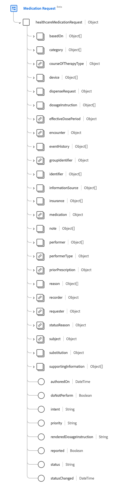
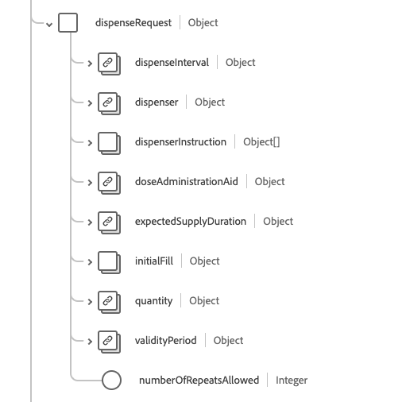

# [!UICONTROL Medication Request] schema field group

[!UICONTROL Medication Request] is a standard schema field group for the [[!DNL Medication] class](../../../classes/medication.md), the [[!DNL XDM Individual Profile] Class](../../../classes/individual-profile.md), and the [[!DNL Provider class]](../../../classes/provider.md). It provides a single object-type field `healthcareMedicationDispense` which captures an order or request for both supply of the medication and the instructions for administration of the medication to a patient.

| Display Name | Property | Data type | Description |
| --- | --- | --- | --- |
| [!UICONTROL Based On] | `basedOn` | Array of [[!UICONTROL Reference]](../data-types/reference.md) | The plan or request that is fulfilled by this medication request. |
| [!UICONTROL Category] | `category`| Array of [[!UICONTROL Codeable Concept]](../data-types/codeable-concept.md) | The categorization or grouping of the medication request. |
| [!UICONTROL Course Of Therapy Type] | `courseOfTherapyType` | [[!UICONTROL Codeable Concept]](../data-types/codeable-concept.md) | The description of the overall pattern for the administration of the medication to the patient. |
| [!UICONTROL Device] | `device` | Array of [[!UICONTROL Codeable Reference]](../data-types/codeable-reference.md) | The type of device to be used for the administration of the medication. |
| [!UICONTROL Dispense Request] | `dispenseRequest` | Object | Indicates the specific details of the dispense request, often known as a medication order. See the [section below](#dispense-request) for more information. |
| [!UICONTROL Dosage Instruction] | `dosageInstructions` | Array of [[!UICONTROL Dosage]](../data-types/dosage.md) | Specific instructions for how the medication is to be used by the patient. |
| [!UICONTROL Effective Dose Period] | `effectiveDosePeriod` | [[!UICONTROL Period]](../data-types/period.md) | The period over which the medication is to be taken. Where there are multiple `dosageInstruction` lines (for example, when tapering doses), this is the earliest date and the latest date of the dosage intructions. |
| [!UICONTROL Encounter] |`encounter` | [[!UICONTROL Reference]](../data-types/reference.md) | The encounter during which the request was created. |
| [!UICONTROL Event History] | `eventHistory` | Array of [[!UICONTROL Reference]](../data-types/reference.md) | Link to records of events related to the medication request such as fulfilling the request, moments of key state transitions, or relevant updates. |
| [!UICONTROL Group Identifier] | `groupIdentifier` | [[!UICONTROL Identifier]](../data-types/identifier.md) | A shared identifier across multiple independent request instances that were activated by a single author. |
| [!UICONTROL Identifier] | `identifier` | Array of [[!UICONTROL Identifier]](../data-types/identifier.md) | Identifiers associated with the medication request that are defined by business processes and/or are used to refer to it when a direct URL reference to the resource itself is not appropriate. |
| [!UICONTROL Information Source] | `informationSource` | Array of [[!UICONTROL Reference]](../data-types/reference.md) | The person or organization who provided the information for the request if the source is someone other than the `requester`. |
| [!UICONTROL Insurance] | `insurance` | Array of [[!UICONTROL Reference]](../data-types/reference.md) | Insurance plans, coverage extensions, pre-authorizations, and/or pre-determinations that may be required for delivering the requested service. |
| [!UICONTROL Medication] | `medication` | [[!UICONTROL Codeable Reference]](../data-types/codeable-reference.md) | Identifies the medication being requested. This should be a link to a resource that represents details of the medication, or a code that identifies the medication. |
| [!UICONTROL Note] | `note` | Array of [[!UICONTROL Annotation]](../data-types/annotation.md) | Extra information about the prescription that could not be conveyed by the other attributes. |
| [!UICONTROL Performer] | `performer` | Array of [[!UICONTROL Reference]](../data-types/reference.md) | The specified performer of the medication treatment/administration. For devices, this is the device that is intended to perform the administration of the medication. |
| [!UICONTROL Performer Type] | `performerType` | [[!UICONTROL Codeable Concept]](../data-types/codeable-concept.md) | Indicates the type of performer for the administration of the medication. |
| [!UICONTROL Prior Prescription] | `priorPrescription` | [[!UICONTROL Reference]](../data-types/reference.md) | The reference to an order or prescription that is being replaced by this request. |
| [!UICONTROL Reason] | `reason` | Array of [[!UICONTROL Codeable Reference]](../data-types/reference.md) | The reason or indication for ordering or not ordering the medication. |
| [!UICONTROL Recorder] | `recorder` | [[!UICONTROL Reference]](../data-types/reference.md) | The person who entered the order on behalf of another individual. |
| [!UICONTROL Requester] | `requester` | [[!UICONTROL Reference]](../data-types/reference.md) | The individual, organization, or device that initiated the request and is responsible for its activation. |
| [!UICONTROL Status Reason] | `statusReason` | [[!UICONTROL Codeable Concept]](../data-types/codeable-concept.md) | The reason for the current state of the request. |
| [!UICONTROL Subject] | `subject` | [[!UICONTROL Reference]](../data-types/reference.md) | The individual or group the medication has been requested for. |
| [!UICONTROL Substitution] | `substitution` | Object | Indicates whether or not a substitution can or should be part of the dispense. Contains three properties: <li>`allowedBoolean`: A boolean value that is true if the prescriber allows a substitution.</li> <li>`allowedCodeableConcept`: A [[!UICONTROL Codeable Concept]](../data-types/codeable-concept.md) value that provides a code if the prescriber allows a substitution.</li> <li>`reason`: A [[!UICONTROL Codeable Concept]](../data-types/codeable-concept.md) value that indicates a reason for the substitution.</li> |
| [!UICONTROL Supporting Information] | `supportingInformation` | Array of [[!UICONTROL Reference]](../data-types/reference.md) | Information to support fulfilling the medication such as a patient's height and weight. |
| [!UICONTROL Authored On] | `authoredOn` | DateTime | The date (and optionally time) when the prescription was written. |
| [!UICONTROL Do Not Perform] | `doNotPerform` | Boolean | A boolean indicator that is true is the patient should stop (or not start) taking the medication. |
| [!UICONTROL Intent] | `intent` | String | The intent of the request. The value of this property must be equal to one of the following known enum values. <li> `proposal` </li> <li> `plan` </li> <li> `order` </li> <li> `original-order` </li> <li> `reflex-order` </li> <li> `filler-order` </li> <li> `instance-order` </li> <li> `option` </li> |
| [!UICONTROL Priority] | `priority` | String | The priority of the request. The value of this property must be equal to one of the following known enum values. <li> `routine` </li> <li> `urgent` </li> <li> `asap` </li> <li> `stat` </li> |
| [!UICONTROL Rendered Dosage Instruction] | `renderedDosageInstruction` | String | The complete representation of the dose included in all dosage instructions. To be used when multiple dosage instructions are included to represent complex dosing such as increasing or tapering doses. |
| [!UICONTROL Reported] | `reported` | Boolean | Indicates if this record was captured as a secondary reported record rather than as an original primary source-of-truth record. |
| [!UICONTROL Status] | `status` | String | The status of the dispensing. The value of this property must be equal to one of the following known enum values. <li> `preperation` </li> <li> `in-progress` </li> <li> `cancelled` </li> <li> `on-hold` </li> <li> `completed` </li> <li> `entered-in-error` </li> <li> `stopped` </li> <li> `declined` </li> <li> `unknown` </li>   |
| [!UICONTROL Status Changed] | `statusChanged` | DateTime | The date (and optionally time) when the status of changed. |

For more details on the field group, refer to the public XDM repository:

* [Populated example](https://github.com/adobe/xdm/blob/master/extensions/industry/healthcare/fhir/fieldgroups/medicationrequest.example.1.json)
* [Full schema](https://github.com/adobe/xdm/blob/master/extensions/industry/healthcare/fhir/fieldgroups/medicationrequest.schema.json)

## `dispenseRequest` {#dispense-request}

`dispenseRequest` is provided as an array of objects. The structure of each object is described below.

| Display Name | Property | Data type | Description |
| --- | --- | --- | --- |
| [!UICONTROL Dispense Interval] | `dispenseInterval` | [[!UICONTROL Duration]](../data-types/duration.md) | The minimum period of time that must occur between dispenses of the medication. |
| [!UICONTROL Dispenser] | `dispenser`| [[!UICONTROL Reference]](../data-types/reference.md) | The intended organization that will dispense the medication as specified by the prescriber. |
| [!UICONTROL Dispenser Instruction] | `dispenserInstruction`| Array of [[!UICONTROL Annotation]](../data-types/annotation.md) | Additional information for the dispenser, such as counselling to be provided to the patient |
| [!UICONTROL Dose Administration Aid] | `doseAdministrationAid`| [[!UICONTROL Codeable Concept]](../data-types/codeable-concept.md) | Information about the type of adherence packaging to be supplied for the medication dispense. |
| [!UICONTROL Expected Supply Duration] | `expectedSupplyDuration`| [[!UICONTROL Duration]](../data-types/duration.md) | The period time over which the supplied product is expected to be used, or the length of time the dispense is expected to last. |
| [!UICONTROL Initial Fill] | `initialFill`| Object | Information for the initial fill. Contains two properties: <li>`quantity`: A [[!UICONTROL Simple Quantity]](../data-types/simple-quantity.md) value that provides the amount to provide during the first dispense.</li> <li>`duration`: A [[!UICONTROL Duration]](../data-types/duration.md) value that provides the length of time the first dispense is expected to last.</li> |
| [!UICONTROL Quantity] | `quantity`| [[!UICONTROL Simple Quantity]](../data-types/simple-quantity.md) | The amount to be dispensed for a fill. |
| [!UICONTROL Validity Period] | `validityPeriod`| [[!UICONTROL Period]](../data-types/period.md) | The validity period of the prescription. |
| [!UICONTROL Number Of Repeats Allowed] | `numberOfRepeatsAllowed`| Integer | The number of refills authorized, with a minimum value of 0. |
