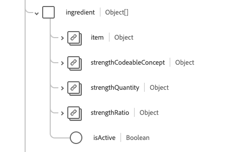

# [!UICONTROL Medication] schema field group

[!UICONTROL Medication] is a standard schema field group for the [[!DNL Medication] class](../../../classes/medication.md). It provides a single object-type field `healthcareMedication` which captures a medication's information.

| Display Name | Property | Data type | Description |
| ---|  --- | --- | --- |
| [!UICONTROL Batch] | `batch` | Object | Details about a packaged medication. Contains two properties: <li>`lotNumber`: A string value for the identifier assigned to batch.</li> <li>`expirationDate`: A DateTime value for when the batch will expire.</li> |
| [!UICONTROL Code] | `code`| [[!UICONTROL Codeable Concept]](../data-types/codeable-concept.md) | The code that identifies this medication. |
| [!UICONTROL Definition] | `definition` | [[!UICONTROL Reference]](../data-types/reference.md) | The definition of the medication. |
| [!UICONTROL Dose Form] | `doseForm` | [[!UICONTROL Codeable Concept]](../data-types/codeable-concept.md) | Describes the dose form of the medication, such as tablets or capsules. |
| [!UICONTROL Identifier] | `identifier` | Array of [[!UICONTROL Identifier]](../data-types/identifier.md) | An identifier for the medication. |
| [!UICONTROL Ingredient] | `ingredient` | Array of objects | Describes ingredient information for the medication. See the [section below](#ingredient) for more information. |
| [!UICONTROL Marketing Authorization Holder] | `marketingAuthorizationHolder` | [[!UICONTROL Reference]](../data-types/reference.md) | The organization that has the authorization to market the medication. |
| [!UICONTROL Total Volume] | `totalVolume` | [[!UICONTROL Quantity]](../data-types/quantity.md) | The amount of product provided in the medication when the product code does not infer a package size. |
| [!UICONTROL Status] | `status` | String | The status of the medication. The value of this property must be equal to one of the following known enum values. <li> `active` </li> <li> `inactive` </li> <li> `entered-in-error` </li>  |

For more details on the field group, refer to the public XDM repository:

* [Populated example](https://github.com/adobe/xdm/blob/master/extensions/industry/healthcare/fhir/fieldgroups/medication.example.1.json)
* [Full schema](https://github.com/adobe/xdm/blob/master/extensions/industry/healthcare/fhir/fieldgroups/medication.schema.json)

## `ingredient` {#ingredient}

`ingredient` is provided as an array of objects. The structure of each object is described below.

| Display Name | Property | Data type | Description |
| --- | --- | --- | --- |
| [!UICONTROL Item] | `item` | [[!UICONTROL Codeable Reference]](../data-types/codeable-reference.md) | The ingredient being described. |
| [!UICONTROL Strength Codeable Concept] | `strengthCodeableConcept`| [[!UICONTROL Codeable Concept]](../data-types/codeable-concept.md) | The quantity of the ingredient present, expressed in a system defined terminology. |
| [!UICONTROL Strength Quantity] | `strengthQuantity`| [[!UICONTROL Quantity]](../data-types/quantity.md) | The quantity of the ingredient present. |
| [!UICONTROL Strength Ratio] | `strengthRatio`| [[!UICONTROL Ratio]](../data-types/ratio.md) | The ratio of the ingredient present. |
| [!UICONTROL Is Active] | `isActive`| Boolean | Indicates if the ingredient is active. |
